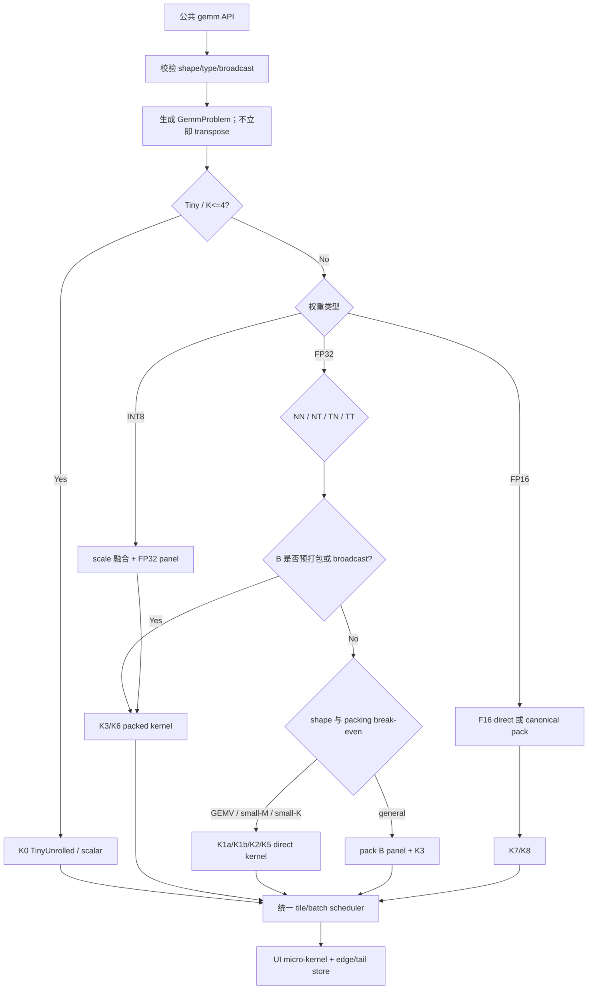

# cvh Mat GEMM：OpenCV Universal Intrinsics Micro-kernel 加速计划

> 状态：实施中（P0/P1 已完成，P2 待开始）  
> 基线版本：`09fee0d8b7ca`（`main`）  
> 计划日期：2026-07-27  
> 适用范围：`cvh::gemm`、`cvh::gemm_pack_b` 及其 header-only CPU 实现  
> SIMD 方言：OpenCV Universal Intrinsics（下文简称 OpenCV UI）

## 1. 结论摘要

本计划不再把所有 GEMM 交给同一条“逐行”循环，而是先把一个 GEMM 问题规范化为：

```text
布局 × 权重类型 × M/N/K 形状 × B 的复用方式 × batch/broadcast
```

然后由调度器选择不同的 micro-kernel、packing 和并行策略。

首轮实现建议以以下内核组合为主：

1. 保留现有 `1 x 4VL` NN 流式 kernel，专门服务 `M=1`、极小 M 和无需 packing 的低开销场景；为 `N=1` 单独提供沿 K 的 `4 x 1` matrix-vector dot kernel。
2. 新增通用 `4 x 2VL` FP32 NN outer-product micro-kernel，同时计算 4 行、2 个向量宽度的输出；窄 N 使用 `4 x (1..2VL)` edge 变体。
3. 为大尺寸或复用 B 的 NN GEMM 增加 panel packing 与 `MC/NC/KC` cache blocking。
4. 为一次性 NT GEMM 增加 `2 x 4` multi-dot kernel；复用 B 或尺寸较大时，把 NT 权重打包成统一 NN panel，复用 `4 x 2VL` 内核。
5. FP16 权重使用 `vx_load_expand` 转为 FP32 后累加，保持 FP32 accumulation。
6. 当前 API 是 `FP32 A × INT8 B`，不能在不改变数值语义的前提下直接使用纯 INT8 dot-product。第一版 INT8 加速应在 packing 时融合 scale、反量化成 FP32 panel，再复用 FP32 kernel。
7. TN/TT 不再优先整张 `transpose()`；改为在 tile packing 阶段处理 stride 和转置，避免完整临时 Mat。
8. 统一 batch 与矩阵 tile 的并行调度，禁止 batch parallel 与 row parallel 嵌套。

推荐的第一优先级是：

```text
FP32 NN 4x2VL direct kernel
    → packed-B panel + blocked NN
    → NT multi-dot / canonical packing
    → FP16
    → INT8
    → batch、转置与跨 ISA 调优
```

默认 OpenCV 在 Apple 平台可能进入 Accelerate/LAPACK，因此它只作为外部库上限参考，不作为 `cvh` 纯头文件 OpenCV UI 内核的硬性追赶门禁。主要性能门禁应是：

- 相对当前 cvh UI kernel；
- 相对 cvh scalar；
- 相对禁用 LAPACK/IPP/KleidiCV/Carotene/OpenCL 的 upstream CPU-only OpenCV。

### 1.1 实施进度（2026-07-27）

| 阶段 | 状态 | 已落地内容 |
| --- | --- | --- |
| P0 | 已完成 | 新增 `gemm_dispatch.hpp`；实现 `Problem/Plan/ShapeClass/KernelId`、shape 优先级分类和 last-plan 可观测性；Mode A/Mode B benchmark 输出 `gemm_kernel` 与 `shape_class` |
| P1 | 已完成 | 新增 FP32 NN `4×2VL` direct、`4×1` N=1 dot、窄 N edge；保留 `1×4VL` small-M；公共路径按 4-row block 调度并保留并行 |
| P2 | 下一阶段 | canonical packed-B panel、`MC/NC/KC` blocking 与真正的 pack-once kernel |

Apple ARM、Release、单线程、`warmup=2/iters=100/repeats=5` 的 P1 kernel-only 对照：

| Shape | 新 kernel | 旧逐行 kernel | P1 提升 |
| --- | ---: | ---: | ---: |
| `128×128×128` | 0.059932 ms | 0.093532 ms | 1.56x |
| `32×512×64` | 0.030670 ms | 0.055283 ms | 1.80x |
| `256×32×256` | 0.046262 ms | 0.066703 ms | 1.44x |
| `256×256×256` | 0.492012 ms | 0.869278 ms | 1.77x |

形状专用路径的同口径结果：

| Shape | 命中 kernel | 新 kernel | 旧逐行 kernel | P1 提升 |
| --- | --- | ---: | ---: | ---: |
| `1×257×17` | `nn_1x4vl` | 0.000375 ms | 0.000374 ms | 持平 |
| `32×257×1` | `nn_dot_4x1` | 0.000470 ms | 0.002262 ms | 4.81x |
| `3×257×11` | `nn_1x4vl` | 0.002089 ms | 0.002240 ms | 1.07x |
| `17×257×5` | `nn_narrow_4x2vl` | 0.002121 ms | 0.005080 ms | 2.40x |

同机 Mode B 端到端相对 2026-07-25 冻结基线：

| Shape | 2026-07-25 基线 | P1 当前 | 提升 |
| --- | ---: | ---: | ---: |
| `128×128×128` | 0.091630 ms | 0.057001 ms | 1.61x |
| `32×512×64` | 0.055151 ms | 0.030841 ms | 1.79x |
| `256×32×256` | 0.071660 ms | 0.045179 ms | 1.59x |
| `256×256×256` | 0.850262 ms | 0.488052 ms | 1.74x |

当前 correctness gate：

- 默认 UI Core：`213/213` 通过；
- UI-disabled Core：`200` 通过、`13` 个既有 UI-only case 跳过；
- 新增 classifier、四类 P1 kernel、tiny/short-N fallback 与 4-thread row-block 一致性测试；
- Mode B stable GEMM：`8/8 OK`，全部记录实际 kernel/shape class；
- UI-enabled 全量 CTest：`17/17` 通过；UI-disabled 全量 CTest：`14/14` 通过，均包含 header compile 与 ODR smoke；
- x86_64 SSE2 与 AVX2 已通过 GEMM benchmark translation unit 的交叉语法编译；真实 x86 运行与性能回归仍待关闭。

## 2. 当前实现与问题定位

### 2.1 当前 API 合同

当前公共 API 位于 [`include/cvh/core/mat.h`](../include/cvh/core/mat.h)：

```cpp
GemmPackedB gemm_pack_b(const Mat& b, bool transB = false);
Mat gemm(const Mat& a, const Mat& b, bool transA = false, bool transB = false);
Mat gemm(const Mat& a, const GemmPackedB& packed_b, bool transA = false);
Mat gemm(const Mat& a, const Mat& b, const Mat& b_scales,
         bool transA = false, bool transB = false);
```

现有合同不是完整的 OpenCV `gemm(A, B, alpha, C, beta, flags)`：

| 项目 | 当前支持 |
| --- | --- |
| Activation A | `CV_32F` |
| NN 权重 B | `CV_32F`、`CV_16F` |
| NT 权重 B | `CV_32F`、`CV_16F`、带 per-row scale 的 `CV_8S` |
| 输出 | `CV_32F` |
| 转置 | `transA`、`transB` bool 组合 |
| 多维输入 | 支持最后两维做 GEMM，前导维做 NumPy 风格 batch broadcast |
| 预打包 | `GemmPackedB`，当前只覆盖 FP32/FP16 |

本计划只优化上述既有合同，不在同一批次扩展 F64、alpha/beta、C 矩阵或新的量化语义。

### 2.2 当前 UI fast-path

当前低层实现位于：

- [`include/cvh/core/detail/gemm_impl.hpp`](../include/cvh/core/detail/gemm_impl.hpp)
- [`include/cvh/core/detail/gemm_ui.hpp`](../include/cvh/core/detail/gemm_ui.hpp)

已有两条 UI 路径：

| 路径 | 当前 kernel | 优点 | 主要局限 |
| --- | --- | --- | --- |
| FP32 NN | 单行 `1 x 4VL`，沿 N 做 4 个向量 FMA | B 行连续，简单、低开销 | 每次只处理 A 的一行，B 被 M 次重复读取；没有 MR×NR 寄存器分块 |
| FP32 NT | 每个 C 元素做一次沿 K 的双累加向量 dot | A/B 行均沿 K 连续 | 每次只产生一个输出；A 向量会为不同 N 重复加载并反复横向归约 |

FP16 与 INT8 目前仍走 scalar。`gemm_pack_b()` 当前只是复制 B，没有改变布局，也没有产生真正面向 micro-kernel 的 packed panel。

### 2.3 当前结构性瓶颈

1. **只有向量循环，没有 GEMM micro-kernel。**  
   NN 每次只计算一行，不能让同一段 B 同时服务多个 A 行。

2. **packed-B 名称与实际布局不一致。**  
   当前 pack-once 数据仍是普通 row-major copy，因此 pack-once 与 end-to-end 的 kernel 行为基本相同。

3. **缺少按形状分类。**  
   GEMV、small-M、small-K、narrow-N、square、batched-small 共用同一选择规则。

4. **NT 的 A 数据复用不足。**  
   相邻输出列分别做独立 dot，重复读取 A，并对每个输出单独做 `v_reduce_sum`。

5. **转置通过完整临时 Mat 实现。**  
   TN/TT 路径会先执行 `transpose()`，增加分配、复制和 cache 流量。

6. **batch 与 row 并行策略分散。**  
   当前存在 batch 小矩阵并行与单矩阵 row 并行两套入口，后续引入 block 后容易出现嵌套或粒度失衡。

7. **dispatch 可观测性不足。**  
   `scalar/opencv_ui` 只能说明是否用了 UI，不能说明实际命中了哪个 GEMM kernel。

## 3. 性能基线与正确解读

### 3.1 2026-07-25 默认 upstream 对照

最新 Mode B 单线程数据来自  
[`benchmark/opencv_compare/results/2026-07-25-opencv-upstream-performance.md`](../benchmark/opencv_compare/results/2026-07-25-opencv-upstream-performance.md)。

| Shape `M×K×N` | cvh FP32 NN | 默认 OpenCV | cvh/OpenCV |
| --- | ---: | ---: | ---: |
| `128×128×128` | 0.091630 ms | 0.003266 ms | 28.06x |
| `256×256×256` | 0.850262 ms | 0.020437 ms | 41.60x |
| `256×32×256` | 0.071660 ms | 0.005169 ms | 13.86x |
| `32×512×64` | 0.055151 ms | 0.108692 ms | cvh 快 1.97x |
| `512×512×512` | 7.132458 ms | 0.178250 ms | 40.01x |

这组结果不能直接解释为 “OpenCV UI kernel 快 28–40 倍”。在 Apple 平台，默认 OpenCV 方阵和 wide/small-K case 会进入 Accelerate/LAPACK。

### 3.2 CPU-only upstream 对照

既有归因测试关闭了 LAPACK、IPP、KleidiCV、Carotene 与 OpenCL：

| Shape `M×K×N` | cvh | 默认 OpenCV | CPU-only OpenCV | cvh 相对 CPU-only |
| --- | ---: | ---: | ---: | ---: |
| `128×128×128` | 0.090635 ms | 0.003374 ms | 0.161422 ms | 快 1.78x |
| `32×512×64` | 0.055685 ms | 0.109595 ms | 0.108082 ms | 快 1.94x |
| `256×32×256` | 0.065286 ms | 0.004887 ms | 0.222794 ms | 快 3.41x |

因此，本计划的目标不是通过引入 BLAS 复制默认 OpenCV 的外部库路径，而是在保持 header-only、OpenCV UI 和无链接依赖的前提下，继续提高 cvh 内建 CPU kernel 的吞吐与覆盖面。

## 4. GEMM 分类模型

分类必须有明确优先级，避免同一个 shape 同时命中多个模糊规则。

### 4.1 第一层：规范化布局

调度器先生成只读描述符，不立即创建转置 Mat：

```cpp
struct GemmProblem
{
    const void* a;
    const void* b;
    float* c;
    int M, N, K;
    size_t lda, ldb, ldc;
    bool trans_a;
    bool trans_b;
    int a_type;
    int b_type;
    size_t batch_count;
    bool b_is_broadcast;
    bool b_is_prepacked;
};
```

布局类别：

| ID | 逻辑运算 | 原始访问特征 | 计划 |
| --- | --- | --- | --- |
| L-NN | `A[M,K] × B[K,N]` | A 行连续，B 沿 N 连续 | 直接 outer-product 或 packed-panel kernel |
| L-NT | `A[M,K] × B[N,K]` | A/B 行均沿 K 连续 | 小尺寸 multi-dot；大尺寸或复用 B 时转为 canonical panel |
| L-TN | `A[K,M] × B[K,N]` | A 逻辑行是 strided | 按 MC×KC tile pack A，不做整张 transpose |
| L-TT | `A[K,M] × B[N,K]` | A strided，B 适合 dot | pack A；B 走 NT direct 或 canonical pack |

### 4.2 第二层：权重类型

| ID | 计算合同 | 累加类型 | UI 策略 |
| --- | --- | --- | --- |
| T-F32 | FP32 A × FP32 B | FP32 | `v_float32` + `v_fma` |
| T-F16 | FP32 A × FP16 B | FP32 | `vx_load_expand(hfloat*)` 后 `v_fma` |
| T-I8 | FP32 A × INT8 B × scale | FP32 | 首版在 pack 时反量化为 FP32 panel |

`T-I8` 不直接使用 `v_dotprod_expand(int8,int8)`，因为 A 仍是 FP32。若未来要使用纯整数 dot，需要新增 activation quantization 合同、zero-point、scale 组合与误差规则，这应属于独立 API 设计，不混入本计划。

### 4.3 第三层：形状类别

以下阈值是首版种子值，必须由 benchmark 校准，不能视为永久 ABI。

| ID | 首版判定规则（按顺序） | 典型场景 | 主要目标 |
| --- | --- | --- | --- |
| S0 Tiny/Special | `K <= 4` 或 `M*N*K <= 4096` | 2×3、4×4、变换矩阵 | 避免 packing 与复杂 dispatch |
| S1 GEMV/GEVM | `M == 1` 或 `N == 1` | 单 token、向量投影 | M=1 沿 N 流式；N=1 沿 K 做多行 dot |
| S2 Small-M | `M <= 4` 且 `N >= 2VL` | 小 batch inference | 保留/扩展单行流式 kernel |
| S3 Narrow-N | `N <= 2VL` 且 `M > 4` | 少量输出通道 | 以 MR 复用 B，控制 N tail |
| S4 Small-K Wide | `K <= 32` 且 `M,N > 4` | 宽输出、短 reduction | 不 pack 或轻量 pack，展开 K |
| S5 General | 其余单矩阵 | 方阵、大矩形 | MR×NR + MC/NC/KC blocking |
| S6 Batched-Small | 单矩阵很小且 batch 数量足够 | rank-3/rank-4 GEMM | kernel 不变，并行单位改为 batch/tile |

其中 `VL = cv::VTraits<cv::v_float32>::vlanes()`。

### 4.4 第四层：B 的复用方式

| ID | 条件 | 策略 |
| --- | --- | --- |
| R0 One-shot Direct | 单次调用，矩阵较小或 small-M/small-K | 不 packing，优先降低启动成本 |
| R1 One-shot Packed | 单次调用但 `M/N/K` 足够大 | 在本次调用内 pack B panel，并在多个 M tile 间复用 |
| R2 Pack-once | 传入 FP32/FP16 `GemmPackedB` | 直接消费预打包 panel |
| R3 Broadcast-Reuse | batch 中 B 广播 | 每个唯一 B 只 pack 一次，跨 batch 复用 |

## 5. Micro-kernel 组合

### 5.1 寄存器分块原则

通用内核使用：

```text
MR = 4
NR = 2 × VL
accumulator registers = MR × (NR / VL) = 8
```

8 个 FP32 vector accumulator，加上 B load、A broadcast 和临时寄存器，能够在 NEON/SSE/AVX2 常见的 16 个向量寄存器预算内工作。

AVX-512 可在独立 benchmark 证明无 spill 后增加候选：

```text
MR = 4
NR = 4 × VL
accumulator registers = 16
```

该变体不应成为首版通用模板，以免为 AVX-512 的寄存器预算牺牲 NEON/SSE/AVX2。

### 5.2 Kernel 清单

| Kernel ID | Tile | 输入布局 | 使用场景 | 关键实现 |
| --- | --- | --- | --- | --- |
| K0 TinyUnrolled | 固定 1–4 | 任意规范化布局 | S0 | K=1/2/3/4 模板展开；其余 tiny scalar |
| K1a NNStream | `1 × 4VL` | NN direct | `M=1`、S2 | 保留现有 kernel；最低启动成本 |
| K1b NNDot | `4 × 1` outputs | NN、`N=1` | matrix-vector | 4 行 A 共享同一 B 向量，沿 K 累加并归约 |
| K2 NNDirect | `4 × 2VL` | NN row-major | S4、中等 one-shot | 4 个 A scalar broadcast，共享两次 B vector load |
| K2e NNNarrow | `4 × (1..2VL)` | NN row-major | S3 | 完整 VL 段向量化，剩余列按 scalar edge，禁止越界 load |
| K3 NNPacked | `4 × 2VL` | canonical packed panel | S5、R1/R2/R3 | N tail 由 zero padding 消除；支持 KC 分块累加 |
| K4 NNPacked512 | `4 × 4VL` | canonical packed panel | AVX-512 S5 | 仅在真实 AVX-512 benchmark 后启用 |
| K5 NTMultiDot | `2 × 4` outputs | NT direct | one-shot NT、小/中尺寸 | 同时加载 2 行 A 与 4 行 B；一次 K 循环产生 8 个输出 |
| K6 NTCanonical | `4 × 2VL` | NT → packed NN panel | 大 NT、R2/R3 | packing 时转置/交错，复用 K3 |
| K7 F16NN | `4 × 2VL` | NN FP16 B | direct 或 packed | `vx_load_expand` + FP32 FMA |
| K8 F16NT | `2 × 4` 或 canonical | NT FP16 B | 依据复用方式 | direct multi-dot 或 packing 时 expand |
| K9 I8DequantPack | `4 × 2VL` | INT8 B → FP32 panel | INT8 NT 的主要路径 | packing 融合 per-row scale，复用 K3 |
| K10 Edge | `1..MR × 1..NR` | 所有 | M/N/K tail | direct 路径 scalar/vector tail；packed 路径用 padding |

### 5.3 `4 × 2VL` FP32 outer-product 伪代码

```cpp
acc[4][2] = 0;

for (int k = 0; k < K; ++k)
{
    v_float32 b0 = vx_load(b_panel + k * NR);
    v_float32 b1 = vx_load(b_panel + k * NR + VL);

    for (int r = 0; r < 4; ++r)
    {
        v_float32 ar = vx_setall_f32(a[r * lda + k]);
        acc[r][0] = v_fma(ar, b0, acc[r][0]);
        acc[r][1] = v_fma(ar, b1, acc[r][1]);
    }
}

store 4 × 2 vectors to C;
```

相对当前单行 kernel，这个内核让每次 B load 同时服务 4 个输出行，把 B 的 load/FMA 比从每行重复一次降低为 4 行共享。

### 5.4 `2 × 4` NT multi-dot 伪代码

```cpp
v_float32 acc[2][4] = {};

for (int k = 0; k < K; k += VL)
{
    v_float32 a0 = vx_load(a_row0 + k);
    v_float32 a1 = vx_load(a_row1 + k);

    for (int n = 0; n < 4; ++n)
    {
        v_float32 bn = vx_load(b_row[n] + k);
        acc[0][n] = v_fma(a0, bn, acc[0][n]);
        acc[1][n] = v_fma(a1, bn, acc[1][n]);
    }
}

对 8 个 accumulator 分别做一次横向归约并写出；
```

它不能像 NN outer-product 一样避免横向归约，但可显著减少 A 的重复读取，并在一个 K 循环内产生多个 C 元素。

## 6. 类别到 kernel 的映射

### 6.1 FP32

| 布局/类别 | One-shot | Pack-once / B broadcast |
| --- | --- | --- |
| NN + S0 | K0 TinyUnrolled | K0；不强制消费 packed panel |
| NN + S1 | `M=1` 用 K1a；`N=1` 用 K1b | 极小问题保留 direct；重复大 K 可用 packed dot/canonical panel |
| NN + S2 | K1a NNStream | K1a 或 K3，按 M 与调用次数决定 |
| NN + S3/S4 | K2e NNNarrow 或 K2 NNDirect | K3 NNPacked |
| NN + S5 | 达到 packing 阈值用 K3，否则 K2 | K3 |
| NT + S0/S1 | K0 或现有 dot | K6，若 pack 成本可摊销 |
| NT + S2/S3/S4 | K5 NTMultiDot | K6 |
| NT + S5 | 优先 K6；小 M 可先 K5 | K6 |
| TN/TT | pack A tile 后进入对应 NN/NT 路径 | pack A tile + K3/K6 |

### 6.2 FP16

| 布局/复用 | Kernel | 说明 |
| --- | --- | --- |
| NN one-shot | K7 direct | 连续 FP16 B 通过 `vx_load_expand` 转 FP32 |
| NN pack-once | K7 packed | 首版可保留 FP16 panel，计算时 expand；是否预扩为 FP32 由 benchmark 决定 |
| NT one-shot | K8 direct | 多 dot 中对 B 做 expand |
| NT reused | K8 canonical | packing 时转为适合 N 向量化的 panel |

FP16 packed 数据有两种候选：

1. **保留 FP16 panel：** 内存小、cache 友好，但 kernel 内有转换成本。
2. **预扩 FP32 panel：** kernel 最简单，但 packed 内存翻倍。

必须同时测 pack-only、kernel-only 和多次复用，不能只用一次端到端结果决定。

### 6.3 INT8

首版固定采用：

```text
INT8 B row + per-row scale
    → packing 时转换为 FP32 canonical panel
    → K3 NNPacked
```

对于极小 one-shot INT8：

- 若 packing 成本大于计算成本，继续保留 scalar fallback；
- 可评估 UI widen → FP32 的 direct kernel；
- 未证明稳定收益前，不让 direct INT8 UI 路径进入公共 dispatch。

当前没有 `gemm_pack_b(b, scales)` 或 packed-INT8 公共 overload，因此 K9 首版是一次公共调用内部的临时 packing；若 B 在同一次 batched GEMM 中 broadcast，可在该调用内复用。跨调用复用 INT8 packed weight 需要单独扩展 API，不在本计划中隐式加入。

## 7. Packing 与 cache blocking

### 7.1 Canonical B panel

建议布局：

```text
[N panel][K block][NR contiguous values]
```

对每个 `NR` 列组，保存 K 方向的连续小面板：

```text
Bpack[n0][k][0 ... NR-1]
```

特点：

- micro-kernel 每个 k 只需连续加载 `NR/VL` 个向量；
- N tail 在 packing 时补零，内核不越界，也不需要所有 ISA 都具备 masked load；
- NT 权重可以在 packing 时转置为相同布局；
- FP16/INT8 可以在 packing 时完成 expand/dequant；
- broadcast B 只需为每个唯一矩阵 pack 一次。

### 7.2 首版 block 参数

以下仅为初始值：

| 参数 | 初始值 | 目的 |
| --- | ---: | --- |
| `MR` | 4 | 复用 B，控制寄存器数量 |
| `NR` | `2VL` | 8 个 accumulator，适配 NEON/SSE/AVX2 |
| `KC` | 128 | 控制 K panel 与累计长度 |
| `MC` | 64 | A block 约 32 KiB（FP32、KC=128） |
| `NC` | 128，向下/向上对齐 NR | B panel 约 64 KiB（FP32、KC=128） |

约束关系比固定数字更重要：

```text
micro tile:
    (MR×KC + KC×NR + MR×NR) × sizeof(float)
    应留在 L1 可承受范围

B macro panel:
    KC×NC×sizeof(weight)
    应主要留在 L2
```

NEON/SSE/AVX2/AVX-512 可以有不同参数表，但调度结构与 panel 语义必须保持一致。

### 7.3 K blocking

当 `K > KC`：

1. 第一个 K block 将 accumulator 初始化为 0；
2. 后续 K block从 C 载入部分和，继续累加；
3. 最后一个 K block写回最终结果。

首版不沿 K 做多线程并行，以保持确定的 reduction 顺序，并避免额外合并 buffer。

### 7.4 One-shot packing 判定

首版启发式：

```text
优先 direct：
    S0/S1/S2
    或 K <= 32
    或 M < 2×MR

候选 one-shot pack：
    M >= 2×MR
    且 N >= 2×NR
    且 K >= 64

强制使用预打包：
    传入 GemmPackedB
    或 B 在 batch 中 broadcast
```

最终阈值必须由每个 ISA 的 break-even benchmark 生成，不能只在 Apple ARM 上确定后直接固化到 x86。

## 8. `GemmPackedB` 演进与兼容性

`GemmPackedB` 当前字段公开，`packed_fp32/packed_fp16` 也可能被外部代码直接读取。直接改变这两个 vector 的布局存在源代码可见的行为变化。

安全的分阶段方案：

### 阶段 A：兼容扩展

保留现有 row-major 字段语义，新增 panel metadata 和内部 panel：

```cpp
enum class GemmPackedLayout
{
    LegacyRowMajor,
    PanelNR
};

struct GemmPackedB
{
    // 既有字段暂时保留
    MatShape shape;
    MatShape strides;
    int type;
    int k, n;
    size_t packed_step;
    std::vector<float> packed_fp32;
    std::vector<hfloat> packed_fp16;

    // 新增字段
    GemmPackedLayout layout;
    int layout_version;
    int lanes;
    int nr, kc, padded_n;
    std::vector<float> panel_fp32;
    std::vector<hfloat> panel_fp16;
};
```

优点是完全保守；缺点是 pack-once 期间可能保留两份权重。

同时必须更新 `GemmPackedB::empty()`、metadata 校验和 batch offset 计算，使它们认识新 panel；不能出现 panel 已生成但 object 仍被判断为空的状态。

### 阶段 B：确认公共合同

在仓库与下游使用方审计完成后，二选一：

1. 把旧 vector 标记为兼容字段，并在新的 major 版本移除；
2. 新增不暴露存储字段的 `GemmPackedB2`/opaque storage API。

在没有明确兼容决策前，不建议静默复用旧 vector 存储 panel 数据。

### Packed 数据有效性

packed object 至少记录：

- layout version；
- 原始 type、K、N、transB；
- `VL/NR/KC`；
- padded N；
- batch/broadcast strides；
- INT8 scale 是否已经融合。

若 packed object 与当前编译 ISA 的 lanes 不匹配，允许：

- 走可解释该 panel 的兼容 kernel；或
- 明确回退 legacy 数据重新 pack。

不能把不兼容 panel 当成普通 row-major 数据读取。

## 9. 调度器设计



建议将选择结果固化为一个内部 plan：

```cpp
enum class GemmKernelId
{
    TinyScalar,
    TinyUnrolled,
    NN1x4VL,
    NNDot4x1,
    NNNarrow4x2VL,
    NN4x2VLDirect,
    NN4x2VLPacked,
    NT2x4Dot,
    F16NN4x2VL,
    F16NT2x4,
    I8DequantPacked
};

struct GemmPlan
{
    GemmKernelId kernel;
    int mr, nr, mc, nc, kc;
    bool pack_a;
    bool pack_b;
    bool dequantize_b;
    bool parallelize_batch;
    bool parallelize_tiles;
};
```

`gemm_impl.hpp` 只负责：

1. API 校验和输出 Mat；
2. batch broadcast 地址计算；
3. 调用 `make_gemm_plan()`；
4. 分配一次 workspace；
5. 执行 plan。

低层 kernel 不应再负责公共 shape 推断或动态分配。

## 10. Batch 与并行策略

### 10.1 统一工作单元

将并行任务统一为：

```text
(batch_index, m_tile, n_tile)
```

每次 GEMM 只能选择一种外层并行方式：

| 场景 | 并行策略 |
| --- | --- |
| 单矩阵大 M/N | 按 M×N macro tile 并行 |
| batch 多、单矩阵小 | 按 batch 或 batch×M tile 并行 |
| B broadcast | B panel 先创建一次，所有 batch task 只读复用 |
| 单矩阵很小且 batch 也小 | 串行，避免调度成本 |

禁止在 batch parallel task 内再次调用 row parallel。

### 10.2 False sharing

- 不同 task 应写不同的 C tile；
- narrow-N 时优先按连续 M block 分配，避免相邻线程写同一 cache line；
- workspace 按 task/thread 分片，不能共享可写 A pack buffer；
- packed B 只读，可跨线程共享。

### 10.3 Parallel gate

并行门槛以估算 FLOPs 为基础：

```text
2 × M × N × K × batch_count
```

但还必须结合 tile 数量；总 FLOPs 很大、可用 tile 只有 1 个时不能盲目并行。

## 11. Tail、对齐与数值规则

### 11.1 Tail

| 场景 | 规则 |
| --- | --- |
| packed N tail | packing 时补零到 NR |
| direct N tail | 完整 vector + scalar tail；禁止越界 load |
| M tail | 调用 `MR=1/2/3` edge kernel 或受控 scalar |
| K tail | vector dot 后 scalar；outer-product K 本身按标量迭代，无额外 N 越界 |

不能假设所有 UI backend 都提供等价的 masked load/store。

### 11.2 对齐

OpenCV UI 使用 `vx_load/vx_store` 的非对齐语义即可保证正确性。只有 benchmark 证明 packed buffer 对齐有收益时，才增加 aligned load 变体。

### 11.3 浮点顺序

MR×NR、FMA、K blocking 会改变 FP32 reduction order。验收规则：

- 不要求与 scalar checksum 位级一致；
- 与 NumPy/upstream reference 走 absolute + relative tolerance；
- 保留 large-value、small-value、NaN/Inf 和 odd-tail 测试；
- 同一 plan、同一线程配置下结果应稳定；
- 首版不做 K 维并行 reduction。

## 12. 代码组织建议

| 文件 | 计划职责 |
| --- | --- |
| `include/cvh/core/detail/gemm_impl.hpp` | 公共 API orchestration、batch/broadcast、workspace |
| `include/cvh/core/detail/gemm_dispatch.hpp` | `GemmProblem`、分类、`GemmPlan` |
| `include/cvh/core/detail/gemm_ui.hpp` | MR×NR、dot、FP16 UI micro-kernel |
| `include/cvh/core/detail/gemm_pack.hpp` | A/B panel packing、NT canonicalization、INT8 dequant |
| `include/cvh/core/mat.h` | 必要的 packed metadata；不暴露 UI vector 类型 |
| `test/core/internal/gemm_dispatch_test.cpp` | 分类、kernel id、scalar/UI 一致性 |
| `test/core/operations/gemm_test.cpp` | packed reuse 与类型合同 |
| `test/core/operations/gemm_fixture_test.cpp` | transpose、broadcast、NumPy reference |
| `benchmark/core_mat_header_benchmark.cpp` | scalar/UI、kernel/pack/public 分层 |
| `benchmark/opencv_compare_header_benchmark.cpp` | 默认与 CPU-only upstream 对照 |

所有 header 定义必须保持 ODR-safe：

- free function 使用 `inline`/`static inline`；
- 不新增普通全局可变状态；
- benchmark/debug hook 不进入稳定公共 ABI；
- UI 类型只出现在内部 detail header。

## 13. Benchmark 设计

### 13.1 Shape 矩阵

| 类别 | 建议 shape `M×K×N` |
| --- | --- |
| Tiny | `1×1×1`、`2×3×4`、`4×4×4` |
| GEMV | `1×1024×1024`、`64×1024×1` |
| Small-M | `4×1024×512` |
| Narrow-N | `512×1024×8`、`512×1024×(VL+3)` |
| Small-K Wide | `256×16×256`、`256×32×256` |
| Skinny | `32×512×64` |
| Square | `64³`、`128³`、`256³`、`512³` |
| Tail | `13×29×19`、`7×(VL+3)×(2VL+1)` |
| Batched | `B=32: 16×64×64` |
| Broadcast B | `A=[32,16,64]`、`B=[1,64,64]` |

每个适用 shape 至少覆盖：

- NN、NT；
- FP32、FP16；
- INT8 NT；
- one-shot、pack-only、pack-once；
- `transA`；
- UI auto 与 scalar-only。

### 13.2 组件拆分

必须分别测：

1. `public_end_to_end`：输出分配、shape、packing 全部计入；
2. `public_pack_once`：B 已预打包，输出分配计入；
3. `kernel_only`：输出与 workspace 已创建；
4. `pack_b_only`；
5. `pack_a_tile_only`；
6. `batch_broadcast_reuse`。

### 13.3 指标

- median/min latency；
- GFLOP/s：`2*M*N*K/time`；
- scalar → UI speedup；
- 当前 UI baseline → 新 kernel speedup；
- packing 占比与 break-even 调用次数；
- kernel id、MR/NR/KC、线程数；
- checksum 或 tolerance correctness 状态；
- 默认 OpenCV 与 CPU-only OpenCV 的独立列。

### 13.4 性能门禁

首版建议门禁：

| 类别 | 接受标准 |
| --- | --- |
| FP32 general NN kernel-only | 相对当前 UI baseline 至少 1.5x |
| FP32 square pack-once | `128/256/512` 中至少两档提升 ≥1.5x，其余不得稳定回退 >5% |
| Small-M / Skinny | 保留 direct kernel；不得稳定回退 >5% |
| One-shot packing | 只在端到端收益 >10% 时启用 |
| FP16 UI | 相对 FP16 scalar 至少 1.5x |
| INT8 packed | 相对 INT8 scalar 至少 1.5x，且误差合同不变 |
| Batch scaling | 任务足够时有正向扩展；无嵌套并行 |
| CPU-only upstream | 不低于当前已经领先的关键 shape，单 case 回退不得超过 5% |

默认 OpenCV/Accelerate 的倍数只记录，不作为拒绝纯 UI 改动的条件。

## 14. Correctness 与回归矩阵

### 14.1 必须保留的现有覆盖

- NN/NT/TN/TT；
- rank-2/rank-3/rank-4；
- A broadcast、B broadcast、rank mismatch broadcast；
- FP32/FP16；
- INT8 + per-row scale；
- packed B reuse；
- odd M/N/K 与 vector tail；
- scalar-only 与 UI auto。

### 14.2 新增 micro-kernel 定向测试

对每个 kernel 覆盖：

```text
M ∈ {1, 2, 3, 4, 5, MR-1, MR, MR+1}
N ∈ {1, VL-1, VL, VL+1, 2VL-1, 2VL, 2VL+3}
K ∈ {1, 2, 3, 4, VL-1, VL, VL+1, 31, 32, 33, 127, 128, 129}
```

并增加：

- packed N zero-padding 不影响有效输出；
- K-block partial sum 正确；
- FP16 direct 与 packed 一致；
- INT8 packing 正确融合 scale；
- broadcast B 只 pack 一次；
- transA tile pack 与完整 transpose reference 一致；
- dispatch 选择符合分类优先级；
- UI-disabled 构建不实例化不可用 kernel。

### 14.3 工程门禁

- 默认 UI CTest；
- UI-disabled CTest；
- header-only smoke；
- 多 TU ODR smoke；
- ASan/UBSan 定向测试；
- Apple ARM 真实运行；
- x86 SSE2/AVX2/AVX-512 编译；
- x86 SSE/AVX 真实 correctness 与 performance；
- tail 与 packing buffer 的越界检查。

## 15. 分阶段实施计划

### P0：冻结基线与建立可观测分类

**实现**

- 新增 `GemmProblem`、`GemmPlan`、`GemmKernelId`；
- 保持现有计算路径不变，先让所有调用通过分类器；
- benchmark 输出 kernel id、shape class、packing decision；
- 增补分类边界与 break-even shape。

**验收**

- 所有既有结果不变；
- 当前 UI/scalar 性能无 >5% 回退；
- 每个公开 GEMM case 能说明命中了哪个计划。

### P1：FP32 NN direct `4×2VL`

**实现**

- 新增 K2 `NN4x2VLDirect`；
- 保留 K1a `1x4VL`，新增 K1b `4x1`；
- 增加 MR edge kernel；
- `M=1` 继续走 K1a，`N=1` 走 K1b；
- S2 走 K1a，S3 走 K2e，S4 与一部分 S5 走 K2。

**验收**

- `13×29×19`、`256×32×256`、`32×512×64` 正确；
- K2 kernel-only 相对当前逐行 kernel ≥1.3x；
- small-M/skinny 无 >5% 回退。

### P2：Packed panel 与 blocked FP32 NN

**实现**

- 新增 canonical B panel；
- 新增 K3 `NN4x2VLPacked`；
- 加入 MC/NC/KC loop 与 partial-sum store；
- `GemmPackedB` 先采用兼容扩展；
- one-shot pack 只在明确阈值后开启。

**验收**

- square `128/256/512`、pack-once 和 pack-only 全部有分层数据；
- `128/256/512` 至少两档端到端提升 ≥1.5x；
- one-shot 小矩阵不被 packing 拖慢。

### P3：NT、TN、TT

**实现**

- 新增 K5 `NT2x4Dot`；
- NT 大矩阵和 pack-once 走 K6 canonical panel；
- transA 改为 A tile pack；
- 移除 fast-path 对整张 `transpose()` 的依赖；
- TT 组合复用相同 pack helper。

**验收**

- 所有 transpose fixture 与 batch broadcast 通过；
- NT direct 相对现有单输出 dot ≥1.3x；
- TN/TT 端到端减少完整临时 Mat 分配；
- 小转置矩阵不因 tile packing 回退 >5%。

### P4：FP16

**实现**

- NN `vx_load_expand` kernel；
- NT direct/canonical 两条候选；
- 对比 FP16 panel 与 FP32-expanded panel；
- 保持 FP32 accumulation。

**验收**

- FP16 相对 scalar ≥1.5x；
- direct/packed 误差在既有 tolerance 内；
- packing 形式由复用次数与 cache 数据决定。

### P5：INT8

**实现**

- packing 融合 per-row scale；
- 生成 FP32 canonical panel；
- 复用 K3；
- 极小 one-shot 保留 scalar，direct widen UI 作为可选实验。
- 首版仅做调用内临时 pack 与同一 batched 调用内的 broadcast 复用，不新增跨调用 packed-INT8 公共 API。

**验收**

- 相对 INT8 scalar ≥1.5x；
- quantization 误差合同不扩大；
- benchmark 明确报告 dequant packing 成本；
- 不宣称命中纯 INT8 dot 指令。

### P6：Batch、并行与 workspace

**实现**

- 统一 `(batch,m_tile,n_tile)` scheduler；
- broadcast B pack cache；
- per-task A workspace；
- 移除嵌套 batch/row parallel；
- 增加串行/并行粒度阈值。

**验收**

- batched-small 和单大矩阵都选择合理粒度；
- 多线程无 race、false sharing 明显热点或结果漂移；
- 单线程代表 case无 >5% 回退。

### P7：跨 ISA 调优与收尾

**实现**

- 分别校准 NEON、SSE2、AVX2、AVX-512 的 MR/NR/KC/MC/NC；
- 只有在真实数据证明后加入 `4×4VL` AVX-512 kernel；
- 完成 default/UI-disabled、ODR、sanitizer、真实 x86 gate；
- 更新日期性能报告。

**验收**

- ARM 与 x86 都关闭 correctness/performance；
- 没有寄存器 spill 导致的稳定回退；
- 未收敛 shape 有明确 fallback 与原因；
- 不引入 direct platform intrinsics 或链接依赖。

## 16. 风险与控制

| 风险 | 表现 | 控制措施 |
| --- | --- | --- |
| Packing 反而拖慢 | one-shot、小 M、小 K 回退 | 分类器保留 direct kernel；以端到端 break-even 决定 |
| 寄存器 spill | `4×2VL` 在窄寄存器 ISA 变慢 | 首版限制 8 个 accumulator；检查汇编与 kernel benchmark |
| FP32 reduction 顺序变化 | checksum 不同 | tolerance gate；固定 K block 顺序；不做 K 并行 |
| `GemmPackedB` 兼容性 | 外部读取公开 vector | 先新增 panel 字段，不静默改变旧字段布局 |
| Header-only 代码膨胀 | 编译时间、二进制增长 | 控制模板组合；公共调度非模板化；按 type/layout 显式实例 |
| NT canonical pack 成本 | 一次性 NT 变慢 | 小/中 NT 走 K5 multi-dot，大/复用 NT 才 pack |
| INT8 误用 dot 指令 | 需要量化 A，语义变化 | 当前合同只做 dequant pack；量化 activation 另立 API |
| Batch 嵌套并行 | 过度调度、性能抖动 | 单一 tile scheduler，一次调用只选一种外层并行 |
| Apple-only tuning | x86 回退 | 阈值按 ISA 表维护；真实 x86 运行是发布 gate |
| 默认 OpenCV 对照误导 | 把 Accelerate 当 UI 内核 | 始终同时报告默认与 CPU-only upstream |

## 17. 停止条件与回退策略

某个优化分支满足以下任一条件时，不进入默认 dispatch：

1. kernel-only 提升不足 10%，但显著增加复杂度或代码体积；
2. 任一主要 shape 稳定回退超过 5%，且分类器无法可靠隔离；
3. 需要 direct NEON/AVX intrinsic 才能成立，而 UI 版本没有可接受收益；
4. 扩大既有数值 tolerance；
5. 改变 `GemmPackedB` 可观察布局但没有兼容方案；
6. 只有 Apple ARM 收益，真实 x86 明显回退。

回退顺序固定为：

```text
specialized packed kernel
    → generic packed 4×2VL
    → direct 4×2VL / 1×4VL
    → 现有 UI dot/row kernel
    → scalar reference
```

## 18. 完成定义

本计划完成时，应同时满足：

- GEMM 有稳定、可测试的分类器和 kernel id；
- FP32 NN 至少具备 direct 与 packed 两级 MR×NR micro-kernel；
- NT 同时具备低开销 multi-dot 与 canonical packed 路径；
- TN/TT fast-path 不依赖整张临时 transpose；
- FP16 命中 UI；
- INT8 有语义正确的 dequant-packed 加速；
- batch/broadcast 可以复用 B packing，且没有嵌套并行；
- benchmark 能拆分 public、packing、kernel 和 CPU-only upstream；
- 默认 UI、UI-disabled、header-only、ODR、sanitizer、ARM 与真实 x86 门禁全部通过；
- 任何未覆盖类别都有明确 scalar 或旧 UI fallback，不以“命中 opencv_ui”掩盖实际 kernel。

---

## 附录 A：建议的首批落地顺序

```text
1. GemmPlan + KernelId（不改性能）
2. FP32 NN 4×2VL direct
3. Packed B panel + FP32 NN blocked
4. NT 2×4 multi-dot
5. NT canonical pack
6. transA tile pack
7. FP16 load-expand
8. INT8 dequant pack
9. batch/tile scheduler
10. ARM/x86 参数校准
```

## 附录 B：参考实现与基线文件

- [`include/cvh/core/detail/gemm_impl.hpp`](../include/cvh/core/detail/gemm_impl.hpp)
- [`include/cvh/core/detail/gemm_ui.hpp`](../include/cvh/core/detail/gemm_ui.hpp)
- [`include/cvh/core/mat.h`](../include/cvh/core/mat.h)
- [`test/core/internal/gemm_dispatch_test.cpp`](../test/core/internal/gemm_dispatch_test.cpp)
- [`test/core/operations/gemm_test.cpp`](../test/core/operations/gemm_test.cpp)
- [`test/core/operations/gemm_fixture_test.cpp`](../test/core/operations/gemm_fixture_test.cpp)
- [`benchmark/core_mat_header_benchmark.cpp`](../benchmark/core_mat_header_benchmark.cpp)
- [`benchmark/opencv_compare_header_benchmark.cpp`](../benchmark/opencv_compare_header_benchmark.cpp)
- [`benchmark/opencv_compare/results/2026-07-25-opencv-upstream-performance.md`](../benchmark/opencv_compare/results/2026-07-25-opencv-upstream-performance.md)
- [`doc/opencv-upstream-simd-acceleration-plan.md`](opencv-upstream-simd-acceleration-plan.md)
