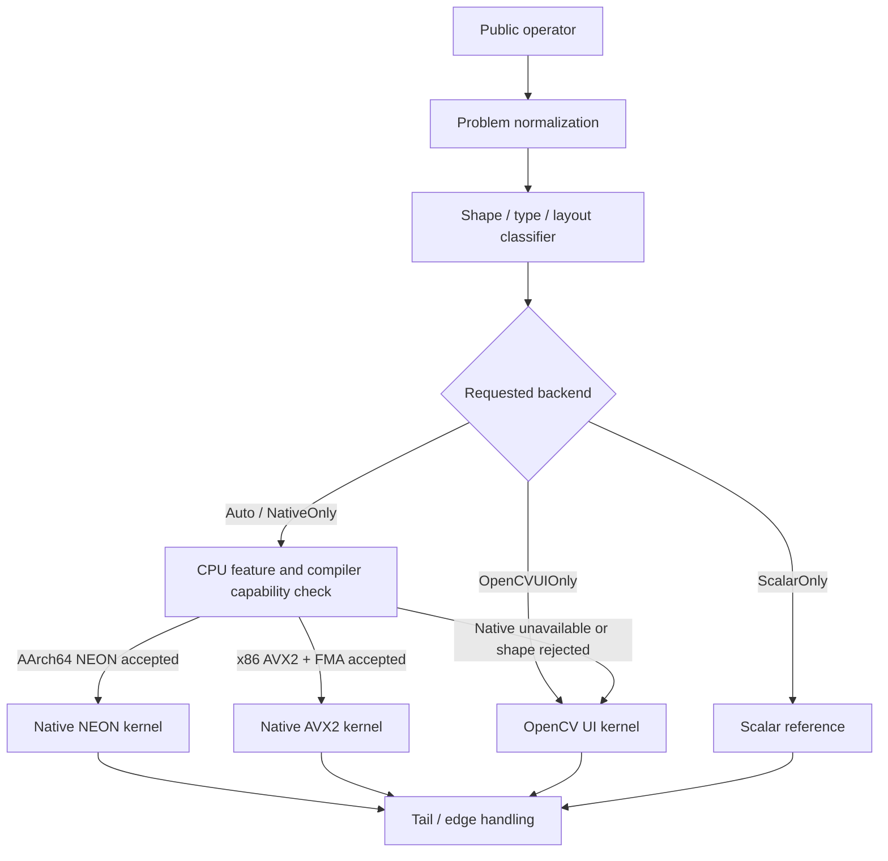

# cvh 计算密集型算子二阶段加速计划：OpenCV UI、原生 NEON 与原生 AVX2

> 状态：本地实现完成；Apple ARM 门禁已关闭，真实 x86/Linux/Windows 发布门禁待验证  
> 计划日期：2026-07-27  
> 最近更新：2026-07-27  
> 第一优先级：`cvh::gemm` / `cvh::gemm_pack_b`  
> 扩展范围：滤波、导数、金字塔、归约及其他经过 profiling 证明为计算瓶颈的 CPU 算子  
> 产品边界：保持纯 header-only，不引入 BLAS、LAPACK、IPP、OpenCL 或项目内必需 `.cpp`

## 0. 实施进度与实测结果

截至 2026-07-27，N2-0 至 N2-5 的代码均已落地，N2-6 的本机门禁已完成。
由于当前环境是 Apple AArch64，真实 x86/Linux/Windows 运行仍属于发布前外部门禁，
不能用交叉编译代替。

| 工作包 | 状态 | 已落地内容 | 尚未关闭 |
| --- | --- | --- | --- |
| N2-0 原生后端基础设施 | 完成 | native 编译开关、NEON/AVX2+FMA 能力检测、forced backend、实际 backend/tag 观测、UI-disabled fallback、独立 native 测试目标 | MSVC `/arch:AVX2` 与真实 Linux/Windows x86 运行 |
| N2-1 FP32 NN direct | Apple ARM 完成；x86 待实机 | NEON `8×12`、AVX2 `6×16`，edge/tail、行块多线程、function-target multiversion | AVX2 实机 correctness、性能和参数调优 |
| N2-2 native packing/blocking | Apple ARM 完成；x86 待实机 | 版本化 B panel、A panel/workspace、KC 累加、二维 tile scheduler、pack-once、one-shot break-even | 对齐 allocator 与 x86 MC/NC/KC 实机调参可继续细化 |
| N2-3 GEMV/NT/TN/TT | 完成 | N=1 multi-row dot、M=1 forced kernel、NEON `4×4`/AVX2 `4×2` NT multi-dot、TN/TT 按 tile 打包；raw 和 packed/broadcast batch 均不生成整张 transpose | M=1 未达门禁，仅保留 forced；NT 仅对白名单 shape 开启 |
| N2-4 FP16/INT8-dequant | Apple ARM 完成；x86 待实机 | FP16 扩展为 FP32 panel、AArch64 FP16 vector convert、AVX2 F16C、INT8 per-row scale 反量化 panel，统一复用 FP32 kernel | AVX2/F16C 实机收益 |
| N2-5 共享计算 kernel 试点 | 实现完成，默认未接纳 | FP32 continuous/no-mask `norm` 的 NEON/AVX2 L1/L2/Inf 与 diff kernel，FP64 累加、多 accumulator、NaN 合同测试 | Apple ARM 性能未稳定达到 `Auto` 门禁，保留 forced 验证 |
| N2-6 发布收尾 | 本机完成；跨平台待验证 | benchmark 元数据、ASan/UBSan 专项、UI 开/关全构建、ODR/install-tree/header-only、generic x86 与 AVX2/FMA/F16C 交叉编译 | 真实 x86/Linux/Windows 日期化报告 |

当前默认选择规则的关键部分是：

```text
Auto
  ├── Apple AArch64 NEON
  │   ├── FP32 NN general → direct；大 one-shot/pack-once → blocked packed
  │   ├── N=1 且 M>=16,K>=128 → native multi-row dot
  │   ├── NT 且 M>=8,N>=16,K>=192 → native multi-dot
  │   ├── FP16/INT8-dequant 且超过 break-even → FP32 native panel
  │   └── tiny、small-K、M=1、未达标 norm → OpenCV UI → scalar
  ├── x86 AVX2+FMA → 仅在 CVH_ENABLE_DIRECT_AVX2 开启后选择
  └── 其他平台/shape/type → OpenCV UI → scalar
```

`cvh::headers` 默认 `CVH_ENABLE_DIRECT_AVX2=0`；`cvh::headers_fast` 会启用它，
再由运行时能力和 shape 白名单决定是否自动选择 AVX2。`Avx2Only` 和
`NativeOnly` 只用于强制验证。`SmallKWide`
`256×32×256` 的 forced NEON 稳定回退约 `5%–8%`，继续留在 UI。

### 0.1 N2-2 FP32 packing/blocking（Apple ARM，Release，单线程）

| Case | UI median | NEON median | 相对 UI | 选择 |
| --- | ---: | ---: | ---: | --- |
| `128³` one-shot | 0.080664 ms | 0.048577 ms | `1.66x` | direct native |
| `128³` pack-once | 0.059455 ms | 0.041879 ms | `1.42x` | native panel |
| `32×512×64` one-shot | 0.031645 ms | 0.024682 ms | `1.28x` | direct native |
| `256³` one-shot | 0.496382 ms | 0.325195 ms | `1.53x` | blocked packed |
| `256³` pack-once | 0.512228 ms | 0.317709 ms | `1.61x` | native panel |

`GemmPackedB` 始终保留 canonical row-major 数据，同时增加版本化
`[N/NR tile][K][NR]` FP32 panel。UI/scalar、跨 backend fallback 和公共结构布局不受
编译宏影响。当前 NEON 参数为 `MR=8, NR=12, KC=192, MC=128, NC=192`；
AVX2 参数为 `MR=6, NR=16, KC=256, MC=120, NC=256`。

### 0.2 N2-3 布局与 GEMV 接纳结论

| Case | UI median | forced NEON median | 相对 UI | `Auto` 决策 |
| --- | ---: | ---: | ---: | --- |
| M=1：`1×257×17` | 0.000902 ms | 0.001092 ms | `0.83x` | 拒绝，仅 forced |
| N=1：`32×257×1` | 0.000994 ms | 0.000879 ms | `1.13x` | 接纳 |
| NT：`32×512×64` | 0.065267 ms | 0.041301 ms | `1.58x` | 接纳 |
| NT：`128³` | 0.088427 ms | 0.092814 ms | `0.95x` | 拒绝 |
| NT：`256³` | 0.855263 ms | 0.757070 ms | `1.13x` | 接纳 |

TN/TT 已覆盖二维和高维 broadcast batch。A 的转置访问在 A panel packing 中处理；
B 的普通/转置访问在 B panel packing 中处理；packed-B 的 batch panel 按广播索引直接
选择，均不创建完整 transpose Mat。

### 0.3 N2-4 FP16 与 INT8-dequant

以下倍数是相对本项目原先的 scalar/UI fallback，不是相对外部 BLAS：

| Case | 旧路径 median | native NEON median | 相对旧路径 |
| --- | ---: | ---: | ---: |
| FP16 `128³` one-shot | 1.544001 ms | 0.043009 ms | `35.90x` |
| FP16 `128³` pack-once | 1.560183 ms | 0.040096 ms | `38.91x` |
| FP16 `256³` one-shot | 13.982925 ms | 0.356290 ms | `39.25x` |
| FP16 `256³` pack-once | 13.295103 ms | 0.327473 ms | `40.60x` |
| INT8-dequant `128³` | 0.501560 ms | 0.047485 ms | `10.56x` |
| INT8-dequant `256³` | 5.198039 ms | 0.355172 ms | `14.64x` |

FP16 和 INT8 权重都转换为 FP32 panel，累加合同仍是 FP32；INT8 不量化 A，也未使用
会改变语义的 dot-product/VNNI 路径。

### 0.4 N2-5 归约试点结论

原生 NEON/AVX2 `norm` kernel 已实现且可强制测试，但 Apple ARM 配对数据没有稳定达到
`15% kernel-only / 10% end-to-end` 双门槛：相同 `640×480 CV_32FC1` L2 case
出现约 `0.98x–1.11x` 的波动，L1/Inf 和 diff 也无稳定优势。因此 `Auto` 对所有
native norm 保持关闭，默认继续使用 UI；这满足“完成一组共享归约 kernel 试点”，
但不把未达标候选伪装成已接纳优化。

### 0.5 已通过门禁与剩余门禁

- Apple AArch64、OpenCV UI enabled：完整 CTest `18/18`；
- Apple AArch64、OpenCV UI disabled：完整 CTest `15/15`；
- native 专项测试在 UI enabled/disabled 下均为 `14/14`，覆盖 forced/fallback、
  native panel、one-shot blocked、M/N/K tail、4 线程、GEMV、NT、TN/TT、
  batch broadcast、FP16、INT8-dequant 和 native norm；
- header-only/install-tree/多 TU ODR contract：`7/7`；
- GEMM/归约相关 ASan+UBSan：native `14/14`，Core 相关过滤集 `30` 项无 sanitizer
  错误；全量 Core sanitizer 另发现既有 `saturate_cast<unsigned int>(double)` 对负数
  转换的 UB，不属于本次改动；
- AppleClang generic x86_64 与 `-mavx2 -mfma -mf16c` 对象编译通过；generic 对象中
  AVX2 FMA 指令只存在于 function-target 隔离的 kernel；
- benchmark 已输出 backend、kernel、shape class、MR/NR/KC/MC/NC、pack A/B 和
  packing format；
- 未关闭：真实 x86 AVX2/F16C 运行和性能、Linux AArch64 GCC/Clang、
  Linux x86_64 ASan/UBSan、Windows MSVC `/arch:AVX2`。

## 1. 结论摘要

第一阶段已经证明，通用 OpenCV Universal Intrinsics（下文简称 OpenCV UI）
micro-kernel 能显著改善 cvh GEMM，但对方阵和 wide shape，当前代码仍无法充分控制：

- 架构相关的 MR/NR 寄存器分块；
- A/B panel 的物理布局和对齐；
- FMA 指令调度与 K 循环展开；
- 预取距离、cache blocking 和寄存器 spill；
- NEON lane-FMA 与 AVX2 broadcast-FMA 等架构特有指令形态。

二阶段采用三层 kernel 体系：

```text
Scalar reference
    └── OpenCV UI portable SIMD
            ├── Native AArch64 NEON
            └── Native x86 AVX2 + FMA
```

GEMM 必须同时保留以下实现：

1. scalar：正确性基准和最终 fallback；
2. OpenCV UI：跨平台 SIMD 基线、未覆盖 shape 的默认 SIMD fallback；
3. 原生 AArch64 NEON：显式寄存器分块、lane-FMA、预取和 NEON 专用 packing；
4. 原生 x86 AVX2/FMA：显式 YMM 寄存器分块、broadcast-FMA、预取和 AVX2 专用 packing。

原生实现不是简单地把 `cv::v_*` 改写成 intrinsic。只有当架构专用调度、
packing 或指令选择能稳定超过 UI 路径时，才进入默认 `Auto` 分发。

二阶段的核心依赖顺序是：

```text
原生后端能力检测与强制分发
    → GEMM benchmark / 汇编 / hardware-counter 基线
    → 后端感知的 packed panel 与 cache blocking
    → NEON / AVX2 FP32 micro-kernel
    → GEMV、NT、tail、FP16、INT8-dequant
    → 其他计算密集型算子
```

## 2. 当前基线与问题定义

### 2.1 P1 当前性能

Apple ARM、Release、单线程、FP32 NN、端到端 stable benchmark：

| Shape `M×K×N` | cvh P1 | 默认 OpenCV | 当前差距 |
| --- | ---: | ---: | ---: |
| `128×128×128` | 0.057001 ms | 0.003292 ms | cvh 慢 17.32x |
| `32×512×64` | 0.030841 ms | 0.110484 ms | cvh 快 3.58x |
| `256×32×256` | 0.045179 ms | 0.004988 ms | cvh 慢 9.06x |
| `256×256×256` | 0.488052 ms | 0.020474 ms | cvh 慢 23.84x |

默认 OpenCV 在 Apple 平台可能进入 Accelerate/LAPACK，因此上述差距不能全部归因于
OpenCV UI 或原生 NEON kernel。已有 CPU-only upstream 数据关闭
LAPACK、IPP、KleidiCV、Carotene 和 OpenCL 后，cvh 当前在已测 shape 上快约
`2.83x–4.93x`。

二阶段仍然需要优化方阵，因为：

- `128³` 和 `256³` 是 cache blocking 与寄存器复用的代表；
- 当前 NN direct kernel 仍会跨多个 M block 重复读取整张 B；
- `gemm_pack_b()` 仍是普通 row-major copy，没有形成 micro-kernel panel；
- 原生 kernel 能进一步减少 broadcast、load 和 loop-control 指令；
- 即使不追平外部 BLAS，也应逼近当前硬件可达到的 header-only 单核上限。

### 2.2 OpenCV UI 与原生 intrinsic 的关系

在 AArch64 上，OpenCV UI 最终也会生成 NEON 指令；在启用 AVX2 的 x86 构建中，
OpenCV UI 也可生成 AVX2 指令。二阶段增加原生实现的价值不是“首次使用 SIMD”，而是：

| 能力 | OpenCV UI | 原生 NEON/AVX2 |
| --- | --- | --- |
| 跨 ISA 复用 | 强 | 弱 |
| 固定寄存器预算 | 间接 | 可显式设计 |
| lane-FMA / broadcast-FMA | 依赖 UI 映射和编译器 | 直接选择 |
| K unroll 和软件流水 | 可做，但表达受抽象限制 | 可针对流水线安排 |
| 架构专用 MR/NR | 不宜过度分叉 | 可分别调优 |
| prefetch 距离 | 通用 | 可按平台校准 |
| 汇编稳定性 | 较依赖 UI/编译器版本 | 更容易做指令级 gate |
| 维护成本 | 低 | 高 |

因此 UI 始终保留，原生 kernel 只覆盖收益足够高的热点组合。

## 3. 目标与非目标

### 3.1 必须达成

1. GEMM 具备 scalar、OpenCV UI、原生 NEON、原生 AVX2/FMA 四级实现。
2. 每次调用能报告实际 backend、kernel、shape class、packing format。
3. `Auto` 只选择当前 CPU 确实支持且通过 shape gate 的原生 kernel。
4. 强制 UI、强制 NEON、强制 AVX2 和强制 scalar 可用于测试与 benchmark。
5. 保持 `cvh::headers` 与 `cvh::headers_fast` 纯 header-only。
6. 所有原生路径都有 UI fallback 和 scalar fallback。
7. 不扩大既有数值容差，不改变 FP32 accumulation 合同。
8. ARM 与真实 x86 都完成 correctness 和 performance gate 后，原生路径才能默认开启。

### 3.2 本阶段不做

- 不通过链接 Accelerate、BLAS、LAPACK 或 oneDNN 追赶默认 OpenCV；
- 不新增 FP32 activation 量化语义来使用 INT8 dot-product；
- 不在首批支持 AVX-512、SVE、RVV、AMX 或 SME；
- 不为所有 UI 算子机械复制一份 NEON 和 AVX2 实现；
- 不引入项目自有的通用 SIMD 类型封装；
- 不改变公开 GEMM 的 alpha/beta/C 合同；
- 不把运行时 autotune 放进用户进程。

## 4. 二阶段总体架构



分发分为两部分：

- `KernelBackend`：选择 scalar、UI、NEON 或 AVX2；
- `KernelId`：选择 direct、packed、GEMV、NT multi-dot、narrow-N 等算法。

建议的数据结构：

```cpp
enum class KernelBackend
{
    Scalar,
    OpenCVUI,
    Neon,
    Avx2,
};

enum class NativeKernelId
{
    Scalar,
    NNDirect,
    NNPacked,
    NNDotN1,
    NTSmallMultiDot,
    NTPacked,
};

struct KernelPlan
{
    KernelBackend backend;
    NativeKernelId kernel;
    ShapeClass shape;
    int mr;
    int nr;
    int kc;
    int mc;
    int nc;
    bool pack_a;
    bool pack_b;
};
```

不要把 backend 编进大量组合式 `KernelId`，否则类型、布局、shape 和 ISA 的笛卡尔积会
快速失控。

## 5. 编译开关、运行时能力与 header-only 约束

### 5.1 编译开关

直接架构内核由一个 fast-profile 默认值和两个 ISA 细分开关控制：

```text
CVH_ENABLE_DIRECT_INTRINSICS
CVH_ENABLE_DIRECT_NEON
CVH_ENABLE_DIRECT_AVX2
```

建议产品行为：

| CMake target | 默认行为 |
| --- | --- |
| `cvh::headers` | scalar + OpenCV UI，不默认启用原生 kernel |
| `cvh::headers_fast` | 启用可用的原生 kernel 和运行时分发 |
| 可选 `cvh::headers_avx2` | 面向明确要求 AVX2/FMA 的固定部署环境 |

`CVH_ENABLE_OPENCV_INTRIN=0` 完全禁用 UI。直接 NEON/AVX2 内核由上述独立开关
控制，不依赖 UI 类型，也不产生编译型 backend。

### 5.2 AArch64 NEON

首个 ARM 目标限定为 AArch64：

- AArch64 ABI 保证 Advanced SIMD，可直接把 NEON 视为可用；
- 使用 `<arm_neon.h>`；
- 使用 `vfmaq_*` 需要 AArch64 FMA；
- 32-bit ARM/ARMv7 的 HWCAP 探测单独延期，不和首批混合。

编译条件必须同时检查架构和 intrinsic 可用性，不能只手工定义 `CV_NEON=1`。

### 5.3 x86 AVX2/FMA

AVX2 原生 GEMM 以 `AVX2 + FMA + OS YMM state` 为完整能力条件。

GCC/Clang 首选同一 header 内的 function multiversion：

```cpp
__attribute__((target("avx2,fma")))
inline void kernel_avx2(...);
```

运行时用编译器 CPU feature builtin，或等价的 CPUID + XGETBV 检查。能力判断需要缓存，
不能在每个 tile 上重复执行。

MSVC 没有完全等价的通用 per-function target attribute。首版采用：

- 固定 `/arch:AVX2` 的 `headers_avx2` 构建；或
- UI fallback，直到独立的 MSVC header-only multiversion 方案通过验证。

禁止仅根据 `__AVX2__` 在通用二进制中调用 AVX2 kernel，也禁止让不支持 AVX2 的 CPU
执行到相关函数。

### 5.4 ODR 和 ABI

所有原生函数必须：

- 位于 `detail` 命名空间；
- 使用 `inline`；
- 不把 `float32x4_t`、`__m256` 等类型暴露到公共 API；
- 不因不同 TU 的编译参数改变公共类型布局；
- 公共 `GemmPackedB` 的字段在 UI/NEON/AVX2 构建中保持一致；
- 多 TU 混合编译标志必须由 CMake target contract 检查或明确禁止。

## 6. 分发控制与可观测性

现有 `DispatchMode` 只有 `Auto/ScalarOnly`，`DispatchTag` 只有
`Scalar/OpenCVUI`。二阶段建议增加：

```text
DispatchMode:
  Auto
  ScalarOnly
  OpenCVUIOnly
  NativeOnly
  NeonOnly
  Avx2Only

DispatchTag:
  Scalar
  OpenCVUI
  NativeNEON
  NativeAVX2
```

强制一个当前平台不支持的 backend 时，测试入口应返回清晰的“不支持”，不能静默伪装成
已经执行该 backend。公共 `Auto` 路径仍允许正常 fallback。

benchmark 至少记录：

```text
backend
kernel_id
shape_class
mr/nr/kc/mc/nc
packing_format
cpu_feature_set
compiler
```

## 7. GEMM 原生 micro-kernel 设计

以下 MR/NR 是首轮候选，不是未经 benchmark 就写死的最终参数。

### 7.1 AArch64 NEON FP32 NN

NEON 使用 128-bit 向量，每个向量包含 4 个 FP32。AArch64 有 32 个 SIMD/FP 寄存器，
可采用比当前 UI `4×2VL` 更大的寄存器 tile。

候选内核：

| Kernel | 输出 tile | accumulator | 适用场景 |
| --- | ---: | ---: | --- |
| `neon_nn_8x12` | 8 行 × 12 列 | 24 个向量 | packed 通用主内核 |
| `neon_nn_8x8` | 8 行 × 8 列 | 16 个向量 | 寄存器压力较低的备选 |
| `neon_nn_4x12` | 4 行 × 12 列 | 12 个向量 | small-M / M tail |
| `neon_nn_4x1_dot` | 4 行 × 1 列 | 多路 K 累加 | N=1 GEMV |

主内核优先探索：

- `vld1q_f32` 连续加载 packed B；
- `vfmaq_laneq_f32` 从 packed A 向量按 lane 广播并 FMA；
- K 循环展开 4 或 8 次；
- 双组 B load 与 accumulator 更新形成软件流水；
- 对下一段 A/B panel 使用 `__builtin_prefetch`；
- M/N tail 使用小 MR kernel，不在主循环中引入掩码分支。

`8×12` 必须通过汇编确认没有 accumulator spill。若编译器因 inline、地址计算或
prefetch 额外占用寄存器导致 spill，则回退到 `8×8` 或 `4×12`。

### 7.2 x86 AVX2/FMA FP32 NN

AVX2 使用 256-bit YMM，每个向量包含 8 个 FP32，但只有 16 个 YMM 寄存器。

候选内核：

| Kernel | 输出 tile | accumulator | 适用场景 |
| --- | ---: | ---: | --- |
| `avx2_nn_6x16` | 6 行 × 16 列 | 12 个 YMM | packed 通用主内核 |
| `avx2_nn_4x24` | 4 行 × 24 列 | 12 个 YMM | small-M / wide-N 候选 |
| `avx2_nn_8x8` | 8 行 × 8 列 | 8 个 YMM | narrow-N / 低寄存器压力 |
| `avx2_nn_4x1_dot` | 4 行 × 1 列 | 多路 K 累加 | N=1 GEMV |

主内核优先探索：

- `_mm256_load_ps` 或对齐可证明时的等价 load；
- `_mm256_broadcast_ss` 加 `_mm256_fmadd_ps`；
- K 循环展开 4；
- 地址增量替代内层乘法；
- A/B 下一 cache line 预取；
- 函数返回边界按需要执行 `_mm256_zeroupper()`，避免 AVX/SSE transition penalty；
- 对不可证明对齐的公共 Mat 使用 unaligned load，packing buffer 保证 32/64 字节对齐。

`6×16` 使用 12 个 accumulator，剩余寄存器用于 B load、A broadcast 和临时地址。
任何进一步扩大 tile 的方案都必须先证明没有 spill。

### 7.3 direct 与 packed 分流

原生 kernel 不应让所有 shape 强制 packing：

| Shape | 默认候选 |
| --- | --- |
| tiny / `K<=4` | scalar |
| `M=1` | UI 或 native `1×NR` direct |
| `N=1` | native multi-row dot |
| small-M | direct native/UI，避免 A packing |
| narrow-N | 小 NR native edge |
| small-K wide-N | direct native，或只 pack B |
| general / square | pack A + pack B + blocked native |
| pack-once B | 复用 backend-specific B panel |

break-even 阈值必须分别在 NEON 和 AVX2 上测量，不能共享一个固定 `M*N*K` 门槛。

## 8. Packing 与 cache blocking

### 8.1 Panel 语义

二阶段的性能上限主要取决于 packing，而不是只替换 FMA intrinsic。

B panel 以 micro-kernel 的 NR 为物理宽度：

```text
NEON:  [KC][12] or [KC][8]
AVX2:  [KC][16] or [KC][8]
UI:    保留 canonical UI panel / row-major fallback
```

A panel 以 MR 为物理高度：

```text
NEON:  [KC][8] or [KC][4]
AVX2:  [KC][6] or [KC][4]
```

pack 时补零 MR/NR tail，使主内核内部无越界和 tail 分支。C 的边缘 tile写入临时栈缓冲，
再复制有效区域，或调用专用 edge kernel；两种方案用 benchmark 决定。

### 8.2 `GemmPackedB` 兼容

落地后的 `GemmPackedB` 继续保留 FP32/FP16 canonical row-major vector，并并存一份
可选的 native FP32 panel。兼容策略如下：

- 保留现有 canonical 数据；
- 已增加版本化、无条件存在的 native panel 元数据；
- 已增加 backend、format version、NR、KC、panel step、原始 K/N；
- native panel 与 canonical 数据同时存在，确保 forced-UI 和跨 backend fallback；
- 不允许编译宏改变 `GemmPackedB` 的布局；
- pack-once 对象在并发 GEMM 中只读，不在计算过程中无锁懒写。

`gemm_pack_b()` 会按当前可用/强制 native backend 生成一个只读 panel；UI/Scalar
模式只生成 canonical 数据。native panel 对所有 batch 分别生成，计算时按广播索引
选取，不进行无锁懒写。

### 8.3 初始 blocking 搜索空间

以下只作为 offline tuning 的起点：

| Backend | MR | NR | KC 候选 | MC 候选 | NC 候选 |
| --- | ---: | ---: | ---: | ---: | ---: |
| NEON | 8 | 12 | 128/192/256 | 64/128/192 | 96/192/384 |
| AVX2 | 6 | 16 | 128/256/384 | 60/120/240 | 128/256/512 |
| OpenCV UI | 4 | `2VL` | 128/256 | 64/128 | `16VL–64VL` |

选择依据：

- packed A 工作集优先驻留 L1；
- packed B panel 与多个 M block 复用；
- C tile 不导致 L1/L2 抖动；
- 小矩阵不因 blocking 循环和 packing 回退；
- 参数按 backend 建表，不在运行时做成本高昂的搜索。

## 9. GEMM 布局、类型和边缘路径

### 9.1 FP32 NN

交付顺序：

1. direct 主 kernel；
2. packed-B；
3. packed-A + packed-B；
4. MC/NC/KC blocking；
5. M/N/K tail；
6. 多线程 tile scheduler。

### 9.2 FP32 NT

NT 分两类：

- 小尺寸或 one-shot：NEON/AVX2 multi-dot，复用 A load；
- 大尺寸或 B 复用：pack 时转成对应 backend 的 NN panel，复用 NN 主内核。

候选 direct kernel：

| Backend | 候选 |
| --- | --- |
| NEON | `4×4` multi-dot，沿 K 向量化 |
| AVX2 | `4×4` 或 `4×2` multi-dot，沿 K 用双 accumulator |

每个输出分别做横向归约的旧路径只作为 UI fallback。

### 9.3 TN / TT

禁止为了 native kernel 先生成完整 transpose Mat。A 的转置访问在 MC×KC packing 时处理，
B 的 NT/T 访问在 NC×KC packing 时处理。

### 9.4 FP16 权重

保持 FP32 accumulation：

- NEON：FP16 load 后扩展为 FP32，再进入 FP32 FMA；
- AVX2：具备 F16C 时使用 `_mm256_cvtph_ps`；
- 没有硬件转换时回退 UI 或 scalar；
- FP16 panel 可选择预扩展为 FP32，以空间换重复计算速度，必须报告 pack 成本和内存放大。

### 9.5 INT8 权重

当前合同是 `FP32 A × INT8 B × per-row scale`。二阶段不量化 A，因此：

- 不使用 VNNI、AVX2 `maddubs` 或 NEON dot-product 改变计算语义；
- packing 时原生向量化地扩展 INT8、转换 FP32、乘 scale；
- 生成 FP32 native panel，复用 FP32 kernel；
- one-shot 小矩阵保留 scalar/UI fallback，避免反量化 packing 成本。

## 10. 多线程策略

GEMM 只允许一个外层并行层：

```text
batch parallel
or
MC/NC tile parallel
or
single-matrix row-block parallel
```

禁止三者嵌套。计划器根据 batch 数、单矩阵 FLOP、M/N tile 数选择一种策略。

优先规则：

1. batch 多且单矩阵小：batch parallel；
2. 单个大矩阵：二维 MC×NC tile parallel；
3. N 很窄：按 M/MC 切分；
4. pack-once B：所有 worker 共享只读 B panel；
5. 每个 worker 使用独立、cache-line 对齐的 A pack workspace；
6. 不让多个线程频繁写同一 cache line 的 C。

单线程 kernel gate 必须先关闭，多线程不能掩盖低效 micro-kernel。

## 11. 其他计算密集型算子的原生扩展

GEMM 是强制三后端实现。其他算子只有满足以下任一条件才进入原生候选：

- arithmetic intensity 高，UI 版本被指令吞吐限制；
- 与 upstream CPU-only 仍稳定落后超过 `1.5x`；
- UI 汇编存在明显 spill、重复转换、低效 gather 或不能表达的 shuffle；
- 该 kernel 被多个公共算子共享。

### 11.1 第一梯队：卷积与共享滤波底座

| 算子族 | NEON 重点 | AVX2 重点 | 复用关系 |
| --- | --- | --- | --- |
| `filter2D` | 多行累加、lane multiply、widen | 8-lane FMA、多输出并行 | Laplacian/通用卷积 |
| `sepFilter2D` | row/column 小核展开 | 双行/多行并行、FMA | Gaussian/Sobel/Scharr |
| `GaussianBlur` | 固定核系数、widen/pack | 固定 3/5/7-tap 展开 | pyramid/filter |
| `Sobel/Scharr/Laplacian` | 固定 stencil | 固定 stencil | filter engine |
| `pyrDown/pyrUp` | 5-tap、交错 load/store | 5-tap、lane shuffle | buildPyramid |

这些算子先优化共享 row/column kernel，不为每个公共 API 复制整套 intrinsic。

### 11.2 第二梯队：归约与统计

候选包括：

- `norm` L1/L2/Inf；
- `meanStdDev`；
- `reduce` sum/min/max；
- `minMaxLoc`。

原生价值主要来自：

- 多 accumulator 降低依赖链；
- widening 与转换的精确控制；
- AVX2 horizontal reduction 和 NEON pairwise reduction；
- mask selected-run 的批量处理。

归约仍必须保持既有溢出、NaN、精度和 accumulator 类型合同。

### 11.3 第三梯队：数学函数

`exp/log/pow` 只有在以下条件满足后才进入原生实现：

- 使用与当前 UI 路径相同或更严格的特殊值语义；
- 多项式近似误差不扩大公共 tolerance；
- 原生系数计算稳定快于 vendored UI math；
- ARM/x86 分别有独立误差扫描和性能数据。

数学函数不与 GEMM 首批并行推进，避免同时承担数值算法与 ISA 调优风险。

### 11.4 条件候选：几何采样

`resize/remap/warpAffine/warpPerspective` 常受 gather、边界分支和内存延迟限制。
只有 hardware counter 证明 compute/shuffle 是主要瓶颈时才增加原生 kernel：

- AVX2 可评估 gather、pack 和坐标转换；
- NEON 可评估 table lookup、interleave/deinterleave；
- border-heavy case 不得因 interior native kernel 回退。

## 12. 文件和模块落地

已新增：

```text
include/cvh/core/detail/cpu_features.hpp
include/cvh/core/detail/native_intrinsics.hpp
include/cvh/core/detail/gemm_dispatch.hpp
include/cvh/core/detail/gemm_neon.hpp
include/cvh/core/detail/gemm_avx2.hpp
include/cvh/core/detail/gemm_pack.hpp
include/cvh/core/detail/gemm_blocked.hpp
include/cvh/core/detail/reduce_neon.hpp
include/cvh/core/detail/reduce_avx2.hpp
include/cvh/core/detail/reduce_native.hpp
```

后续共享算子采用同样模式：

```text
foo_ui.hpp
foo_neon.hpp
foo_avx2.hpp
foo_dispatch.hpp
```

约束：

- 架构 header 自身必须有完整预处理保护；
- 非 ARM TU 不解析 NEON 类型，非 x86 TU 不解析 AVX2 类型；
- 公共实现只依赖统一 plan/backend 枚举，不出现架构类型；
- 不建立新的通用 SIMD wrapper；原生文件直接使用平台 intrinsic；
- backend-specific helper 只在至少两个同类 kernel 复用时抽取。

## 13. Benchmark 与性能诊断

### 13.1 GEMM shape 矩阵

每个 backend 至少覆盖：

| 类别 | 代表 shape |
| --- | --- |
| tiny | `2×3×4`、`4×4×4` |
| M=1 | `1×257×17`、`1×1024×256` |
| N=1 | `32×257×1`、`256×1024×1` |
| small-M | `3×257×11`、`4×512×128` |
| narrow-N | `17×257×5`、`128×512×8` |
| small-K wide | `256×32×256`、`512×16×512` |
| square | `32³`、`64³`、`128³`、`256³`、`512³` |
| rectangular | `32×512×64`、`512×64×128`、`64×128×1024` |
| tail | MR/NR/KC 前后各 `-1/+1` |
| batch | broadcast B、独立 B、small batch、large batch |

每个 shape 分别测：

- public end-to-end；
- allocation excluded；
- pack B only；
- pack A only；
- pack-once；
- kernel-only；
- NN、NT；
- threads `1/2/4/最大可用`。

### 13.2 强制 backend 对照

同一二进制中优先提供：

```text
scalar
opencv_ui
native_neon
native_avx2
auto
```

如果平台无法在同一二进制中包含所有 backend，则生成独立可追溯构建，并记录编译参数。

### 13.3 核心指标

GEMM 必须报告：

- ms；
- GFLOP/s，按 `2*M*N*K`；
- cycles/FMA 或 cycles/output；
- packing 占端到端比例；
- L1D/L2/LLC miss；
- instructions、IPC、branch miss；
- 实际 backend/kernel/block 参数；
- checksum 和数值误差摘要。

汇编检查至少确认：

- 主循环确实使用预期 FMA；
- 没有 accumulator stack spill；
- K 循环没有意外除法或乘法地址计算；
- load/broadcast 数量符合设计；
- AVX2 路径没有不必要的 AVX/SSE transition。

## 14. 性能门禁

### 14.1 原生 kernel 接纳门槛

原生实现进入 `Auto` 必须同时满足：

1. 目标 shape kernel-only 相对 UI 稳定提升至少 `15%`；
2. public end-to-end 相对 UI 稳定提升至少 `10%`；
3. 同 backend 主要 shape 不得稳定回退超过 `5%`；
4. packing 后的 break-even 范围可由分类器明确隔离；
5. code size、编译时间和维护复杂度与收益相称；
6. 真实目标硬件完成，而不是只有交叉编译。

低于门槛的原生实现可以保留在 benchmark 实验分支，但不能默认分发。

### 14.2 GEMM 阶段目标

Apple ARM 单线程首轮目标：

| Shape | P1 当前 | 二阶段接受目标 | Stretch |
| --- | ---: | ---: | ---: |
| `128×128×128` | 0.057001 ms | `<=0.045 ms` | `<=0.040 ms` |
| `32×512×64` | 0.030841 ms | 不回退超过 5% | `<=0.027 ms` |
| `256×32×256` | 0.045179 ms | `<=0.040 ms` | `<=0.036 ms` |
| `256×256×256` | 0.488052 ms | `<=0.390 ms` | `<=0.340 ms` |

x86 AVX2 在真实基线建立前不写绝对毫秒目标，首轮使用：

- native AVX2 kernel-only 相对同机 UI `>=1.15x`；
- end-to-end `>=1.10x`；
- 对 upstream CPU-only 保持或扩大优势；
- 不用 Apple ARM 参数替代 x86 tuning。

默认 OpenCV 的 Accelerate/BLAS 结果继续作为外部库上限，不是原生 intrinsic 合入门禁。

## 15. 正确性与跨平台门禁

### 15.1 GEMM 正确性

每个 native kernel 必须覆盖：

- M/N/K 为 0 或最小合法值；
- MR/NR/K-unroll 的整除、`-1`、`+1`；
- 非有限值、正负零、denormal 的既有合同；
- 大小值混合和 cancellation；
- NN、NT、TN、TT；
- packed 与 unpacked；
- FP32、FP16、INT8-dequant；
- batch broadcast；
- 1/2/4 线程一致性；
- forced backend 和 fallback 可观测性。

FP32 允许 FMA 和归约顺序造成的合理差异，但必须使用统一 absolute-or-relative oracle，
不能为原生 backend 单独放宽 tolerance。

### 15.2 构建矩阵

| 平台 | 必需构建 |
| --- | --- |
| Apple AArch64 | UI、native NEON、UI-disabled、ASan/UBSan |
| Linux AArch64 | GCC/Clang native NEON correctness，进入默认前必须完成 |
| Linux x86_64 | generic UI、`x86-64-v3`、forced AVX2/FMA、ASan/UBSan |
| Windows x86_64 | MSVC generic UI；固定 `/arch:AVX2` 作为二阶段后续 gate |
| AppleClang cross-x86 | SSE2/AVX2/FMA compile gate，不替代真实 x86 运行 |

### 15.3 Header-only gate

- include-only smoke；
- 公共 header compile；
- 多 TU ODR；
- install-tree consumer；
- `cvh::headers` 和 `cvh::headers_fast`；
- UI-disabled fallback；
- 非目标架构不能解析目标 intrinsic；
- `git diff --check`；
- 完整 Core/Imgproc CTest。

## 16. 分阶段实施

### N2-0：原生 backend 基础设施

交付：

- `KernelBackend`、扩展后的 `DispatchMode/DispatchTag`；
- AArch64 NEON 和 x86 AVX2/FMA capability；
- forced backend 测试接口；
- native compile guards；
- benchmark 输出 backend 和 CPU feature；
- ODR、非法指令和 fallback smoke。

退出条件：

- UI 和 scalar 行为不变；
- forced unsupported backend 可诊断；
- generic x86 不会执行 AVX2；
- 多 TU 没有宏导致的定义差异。

### N2-1：FP32 NN direct 原生 kernel

交付：

- NEON `8×12/8×8/4×12` 候选；
- AVX2 `6×16/8×8/4×24` 候选；
- edge kernel；
- small-M、small-K 和 direct shape 分类；
- kernel-only benchmark 与汇编报告。

退出条件：

- 至少一个 NEON 和一个 AVX2 主 kernel 达到 `15%` kernel-only gate；
- 没有 spill；
- 主要 direct shape 无超过 5% 回退。

### N2-2：原生 packing 与 blocked GEMM

交付：

- 对齐 workspace；
- A/B native panel；
- `GemmPackedB` 兼容扩展；
- MC/NC/KC blocking；
- pack-once 复用；
- 大方阵 tile scheduler。

退出条件：

- `128³/256³` 达到接受目标或记录明确硬件上限；
- pack-once 明显区别于普通 row-major copy；
- one-shot break-even 清晰且自动回退。

### N2-3：GEMV、NT 与转置布局

交付：

- N=1 multi-row dot；
- M=1 direct；
- NT small multi-dot；
- large NT canonical pack；
- TN/TT tile packing，无整张 transpose。

退出条件：

- P1 已领先的 skinny/GEMV shape 不回退；
- 所有布局和 tail 通过 native/UI/scalar 对照。

### N2-4：FP16 与 INT8-dequant

交付：

- NEON FP16 expand；
- AVX2 F16C expand；
- native INT8-to-FP32 dequant packing；
- type-specific break-even 和内存成本报告。

退出条件：

- FP32 accumulation 合同不变；
- one-shot 小 shape 不因 packing 退化；
- 未支持 feature 明确回退。

### N2-5：其他计算密集型算子

按 profiling 依次推进：

1. filter/separable/Gaussian/Sobel/Laplacian/pyramid 共享 kernel；
2. norm/meanStdDev/reduce；
3. math functions；
4. 证明确有收益的 geometry sampling。

每个算子独立通过 `15% kernel-only / 10% end-to-end / 5% no-regression` 门禁，
不能因为 GEMM 成功而批量默认开启原生 backend。

### N2-6：发布收尾

交付：

- Apple ARM 与真实 x86 日期化报告；
- 默认 OpenCV、CPU-only OpenCV、UI、native、scalar 五类对照；
- 全量 correctness、sanitizer、ODR、install-tree；
- 默认分发白名单；
- 未达标 kernel 的实验/删除决策；
- 文档和 benchmark schema 固化。

## 17. 风险与控制

| 风险 | 表现 | 控制 |
| --- | --- | --- |
| 原生代码分叉失控 | NEON/AVX2 修复不同步 | 共享 problem/plan/packing 语义；架构文件只含最内层 kernel |
| 非法指令 | generic x86 误入 AVX2 | AVX2+FMA+OS state 检测；forced unsupported 测试 |
| 寄存器 spill | 大 MR×NR 反而变慢 | 汇编 gate；保留小 tile 候选 |
| packing 拖慢 | small/one-shot 回退 | backend 独立 break-even；direct fallback |
| 数值差异 | FMA 改变低位 | 统一 abs/rel oracle，不扩大合同 |
| 公共布局不兼容 | `GemmPackedB` 宏相关 | 字段无条件存在、格式版本化、保留 canonical 数据 |
| Header-only 代码膨胀 | 编译时间和 I-cache 上升 | 只实例化接受的 type/layout；不模板化公共分发 |
| ODR 风险 | TU 编译标志不一致 | CMake target contract、多 TU smoke、公共 ABI 无 ISA 类型 |
| Apple-only tuning | x86 无收益或回退 | 参数分表；真实 x86 是默认开启前硬门禁 |
| 把 BLAS 当 intrinsic 目标 | 不现实的绝对倍数 | 同时报告 default 和 CPU-only upstream |
| prefetch 负收益 | 小矩阵污染 cache | 只在达到 KC/NC 阈值后启用，按平台测量 |
| AVX2 降频 | 宽向量收益不稳定 | 长短 workload 分开测；保留 UI/SSE fallback |

## 18. 停止条件与回退顺序

某个 native kernel 满足以下任一条件时，不进入默认 `Auto`：

1. kernel-only 相对 UI 提升小于 15%；
2. public end-to-end 提升小于 10%；
3. 无法用 shape/backend 分类隔离超过 5% 的回退；
4. 需要扩大数值 tolerance；
5. 真实 ARM 或 x86 运行未验证；
6. 汇编出现稳定 spill 或异常指令膨胀；
7. header-only/ODR/ABI 无法保持；
8. 维护成本显著高于实际收益。

固定回退顺序：

```text
native packed kernel
    → native direct/edge kernel
    → OpenCV UI packed/direct kernel
    → existing OpenCV UI row/dot kernel
    → scalar reference
```

## 19. 完成定义

二阶段完成时必须同时满足：

- GEMM 的 scalar、OpenCV UI、原生 NEON、原生 AVX2/FMA 实现均存在且可强制测试；
- `Auto` 能按 CPU、shape、布局、类型和 packing 状态选择 backend；
- FP32 NN 有 native direct 与 blocked packed 两级 kernel；
- GEMV、NT、TN/TT 和 tail 有明确 native 或 UI fallback；
- FP16 与 INT8-dequant 不改变数值合同；
- `GemmPackedB` 真正包含可复用 panel，且保持兼容；
- benchmark 能拆分 allocation、packing、kernel 和 public end-to-end；
- Apple ARM 与真实 x86 correctness/performance 均关闭；
- CPU-only upstream 优势不丢失，默认 upstream/BLAS 差距被正确归因；
- 至少一组共享滤波或归约 kernel 完成 NEON/AVX2 试点；
- 所有未默认启用的原生候选都有数据和明确原因。

当前核对结果：

| 完成项 | 当前状态 |
| --- | --- |
| 四级 GEMM 实现与 forced 测试 | 已完成 |
| CPU/shape/layout/type/packing 分发 | 已完成 |
| FP32 direct + blocked packed | 已完成 |
| GEMV、NT、TN/TT、tail、batch broadcast | 已完成 |
| FP16、INT8-dequant 数值合同 | 已完成 |
| 版本化、可复用 `GemmPackedB` panel | 已完成 |
| benchmark 分项和 plan 元数据 | 已完成；hardware counter 仍需平台工具补充 |
| Apple ARM correctness/performance | 已完成 |
| 共享归约 kernel NEON/AVX2 试点 | 已完成；未达性能门禁，保持 forced-only |
| 真实 x86/Linux/Windows correctness/performance | 未完成，是发布状态尚未关闭的唯一平台类硬门禁 |

## 20. 参考文件

- [`include/cvh/core/detail/cpu_features.hpp`](../include/cvh/core/detail/cpu_features.hpp)
- [`include/cvh/core/detail/native_intrinsics.hpp`](../include/cvh/core/detail/native_intrinsics.hpp)
- [`include/cvh/core/detail/gemm_dispatch.hpp`](../include/cvh/core/detail/gemm_dispatch.hpp)
- [`include/cvh/core/detail/gemm_ui.hpp`](../include/cvh/core/detail/gemm_ui.hpp)
- [`include/cvh/core/detail/gemm_neon.hpp`](../include/cvh/core/detail/gemm_neon.hpp)
- [`include/cvh/core/detail/gemm_avx2.hpp`](../include/cvh/core/detail/gemm_avx2.hpp)
- [`include/cvh/core/detail/gemm_pack.hpp`](../include/cvh/core/detail/gemm_pack.hpp)
- [`include/cvh/core/detail/gemm_blocked.hpp`](../include/cvh/core/detail/gemm_blocked.hpp)
- [`include/cvh/core/detail/gemm_impl.hpp`](../include/cvh/core/detail/gemm_impl.hpp)
- [`include/cvh/core/detail/reduce_native.hpp`](../include/cvh/core/detail/reduce_native.hpp)
- [`include/cvh/core/detail/reduce_neon.hpp`](../include/cvh/core/detail/reduce_neon.hpp)
- [`include/cvh/core/detail/reduce_avx2.hpp`](../include/cvh/core/detail/reduce_avx2.hpp)
- [`include/cvh/core/detail/dispatch_control.h`](../include/cvh/core/detail/dispatch_control.h)
- [`include/cvh/core/simd/opencv_ui.h`](../include/cvh/core/simd/opencv_ui.h)
- [`doc/mat-gemm-opencv-ui-microkernel-acceleration-plan.md`](mat-gemm-opencv-ui-microkernel-acceleration-plan.md)
- [`doc/opencv-ui-kernel-migration-checklist.md`](opencv-ui-kernel-migration-checklist.md)
- [`doc/x86-correctness-hardening-plan.md`](x86-correctness-hardening-plan.md)
- [`benchmark/core_mat_header_benchmark.cpp`](../benchmark/core_mat_header_benchmark.cpp)
- [`benchmark/opencv_compare_header_benchmark.cpp`](../benchmark/opencv_compare_header_benchmark.cpp)
