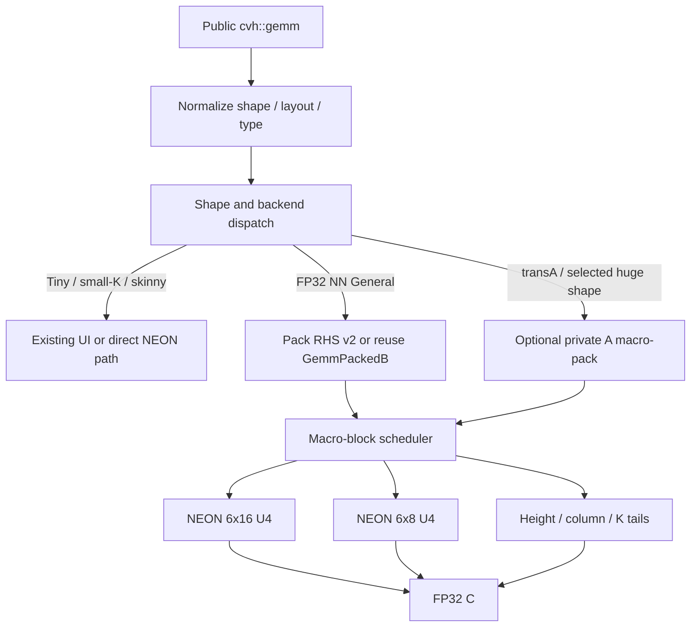

# OCVH GEMM 第三阶段加速计划：BLIS 分块体系与 KleidiAI 风格 NEON 微内核

> 状态：核心实现已落地；本机正确性/兼容性门禁通过，性能发布门禁部分通过
>
> 计划日期：2026-07-28
>
> 最近实施与复核日期：2026-07-28
>
> 实施范围：仅 AArch64 Advanced SIMD / NEON
>
> 第一目标：`cvh::gemm` 的 FP32、NN、General/Square shape
>
> 产品边界：严格 header-only；不链接 Accelerate、BLAS、LAPACK 或 KleidiAI；不新增必需的 `.cpp`/`.c`/`.S` 编译单元
>
> 兼容边界：保留 scalar、OpenCV Universal Intrinsics、现有 AVX2 以及全部 fallback；第三阶段不修改 AVX2 算法和默认门禁

## 0. 结论摘要

第三阶段不应继续只在现有 `8×12` NEON intrinsic 循环上做局部修补。当前主要差距同时存在于三个层面：

1. `MC/NC` 只存在于分发计划中，没有进入实际执行循环，当前实现还不是真正的 cache-blocked GEMM。
2. 当前 packed `8×12` NEON 内核的 K 循环逐项执行，没有 K×4 展开、显式软件流水和预取。
3. 当前并行任务是一个 `MR×NR` micro-tile，粒度太细；`128³` 等规模中线程开销已经大于收益。

本阶段采用“BLISlab 负责上层、KleidiAI 负责下层”的混合设计：

- 从 BLISlab 采用五层循环、`MC/NC/KC` cache blocking、B panel 共享、A workspace 所有权以及 macro-kernel/micro-kernel 分层。
- 从 KleidiAI 采用 FP32 NEON `6×16`/`6×8` 内核族、K×4 主循环、加载/FMLA 交错、直接 LHS、packed RHS、按高度处理 M tail、按 8/4/2/1 处理 N tail，以及“内核不分配、不调度”的接口边界。
- 对 OCVH 的 row-major `Mat` 做有意识的适配：NN 主路径优先使用 `Direct A + Packed B`，避免当前 full A packing 的额外搬运；`transA` 或实测证明有收益的超大 shape 再进入线程私有 A packing。
- 将并行粒度提高到 `MC×NC` 输出宏块，一个任务内部完成全部 K block，消除 micro-tile 级调度。

第三阶段的首选 FP32 NEON 内核不是直接照搬 KleidiAI 源码，而是以其寄存器和流水策略为参考，在 OCVH 内以 inline AArch64 NEON intrinsic 重新实现：

| Shape 类别 | 第三阶段首选 | 说明 |
| --- | --- | --- |
| General，`M>=6,N>=16,K>=64` | `6×16 DirectA/PackedB U4` | 主力方阵和大矩阵路径 |
| General/Narrow，`M>=6,8<=N<16` 或 16 列尾 | `6×8 DirectA/PackedB U4` | 减少无效列和 partial-store 成本 |
| `M%6 != 0` | `H1..H5 × 16/8` 高度族 | 在 K 循环外选择一次，无内层行判断 |
| `K<=32`、tiny、skinny 已有优势区间 | 现有 UI/direct/专用 kernel | 不为 packing 和调度付固定成本 |
| `N=1` / GEMV | 现有 NEON multi-row dot | 与 GEMM 主内核分开 |
| `transA=true` | packed-A 适配后复用 `6×16/6×8` | 第二优先级，先保证 NN 主路径 |

`8×12` 保留为第三阶段 A/B 对照项和安全 fallback，在 `6×16` 完成正确性与性能门禁前不删除。

### 0.1 本轮实施结论

第三阶段的代码结构已经落地，并进入 AArch64 NEON `Auto` 分发：

- 新增 `6×16`、`6×8`、H1..H6、K×4、K tail、overwrite/accumulate 和 8/4/2/1 partial-store 内核族；
- 新增 `[JC][PC][JR][p][NR]` B v2 布局、64-byte aligned workspace 和 `GemmPackedB` v2 元数据；
- NN 采用 Direct-A + Packed-B；TN/TT 先将 A 转成连续 row-major workspace 后复用同一执行器；
- `MC=72,NC=128,KC=384` 已进入真实地址计算和循环；
- 并行任务改为 `(ic,jc)` 输出宏块，一个任务内完成全部 `pc`，小规模保持单线程；
- FP16 和 INT8-dequant 已复用 B v2；旧 `8×12`、UI、scalar、AVX2 和 canonical packed 数据继续保留；
- benchmark 已拆出 public one-shot、public pack-once、B-v2 pack-only、旧 v1 macro-kernel 和新 v2 macro-kernel。

本轮没有新增 `.cpp/.c/.S` 编译单元或外部链接依赖。实现仍由 public header 提供，使用者不需要 Accelerate、BLAS、LAPACK、KleidiAI 或额外 CMake 链接步骤。

### 0.2 实际代码落点

| 文件 | 已落地内容 |
| --- | --- |
| `include/cvh/core/detail/gemm_neon_microkernel.hpp` | `6×16/6×8 U4`、H1..H6、K/tail、full/partial store |
| `include/cvh/core/detail/gemm_neon.hpp` | 接入新内核族并保留旧 direct/GEMV/`8×12` |
| `include/cvh/core/detail/gemm_pack.hpp` | B v2 offset/packer、FP16/INT8 reader、aligned reusable workspace、transA packer |
| `include/cvh/core/detail/gemm_blocked.hpp` | Direct-A macro executor、真实 `MC/NC/KC`、coarse task、scalar reference fallback |
| `include/cvh/core/detail/gemm_dispatch.hpp` | `NNNeon6x16PackedB`、shape gate、v2 metadata gate、宏任务元数据 |
| `include/cvh/core/detail/gemm_impl.hpp` | one-shot、pack-once、NN/TN/TT、batch、FP16、INT8-dequant 生命周期 |
| `include/cvh/core/mat.h` | `GemmPackedKernelFamily` 和 B v2 public-compatible metadata |
| `test/core/internal/gemm_native_dispatch_test.cpp` | 全 tail、生产 block 边界、特殊值、metadata fallback、并行与布局复用 |
| `benchmark/core_mat_header_benchmark.cpp` | v1/v2、pack/macro/public 分层观测和调度元数据 |

### 0.3 最终参数与分发

本机离线扫描过 `KC=256/384`、`MC=66/72`、`NC=128/256`。当前选择：

```text
MR=6
NR=16（N<16 或尾块由 6×8/partial-store family 处理）
KR=1
SR=1
K_UNROLL=4
KC=384
MC=72
NC=128
workspace alignment=64 bytes
parallel threshold=M*N*K >= 8 MiFMA
parallel task=(ic,jc), task 内完成全部 pc
```

`Auto` 的 NN v2 基础门槛为 General shape、`M>=6,N>=16,K>=64`；tiny、small-M、small-K、N=1/GEMV 和 narrow shape 继续走已有专用路径。forced NEON 对 `8<=N<16` 可以覆盖更宽的验证范围。

### 0.4 本机性能结果

环境：Apple arm64、AppleClang 21、Release、`cvh::headers_fast`、7 repeats；表中为 median。起始基线来自本轮实施前保存的 `/tmp/ocvh-gemm-phase3-baseline.csv`，最终数据来自重建后二进制的 `/tmp/ocvh-gemm-phase3-final-*.csv`。

单线程 public API：

| Shape / 模式 | 阶段二基线 | 阶段三 | 改善 | 结论 |
| --- | ---: | ---: | ---: | --- |
| `128³` one-shot | 0.114779 ms | 0.037657 ms | 67.19% | 达到 `<=0.040 ms` 数值目标 |
| `128³` pack-once | 0.060850 ms | 0.034477 ms | 43.34% | 达到 20% hard gate |
| `256³` one-shot | 0.309144 ms | 0.255088 ms | 17.49% | 达到相对 15%，未达 `<=0.240 ms` |
| `256³` pack-once | 0.299377 ms | 0.253620 ms | 15.28% | 有稳定收益，未达 20% hard gate |
| `512³` one-shot | 2.207084 ms | 2.105250 ms | 4.61% | 未达 15% hard gate |
| `32×512×64` one-shot | 0.026854 ms | 0.019245 ms | 28.33% | skinny 基准未回退 |
| `32×512×64` pack-once | 0.024313 ms | 0.016542 ms | 31.96% | 达标 |

多线程 public one-shot：

| Shape | 阶段二参考 | 阶段三 | 改善 | effective chunks |
| --- | ---: | ---: | ---: | ---: |
| `128³`, 8T | 不作为并行候选 | 0.038926 ms | 保持串行 | 1 |
| `256³`, 4T | 0.199233 ms（旧 8T） | 0.113324 ms | 43.12% | 8 |
| `256³`, 8T | 0.199233 ms | 0.116199 ms | 41.68% | 8 |
| `512³`, 8T | 0.645708 ms | 0.495750 ms | 23.22% | 32 |

旧 v1 与新 v2 macro-kernel 的单线程 A/B：

| Shape | v1 `8×12` | v2 `6×16` | 改善 |
| --- | ---: | ---: | ---: |
| `128³` | 0.036060 ms | 0.034417 ms | 4.56% |
| `256³` | 0.270778 ms | 0.251903 ms | 6.97% |
| `512³` | 2.094500 ms | 2.023667 ms | 3.38% |

结果说明：

- 最大收益来自 Direct-A、B v2、去掉 A 全量 packing，以及粗粒度调度的组合，不应把收益全部归因于 FMLA 指令数；
- `128³`、skinny 和 `256³` 并行路径收益明确；
- `512³` 8T 明显改善，但仍未达到计划中的 `<=0.45 ms`；`512³` 1T 与 v2 macro-kernel 也未达到 hard gate；
- 因此本阶段可以标记“核心实施完成”，不能标记“全部性能发布门禁完成”。

### 0.5 汇编审计

AppleClang 21、`-O3` 生成的 AArch64 汇编确认：

- full `6×16` 主循环生成 `fmla.4s` lane 指令；
- K×4 路径在一个展开周期内更新 24 个向量 accumulator；
- full-tile FMLA 区间没有 accumulator 到栈的 spill/reload；
- macro executor 的控制变量存在普通 GPR spill；edge/tail 实例也可能有控制流 spill，这不等同于 accumulator spill；
- 当前没有引入 inline assembly，因而不存在 Apple/ELF 汇编语法分叉。

### 0.6 验证矩阵

| 门禁 | 结果 |
| --- | --- |
| Release 全量 CTest | 18/18 通过 |
| GEMM/native 专项 | 18 tests（其中 GEMM 15）通过 |
| H1..H6、`M=1..13,N=1..33,K=1..17` | 通过 |
| 生产边界 `71/72/73 × 127/128/129 × 383/384/385` | one-shot 与 pack-once 通过 |
| `0/-0`、subnormal、Inf、NaN 分类 | 通过 |
| NN/TN/TT、2D、broadcast batch、FP16、INT8-dequant | 通过 |
| invalid v2 metadata fallback | 通过 |
| ASan + UBSan | GEMM/native、core、ODR、include-only 通过 |
| UI disabled | GEMM/native、core、ODR、include-only 通过 |
| header-only/install-tree consumer | 7/7 smoke 与 `cvh::headers`/`cvh::headers_fast` consumer 通过 |
| x86_64 UI-off 交叉编译 | 通过；当前 arm64 机器无 Rosetta，未执行 |
| x86_64 UI-on 交叉编译 | 未通过：bundled OpenCV `intrin.hpp` 的既有 `VTraits` 兼容问题，发生在通用算术 UI 头 |
| Linux AArch64 Clang/GCC | 当前机器不可用，待 CI/真实设备验证 |

本机验证不覆盖 TSAN、Linux AArch64 或真实 x86 运行，因此这些项目仍是发布前门禁，而不是本轮已完成项。

## 1. 调研范围与固定版本

本计划基于以下上游版本，后续实施和复核应继续使用固定 commit 链接，避免上游变化导致策略描述漂移。

### 1.1 BLISlab

- 仓库：[flame/blislab](https://github.com/flame/blislab)
- 研究 commit：[`8392bbe5348850a09d80ed4810ccb1f60fa2bd7b`](https://github.com/flame/blislab/commit/8392bbe5348850a09d80ed4810ccb1f60fa2bd7b)
- 重点文件：
  - [Step 4 `my_dgemm.c`](https://github.com/flame/blislab/blob/8392bbe5348850a09d80ed4810ccb1f60fa2bd7b/step4/dgemm/my_dgemm.c)
  - [Step 5 ARM `my_sgemm.c`](https://github.com/flame/blislab/blob/8392bbe5348850a09d80ed4810ccb1f60fa2bd7b/step5/arm/sgemm/my_sgemm.c)
  - [Step 5 ARM blocking 配置](https://github.com/flame/blislab/blob/8392bbe5348850a09d80ed4810ccb1f60fa2bd7b/step5/arm/include/bl_config.h)
  - [Step 5 ARM 4×4 NEON kernel](https://github.com/flame/blislab/blob/8392bbe5348850a09d80ed4810ccb1f60fa2bd7b/step5/arm/kernels/bl_sgemm_opt_4x4.c)

BLISlab 是教学工程，ARM 示例面向较老的 Cortex-A15，具体 `MC/NC/KC` 和 `4×4` tile 不能直接作为 Apple Silicon 或现代 AArch64 的最终参数；本阶段采用的是其分层方法和数据复用原则。

### 1.2 KleidiAI

- 仓库：[ARM-software/kleidiai](https://github.com/ARM-software/kleidiai)
- 研究 commit：[`c5a9a970a7782c81e21f0307913a9e4c5689bca4`](https://github.com/ARM-software/kleidiai/commit/c5a9a970a7782c81e21f0307913a9e4c5689bca4)
- 重点文件：
  - [项目设计与 micro-kernel 边界](https://github.com/ARM-software/kleidiai/blob/c5a9a970a7782c81e21f0307913a9e4c5689bca4/README.md)
  - [micro-kernel/packer 对照表](https://github.com/ARM-software/kleidiai/blob/c5a9a970a7782c81e21f0307913a9e4c5689bca4/docs/microkernel_tables.md)
  - [FP32 matmul 统一接口](https://github.com/ARM-software/kleidiai/blob/c5a9a970a7782c81e21f0307913a9e4c5689bca4/kai/ukernels/matmul/matmul_clamp_f32_f32_f32p/kai_matmul_clamp_f32_f32_f32p_interface.h)
  - [通用 AArch64 FP32 `6×16` wrapper](https://github.com/ARM-software/kleidiai/blob/c5a9a970a7782c81e21f0307913a9e4c5689bca4/kai/ukernels/matmul/matmul_clamp_f32_f32_f32p/kai_matmul_clamp_f32_f32_f32p16x1b_6x16_neon_mla.c)
  - [通用 AArch64 FP32 `6×16` 汇编实现](https://github.com/ARM-software/kleidiai/blob/c5a9a970a7782c81e21f0307913a9e4c5689bca4/kai/ukernels/matmul/matmul_clamp_f32_f32_f32p/kai_matmul_clamp_f32_f32_f32p16x1b_6x16_neon_mla_asm.S)
  - [FP32 `6×8×4` wrapper](https://github.com/ARM-software/kleidiai/blob/c5a9a970a7782c81e21f0307913a9e4c5689bca4/kai/ukernels/matmul/matmul_clamp_f32_f32_f32p/kai_matmul_clamp_f32_f32_f32p8x1biasf32_6x8x4_neon_mla.c)
  - [FP32 `6×8×4` 汇编实现](https://github.com/ARM-software/kleidiai/blob/c5a9a970a7782c81e21f0307913a9e4c5689bca4/kai/ukernels/matmul/matmul_clamp_f32_f32_f32p/kai_matmul_clamp_f32_f32_f32p8x1biasf32_6x8x4_neon_mla_asm.S)
  - [16 列 RHS packer wrapper](https://github.com/ARM-software/kleidiai/blob/c5a9a970a7782c81e21f0307913a9e4c5689bca4/kai/ukernels/matmul/pack/kai_rhs_pack_kxn_x32p16x1b_x32_x32_neon.c)
  - [16 列 RHS packer 汇编实现](https://github.com/ARM-software/kleidiai/blob/c5a9a970a7782c81e21f0307913a9e4c5689bca4/kai/ukernels/matmul/pack/kai_rhs_pack_kxn_x32p16x1b_x32_x32_neon_asm.S)

KleidiAI 是 micro-kernel 库，不是完整 GEMM operator。它明确不负责动态内存、内存管理或内部线程调度，调用方通过 tile step 和 offset API 决定处理哪一部分输出。这个边界非常适合映射到 OCVH 已有的 dispatch、workspace 和 `parallel_for_`。

## 2. 从 BLISlab 提炼的 GEMM 策略

### 2.1 五层循环

BLISlab Step 3/4 的核心结构是：

```text
for jc = 0..N step NC                 // Loop 5
  for pc = 0..K step KC               // Loop 4
    pack B(pc:pc+KC, jc:jc+NC)
    for ic = 0..M step MC             // Loop 3
      pack A(ic:ic+MC, pc:pc+KC)
      for jr = 0..NC step NR          // Loop 2
        for ir = 0..MC step MR        // Loop 1
          micro_kernel(MR, NR, KC)
```

每层循环的职责必须清晰：

| 层级 | 数据单元 | 主要目标 |
| --- | --- | --- |
| `NC` | B 的列宏块 | 控制共享 cache 中的 B 工作集 |
| `KC` | K 深度块 | 控制 micro-panel 的流式读取和 C 累加周期 |
| `MC` | A 的行宏块 | 控制每个 worker 的 A 工作集 |
| `NR` | B 微面板宽度 | 对应微内核输出列数 |
| `MR` | A 微面板高度 | 对应微内核输出行数 |

第三阶段必须让 `MC/NC/KC` 都参与真实地址计算和循环，而不是只把参数打印到 benchmark 元数据中。

### 2.2 packing 的复用所有权

BLISlab 的关键不只是“做 packing”，而是“packing 一次后被谁复用”：

- B 在一个 `(jc,pc)` 上只 pack 一次，被所有 `ic` 宏块复用。
- A 在一个 `(ic,pc)` 上只 pack 一次，被该 `ic` 下所有 `jr` 微面板复用。
- B pack buffer 可被线程共享只读。
- A pack buffer 由 worker 私有，避免写竞争和 false sharing。

当前 OCVH 一次性 pack 整张 A/B，但计算仍按 micro-tile 分发，尚未形成上述明确的 cache ownership。

### 2.3 macro-kernel 与 micro-kernel 分工

BLISlab 的 micro-kernel 只负责一个固定 `MR×NR` 输出 tile；edge、panel 地址、下一 panel 预取提示和循环次序属于 macro-kernel。

第三阶段同样要求：

- micro-kernel 不做分发、不分配内存、不决定线程数；
- macro-kernel 处理 `MC/NC/KC`、tail 选择和 `pc>0` 时的累加；
- operator 层处理 shape/type/layout 分类、packing 生命周期和并行策略。

### 2.4 粗粒度并行

BLISlab Step 4 按 `ic` 范围切分工作，每个线程拥有自己的 A packing 空间，共享 B panel，而不是为每个 `MR×NR` tile 创建任务。

这直接对应当前 OCVH 的主要问题：`8×12` tile 在 `128³` 上有 176 个左右的小任务，调度成本会覆盖计算收益。第三阶段任务应提升到 `MC×NC` 或至少 `MC×N` 级别。

## 3. 从 KleidiAI 提炼的 NEON GEMM 策略

### 3.1 `6×16` 是通用 FP32 NEON 主力形态

KleidiAI 的通用 FP32 Advanced SIMD kernel 使用：

- `MR=6`；
- `NR=16`；
- formal packing 参数 `KR=1, SR=1`；
- K 主循环按 4 个元素展开；
- LHS 直接按 row stride 访问；
- RHS 以 16 列 panel 打包；
- 一个 full tile 产生 `6×16=96` 个 FP32 输出。

`6×16` 需要 24 个 128-bit accumulator，正好使用 `v8-v31`。剩余寄存器用于：

- `v0-v5`：六行 A 的 K×4 数据；
- `v6-v7`：轮转装载 packed B；
- 加载与 FMLA 交错，避免一次同时保留全部 B 向量。

当前 OCVH `8×12` 同样有 96 个输出和 24 个 accumulator，但其 K 循环逐项运行，没有形成 KleidiAI 的 K×4 软件流水。

### 3.2 `6×8` 是必要的第二内核

KleidiAI 同时提供 `6×8×4` 变体。其意义不只是处理 N tail：

- accumulator 从 24 个下降到 12 个；
- 有更多寄存器用于预加载和调度；
- 对 `8<=N<16`、较小 `NC`、部分微架构可能更合适；
- 可以避免为了 8 个有效列执行 16 列的全部 FMLA。

第三阶段不能只做一个固定 `6×16` 内核，再让所有剩余列走 scalar。

### 3.3 高度族和部分写回

KleidiAI 在进入 K 主循环前按 `m=1..6` 选择高度路径；N tail 使用 8/4/2/1 组合加载和写回。其价值是：

- full K 循环中没有 `row < valid_rows`；
- full tile 不经过临时数组；
- N tail 不写出目标矩阵边界；
- 同一 packed B 可以被全部高度变体复用。

OCVH 第三阶段应通过模板实例化或小型 wrapper 生成 `H1..H6`，只在 macro-kernel 中做一次 switch。

### 3.4 K×4 软件流水和预取

KleidiAI 的 FP32 NEON 主循环具备以下特征：

- 先装载 A/B，再进入 FMLA 链；
- 每次处理 4 个 K；
- 在计算当前 K group 时穿插下一组 B load；
- 对各 A row 做约 128-byte ahead 的 `PLDL1KEEP` 预取；
- K 末尾用独立 odd loop，不把 tail 条件放进主循环；
- 输出前使用 store prefetch，并把 clamp/partial writeback 放在 K 循环之后。

第三阶段先用 intrinsic 表达相同的数据流，再以编译后汇编为验收对象。不能仅凭源码中写了 `vfmaq_*` 就认为软件流水已经生成。

### 3.5 无状态 micro-kernel 契约

KleidiAI 的接口将 `m_step/n_step/nr/kr/sr`、LHS offset、packed RHS offset、DST offset 与 `run` 分开。OCVH 不需要照搬函数指针 ABI，但应采用相同思想：

```cpp
struct NeonF32KernelTraits
{
    static constexpr int mr = 6;
    static constexpr int nr = 16;
    static constexpr int k_unroll = 4;
};

inline std::size_t packed_rhs_offset(...);
inline void run_6x16(...);
```

所有 traits/offset helper 必须是 `constexpr` 或 `inline`，保持 header-only 和零外部依赖。

## 4. 当前 OCVH 实现审计

### 4.1 当前结构

当前第二阶段已经具备：

- `gemm_dispatch::Plan` 中的 `MR/NR/KC/MC/NC`；
- NEON `8×12` 和 AVX2 `6×16`；
- A/B panel packing；
- `GemmPackedB` 的版本化 native panel；
- forced backend、benchmark 元数据和 correctness 测试；
- FP16/INT8 权重转换到 FP32 panel；
- pack-once API。

这些基础设施应复用，不应重新设计公共 GEMM API。

### 4.2 具体差距

| 位置 | 当前行为 | 第三阶段问题 |
| --- | --- | --- |
| `gemm_blocked.hpp` | `tasks = ceil(M/MR) * ceil(N/NR)` | 一个任务只有一个 micro-tile，粒度过细 |
| `gemm_blocked.hpp` | 只在 tile 内循环 `KC` | `MC/NC` 完全没有进入执行 |
| `gemm_neon.hpp` | packed `8×12` 的 K 循环步长为 1 | 无 K×4 展开、无明确 load/FMLA pipeline |
| `gemm_neon.hpp` | N tail 写入 `float edge[12]` 再标量 copy | edge 成本较高，无法复用 full-width store 路径 |
| `gemm_pack.hpp` | A 格式 `[M/MR][K][MR]` | NN row-major A 必须全量重排，one-shot 固定成本较大 |
| `gemm_pack.hpp` | B 格式 `[N/NR][K][NR]` | 有微面板但没有显式 `NC/KC` 宏面板顺序 |
| `gemm_impl.hpp` | 多条路径每次创建 `std::vector<float>` | workspace 分配、初始化和释放进入端到端时间 |
| `gemm_dispatch.hpp` | NEON 固定 `MR=8,NR=12,KC=192,MC=128,NC=192` | 参数已声明但未真正形成 cache policy |
| 并行策略 | 依据 micro-tile 数量决定并行 | `128³`、skinny、small-K 已实测多线程倒退 |

### 4.3 当前性能基线

Apple M5、Release、FP32 NN 的当前对比数据如下。OpenCV 列为 upstream 默认 Accelerate 路径：

| Shape `M×K×N` | 当前 OCVH | OpenCV Accelerate | 当前差距 |
| --- | ---: | ---: | ---: |
| `128×128×128` | 0.049105 ms | 0.003237 ms | OCVH 慢 15.17x |
| `32×512×64` | 0.024781 ms | 0.112530 ms | OCVH 快 4.54x |
| `256×32×256` | 0.048069 ms | 0.004999 ms | OCVH 慢 9.62x |
| `256×256×256` | 0.311320 ms | 0.020487 ms | OCVH 慢 15.20x |
| `512×512×512` | 2.207084 ms | 0.161083 ms | OCVH 慢 13.70x |

当前 OCVH 设置 8 线程后：

| Shape | OCVH 1T | OCVH 8T | 8T/1T |
| --- | ---: | ---: | ---: |
| `128³` | 0.049105 ms | 0.064943 ms | 0.76x，倒退 |
| `32×512×64` | 0.024781 ms | 0.035073 ms | 0.71x，倒退 |
| `256×32×256` | 0.048069 ms | 0.062225 ms | 0.77x，倒退 |
| `256³` | 0.311320 ms | 0.199233 ms | 1.56x |
| `512³` | 2.207084 ms | 0.645708 ms | 3.42x |

通过 Apple `BLASSetThreading(SINGLE_THREADED)` 强制 Accelerate 单线程后，`128³` 约为 0.003291 ms、`256³` 约为 0.020539 ms，与默认值几乎不变。因此 12–15 倍差距不能主要解释为“Accelerate 开了 8 线程”。Accelerate 继续作为硬件上限参考，不作为第三阶段必须追平的合入门槛。

N3-0 必须把上述结果重新生成到带日期、commit、编译器、线程数、dispatch metadata 的原始 CSV 中；文档表格不能代替可复现基线。

## 5. 第三阶段目标与非目标

### 5.1 必须达成

1. 仅优化 AArch64 NEON，不改变 AVX2 kernel、AVX2 packed format 和 AVX2 `Auto` 策略。
2. `MC/NC/KC` 进入真实 macro-kernel 地址计算和循环。
3. 完成 `6×16 U4` 与 `6×8 U4` 两个 FP32 NEON 内核，并覆盖 M/N/K tail。
4. NN 主路径支持 Direct A + packed B，避免无条件 full A packing。
5. 并行任务提升到输出宏块，禁止按 `MR×NR` 创建任务。
6. one-shot 和 pack-once 都有明确的 B packing v2 格式与兼容检查。
7. 保留现有 scalar、UI、旧 NEON `8×12` 和 AVX2 fallback。
8. benchmark 分离 pack、micro-kernel、macro-kernel、scheduler 和 public end-to-end 时间。
9. 所有 accepted path 通过 correctness、sanitizer、ODR、install-tree 和 header-only 门禁。

### 5.2 本阶段不做

- 不链接 Accelerate、KleidiAI、BLAS、LAPACK 或任何外部二进制库。
- 不因为参考 KleidiAI 而把其 `.c`/`.S` 变为 OCVH 必需编译单元。
- 不优化 AVX2、SVE、SME/SME2、Apple 私有矩阵指令或 INT8 dot-product。
- 不新增运行时 autotune；只允许离线调参后固化少量 profile。
- 不以 benchmark 中最快的一次结果替代稳定 median/p90。
- 不牺牲 skinny、small-K、GEMV、broadcast 或 transpose correctness 来换方阵分数。

## 6. 目标架构

### 6.1 数据流



### 6.2 NN Direct-A 主路径

为适配 row-major OCVH，并避免每次全量 pack A，NN 主路径采用：

```text
pack B once to native panel v2

parallel task over (ic, jc) macro output block
  for pc = 0..K step KC
    for ir = 0..MC step 6
      for jr = 0..NC step 16/8
        run DirectA/PackedB micro-kernel
```

每个 `(ic,jc)` 任务拥有互不重叠的 C 区域，并在任务内部完成全部 `pc`，因此：

- 没有 C 写冲突；
- 不需要每个 `pc` 重建线程调度；
- C 宏块在 K 累加期间保持较好的 cache locality；
- packed B 被全部任务只读共享；
- A 直接按六个 row pointer 读取，不需要 workspace。

这不是机械复制 BLISlab 的循环顺序，而是保留其 blocking/ownership 原则后，对 OCVH `parallel_for_` 和 row-major A 做的适配。

### 6.3 packed-A 辅助路径

以下情况才评估 A packing：

- `transA=true`，原始 A 的 K 方向不连续；
- `K` 很大且直接 A 在硬件计数器上表现为明显 load/cache 瓶颈；
- 一个 packed A macro-panel 能被多个 `jc` 重用；
- packing 成本在 end-to-end 中可回收。

packed-A 路径按 `ic` 做粗粒度并行，每个 callback 创建一次 `MC×KC` 私有 scratch，并在该 `ic/pc` 下遍历多个 `jc`，避免跨 N 宏块重复 pack A。

首个实现可以把 transposed A pack 成 `[row-within-MR][KC]`，以复用 Direct-A 风格的 `6×16/6×8` 内核。只有数据证明 `[KC][MR]` 外积式布局更快时，才增加第二种 A 格式。

## 7. NEON 微内核设计

### 7.1 主内核：`f32_6x16_directa_packedb_u4`

建议签名：

```cpp
template <int Rows, bool Accumulate>
inline void kernel_f32_6x16_u4(
    const float* a,
    std::size_t a_stride,
    const float* packed_b,
    float* c,
    std::size_t c_stride,
    int k,
    int valid_cols);
```

实现要求：

- `Rows` 为 `1..6` 的编译期常量；
- full path 的 `valid_cols=16` 不经过临时数组；
- 24 个 accumulator 覆盖六行、四组 4 列；
- K 主循环每次处理 4；
- A 使用六个 row pointer，每行一次 `vld1q_f32`；
- B 以 `[p][16]` 连续布局读取，并让 load 与 FMLA 交错；
- `Accumulate=false` 直接覆盖 C；`Accumulate=true` 在 K 循环外加载旧 C；
- K remainder 为 `0..3` 的独立 tail；
- prefetch 开关和距离为 traits 参数，不在每次 tile 上动态判断。

### 7.2 次内核：`f32_6x8_directa_packedb_u4`

用途：

- `8<=remaining_n<16`；
- 经过调优证明 `6×8` 在某个 AArch64 profile 上优于 `6×16`；
- 较小 `NC` 或寄存器调度受限场景。

它使用 12 个 accumulator，必须与 `6×16` 共用 B format 的前 8 列语义，避免为同一 B 维护不兼容的持久格式。

### 7.3 高度与列尾

M tail：

```text
remaining M >= 6 -> H6
remaining M == 5 -> H5
...
remaining M == 1 -> H1
```

N tail：

- `>=16`：`6×16` full store；
- `8..15`：优先 `6×8`，剩余按 4/2/1 partial store；
- `<8`：4/2/1 partial store，或在收益不足时回退现有 UI/direct；
- B pack 对 N tail 补零，内核不读取原始 B 越界。

禁止在主 K 循环中按 `valid_rows/valid_cols` 做逐 FMLA 条件判断。

### 7.4 K tail 和 K block 累加

- `KC` 候选必须是 4 的倍数；
- 最后一个 `pb` 允许不是 4 的倍数；
- 主循环处理 `pb & ~3`；
- 独立 scalar/lane tail 处理 `pb % 4`；
- `pc==0` 使用 overwrite 版本，`pc>0` 使用 accumulate 版本；
- 不为了消除 K tail 而读取 A 的逻辑边界之外。

### 7.5 prefetch 与软件流水调优

首轮候选：

| 项目 | 候选 |
| --- | --- |
| A prefetch | off / 64B / 128B / 256B ahead |
| B prefetch | off / next 1–2 cache lines / next NR panel |
| C store prefetch | off / 当前输出行 |
| K unroll | 4 为主，2/8 只作实验 |
| 内核宽度 | 6×16、6×8、旧 8×12 对照 |

每个候选必须同时检查：

- 生成汇编是否存在寄存器 spill；
- 主循环是否保持 FMLA/load 交错；
- 循环中是否残留不必要的地址乘法；
- AppleClang、Clang、GCC 是否都能编译；
- kernel-only 收益是否转化为 public end-to-end 收益。

### 7.6 intrinsic 与 inline assembly 的阶段门

默认实施顺序：

1. 先写 intrinsic 内核；
2. 保存编译后汇编并做指令/寄存器审计；
3. 若 full-tile kernel-only 与同策略手排目标仍差 `>=15%`，再评估 compact extended inline assembly；
4. inline assembly 必须同时通过 Apple AArch64 和 ELF AArch64 语法/ODR 门禁；
5. 禁止直接把 KleidiAI 数千行 `.S` include 进公共 header。

若增加 inline assembly，应保持 intrinsic 版本作为编译器 fallback 和 correctness oracle。

### 7.7 代码来源与许可证边界

本计划采用上游公开呈现的算法结构和调优思想，不把 BLISlab/KleidiAI 变成构建依赖，也不直接复制其完整 micro-kernel：

- 本次研究的 BLISlab 源文件带 BSD 3-clause 风格版权声明；
- KleidiAI 使用 Apache-2.0，并在每个实现中保留 SPDX 和 Arm copyright；
- OCVH 首选基于自身接口和 row-major 数据布局重新实现 intrinsic kernel；
- 如果实施中确实复用了可识别的上游代码片段，必须保留对应许可证/版权声明，在提交中记录原始文件、固定 commit 和改动范围；
- 性能数字和算法事实可以引用上游，但不能把“参考策略”描述成 OCVH 自主发明。

## 8. B packing v2

### 8.1 格式

建议 native v2 逻辑顺序：

```text
[batch]
  [JC block]
    [PC block]
      [JR/NR panel]
        [p within KC]
          [NR floats]
```

属性：

- NEON v2 首选 `NR=16`；
- N tail 补零；
- K 不强制补零，由 U4 tail 处理；
- 一个 `(jc,pc)` B macro-panel 连续存放；
- one-shot 和 `GemmPackedB` pack-once 使用同一格式；
- canonical row-major `packed_fp32/packed_fp16` 继续保留，用于 UI/scalar/AVX2 fallback。

`GemmPackedB` 需要记录：

```text
native_format_version = 2
native_backend = Neon
native_kernel_family = F32DirectA6x16
native_nr = 16
native_kr = 1
native_k_unroll = 4
native_kc
native_nc
native_alignment_offset
native_packed_step
```

读取 v2 前必须完整校验 metadata；任何不匹配都回退 canonical 数据，不能错误解释旧 v1 panel。

### 8.2 compact offset

最后一个 `JC/PC` block 不必按完整 `NC/KC` 物理补齐。offset helper 以实际：

```text
ceil(jb / NR) * pb * NR
```

累加每个 macro-panel 大小。offset 只在宏块边界计算，不能进入 inner K loop。

若 compact offset 的地址计算对 macro-kernel 可见地变贵，可在 `GemmPackedB` 中增加每个 `(jc,pc)` 的 offset table；需用 benchmark 证明后再加，首版保持结构简单。

### 8.3 对齐和 workspace

- 临时 B workspace 目标 64-byte 对齐；
- `std::vector<float>` 不保证 64-byte 对齐时，使用“额外分配 63 字节 + pointer round-up”的 header-only helper；
- `GemmPackedB` 可保留底层 vector，再记录 aligned data offset；
- workspace 在一次 public GEMM 调用中只分配/扩容一次；
- 不在 `pc`、`ic`、micro-tile 循环中分配；
- benchmark 必须分别报告首次增长和容量复用后的时间。

## 9. Cache blocking 参数

BLISlab 的 Cortex-A15/x86 参数不能直接使用。第三阶段通过工作集公式和实测选择参数。

### 9.1 参数候选

| 参数 | 候选 | 限制 |
| --- | --- | --- |
| `MR` | 6 | 与主内核固定 |
| `NR` | 16，尾部 8 | 与 B v2 固定 |
| `KC` | 128 / 192 / 256 / 384 | 4 的倍数 |
| `MC` | 72 / 96 / 144 / 192 | 6 的倍数 |
| `NC` | 128 / 256 / 512 / 1024 | 16 的倍数 |

以 `KC=256` 为例：

- 一个 16 列 B micro-panel：`256×16×4 = 16 KiB`；
- 六行 A：`6×256×4 = 6 KiB`；
- 一个 `6×16` C tile：384 B。

这给出了 micro-kernel 工作集的量级，但不能替代真实 cache counter 和端到端测量。

### 9.2 离线调参

调参顺序：

1. 固定 ST、full tile，选择 `6×16/6×8` 和 K unroll；
2. 固定内核，扫描 `KC`；
3. 固定 `KC`，扫描 `MC/NC`；
4. 加入 one-shot B packing；
5. 加入 2/4/8 线程和输出宏块粒度；
6. 在 Apple M5 和至少一台 Linux AArch64 上交叉验证。

最终只固化：

- `GenericAArch64` profile；
- 可选 `AppleSilicon` profile；
- 旧 `8×12` fallback。

禁止在用户首次调用中运行 autotune。

## 10. 并行策略

### 10.1 任务粒度

Direct-A 主路径以 `(ic,jc)` 输出宏块为任务：

```text
task_count = ceil(M / MC) * ceil(N / NC)
work_per_task ~= MC * NC * K
```

一个任务内部：

- 完成全部 `pc`；
- 完成该 C 宏块的全部 micro-tile；
- 只写自己的 C 区域；
- 只读共享 packed B；
- 直接读取 A。

这与当前 `MR×NR` 任务相比减少几个数量级的 scheduler 交互。

### 10.2 并行门槛

初始策略按 FMA 数 `M*N*K` 分级：

| 工作量 | 初始线程策略 |
| --- | --- |
| `< 8M` FMA | 强制单线程 |
| `8M..32M` FMA | 最多 2–4 个有效任务 |
| `>=32M` FMA | 允许使用配置线程数，但不超过宏块任务数 |

这些只是种子值，N3-5 必须用实测修正。硬性原则是：

- `128³` 默认不并行；
- `32×512×64` 不并行；
- `256×32×256` 不并行；
- `256³` 评估 2/4 线程，不默认假设 8 线程最好；
- `512³` 评估 4/8 线程；
- task 数少于线程数时不创建空转 worker。

### 10.3 packed-A 调度

packed-A 路径优先按 `ic` 分任务，使一个 worker：

```text
for pc
  pack A once to callback-local workspace
  for jc
    consume all B macro-panels
```

这样 A packing 不随 `jc` 重复。Direct-A 与 Packed-A 允许使用不同 scheduler，不应为了统一代码牺牲其中一条路径的数据复用。

## 11. Shape 分发策略

第三阶段增加 NEON 内部 shape class，不改变公共 API：

| 类别 | 初始条件 | 路径 |
| --- | --- | --- |
| `NeonGemm6x16` | NN、FP32、`M>=6,N>=16,K>=64` | Direct A + B v2 + 6×16 |
| `NeonGemm6x8` | NN、FP32、`M>=6,N>=8,K>=64` 且 N 不适合 16 | Direct A + B v2 + 6×8 |
| `NeonGemmPackedA` | transA 或离线白名单 | packed A + B v2 |
| `NeonDirect` | small-K/packing 不回本 | 现有 direct NEON |
| `OpenCVUI` | tiny/small-M/未达 NEON 门槛 | 现有 UI |
| `NeonGemv` | `N=1` | 现有专用 kernel |

`Auto` 接纳规则：

- 先保证 correctness；
- 再要求 candidate 在相同线程数下稳定快于当前 `Auto`；
- 只对白名单 shape/type/layout 开启；
- forced `NeonOnly` 可以覆盖更广 shape，用于测试，但不能把 forced 行为等同默认产品策略。

FP16 和 INT8-dequant 在本阶段不开发新的算术内核。FP32 主路径稳定后，可以让现有“转换为 FP32 packed B”的路径复用 v2 和 `6×16/6×8`，前提是 end-to-end 收益达标。

## 12. 代码落点

建议文件改动：

| 文件 | 第三阶段职责 |
| --- | --- |
| `include/cvh/core/detail/gemm_neon.hpp` | 保留 direct/GEMV；接入新 kernel family |
| `include/cvh/core/detail/gemm_neon_microkernel.hpp` | 新增 `6×16/6×8 U4`、高度族、partial store、prefetch traits |
| `include/cvh/core/detail/gemm_pack.hpp` | B v2 packer、compact offset、aligned workspace、transB reader |
| `include/cvh/core/detail/gemm_blocked.hpp` | 真正的 `MC/NC/KC` macro-kernel 和 coarse scheduler |
| `include/cvh/core/detail/gemm_dispatch.hpp` | 新 kernel id、traits、shape/parallel gate |
| `include/cvh/core/detail/gemm_impl.hpp` | one-shot/pack-once 生命周期、workspace 复用、fallback |
| `include/cvh/core/mat.h` | `GemmPackedB` v2 metadata；保持 canonical 数据和公共兼容 |
| `benchmark/core_mat_header_benchmark.cpp` | pack/ukernel/macro/scheduler/E2E 分层数据 |
| `benchmark/opencv_compare_header_benchmark.cpp` | upstream CPU-only 与 Accelerate 分栏对比 |
| `test/core/internal/gemm_native_dispatch_test.cpp` | kernel id、format v2、tail、forced/auto、thread correctness |

若编译时长或 header 膨胀明显，`gemm_neon_microkernel.hpp` 可继续拆为：

```text
gemm_neon_microkernel_6x16.hpp
gemm_neon_microkernel_6x8.hpp
gemm_neon_store.hpp
```

所有函数必须 `inline`，NEON 类型不得进入 public API。

## 13. 工作包与落地顺序

### N3-0：锁定基线与观测（本机完成；p90/跨库汇总仍待统一 schema）

交付：

- 保存当前 commit 的 1/2/4/8 线程 raw CSV；
- 增加 `pack_b_v1/v2`、kernel family、U4、MC/NC/KC、task count、effective threads 元数据；
- 将 OpenCV upstream 分为 CPU-only 和 Accelerate 两列；
- 输出 median、p90、GFLOP/s、相对当前 OCVH、相对 upstream；
- 增加可选阶段计时：allocation、pack B、pack A、compute、scheduler。

退出条件：

- 当前表格可由固定命令重现；
- benchmark 校验 checksum；
- benchmark 自身开销不进入 kernel-only 数据。

### N3-1：建立无 NEON 依赖的 macro-kernel 骨架（完成）

交付：

- `MC/NC/KC` 真实循环；
- B v2 offset/layout；
- scalar reference micro-kernel 接入同一 macro executor；
- `(ic,jc)` coarse tasks；
- v1/v2 metadata 校验和 fallback。

退出条件：

- 不启用 NEON 也能通过全部 shape/tail/broadcast 测试；
- `MC/NC` 不再是只打印不执行的参数；
- TSAN 可用环境下无 C 写竞争。

### N3-2：实现 NEON `6×16 U4`（实现完成；20% kernel 性能门禁未达）

交付：

- H1..H6 full-width kernel；
- K×4 主循环和 K tail；
- overwrite/accumulate 两版本；
- full 16-column store；
- intrinsic 生成汇编报告。

退出条件：

- full tile 与 scalar reference 一致；
- 无寄存器 spill 或 spill 有明确量化说明；
- kernel-only 相比旧 `8×12` 至少快 20%，否则不进入 `Auto`。

### N3-3：实现 `6×8` 与全部 edge（完成）

交付：

- H1..H6 × 8；
- N 的 4/2/1 partial store；
- N tail zero padding；
- K/M/N 非整倍数矩阵；
- 旧 `edge[12]` 路径从新主内核中移除。

退出条件：

- 覆盖 `M=1..13`、`N=1..33`、`K=1..17` 的边界组合；
- ASan/UBSan 无越界和未初始化读取；
- N tail 不出现超过 5% 的整体回退，否则调整 6×8/UI 分界。

### N3-4：packing v2、workspace 与 pack-once（实现完成；部分 shape 性能门禁未达）

交付：

- `[JC][PC][JR][p][NR]` B v2；
- NN、transB reader；
- 64-byte aligned one-shot workspace；
- `GemmPackedB` v2；
- capacity reuse；
- 旧 v1/canonical fallback。

退出条件：

- one-shot pack 成本单独可测；
- pack-once 不在 GEMM 调用中重打 B；
- packed object 在不同 M、batch broadcast 中正确复用；
- public E2E 收益达到第 15 节门槛。

### N3-5：粗粒度多线程与参数调优（本机完成；`512³` 数值目标未达）

交付：

- `(ic,jc)` output macro task；
- packed-A 的 `ic` 调度；
- 1/2/4/8 线程门槛；
- Generic AArch64 和 Apple Silicon 静态 profile；
- prefetch、KC/MC/NC 调参报告。

退出条件：

- `128³`、skinny、small-K 默认不因线程倒退；
- `256³` 和 `512³` 达到并行收益门槛；
- scheduler 时间占比在 accepted large shape 上低于 5%。

### N3-6：布局/类型复用与发布收尾（本机完成；Linux AArch64 待验证）

交付：

- transA 按收益决定是否接入 packed-A；
- FP16/INT8-dequant 复用 v2 的兼容验证；
- 多 TU ODR、install-tree、UI-disabled、generic AArch64 编译；
- AppleClang、Linux Clang/GCC；
- 更新第二阶段状态和最终 benchmark 报告。

退出条件：

- AVX2 文件和行为无性能/正确性回归；
- 未达收益门槛的路径只保留 forced 或 fallback；
- 文档中的完成状态与真实实现一致。

## 14. 正确性与兼容门禁

### 14.1 shape/tail 矩阵

至少覆盖：

```text
M: 1,2,3,4,5,6,7,11,12,13,71,72,73,95,96,97
N: 1,3,4,7,8,9,15,16,17,31,32,33,127,128,129
K: 1,2,3,4,5,7,8,15,16,17,127,128,129,191,192,193,255,256,257
```

不需要做完整笛卡尔积，但必须包含：

- 每个 MR/NR/KU/KC/MC/NC 边界的前一项、整倍数、后一项；
- `pc` 多 block 的 overwrite + accumulate；
- one-shot 和 pack-once；
- NN/transB，以及 transA 接入后的 TN/TT；
- 2D 与 broadcast batch；
- forced NEON、Auto、UI、scalar；
- UI disabled；
- `GemmPackedB` v1/v2 metadata 不匹配 fallback。

### 14.2 数值

- FP32 accumulation 合同不变；
- 允许因 FMA 次序变化产生既有容差内误差；
- 不扩大容差来掩盖 tail/accumulate 错误；
- 特殊值测试覆盖 `0/-0`、subnormal、Inf、NaN；
- checksum 只用于 benchmark 防消除，正确性使用逐元素 reference。

### 14.3 header-only

必须验证：

- 用户只 include OCVH header 即可使用；
- 不要求 CMake 才能获得 NEON 路径；
- 不新增外部链接参数；
- generic x86 编译不解析 `<arm_neon.h>` 主体；
- AArch64 non-NEON-disabled build 正确回退；
- 多 TU 不产生 duplicate symbol；
- inline assembly 若存在，不产生 platform-specific symbol 命名问题。

## 15. 性能门槛

### 15.1 合入硬门槛：相对当前 OCVH

同机、同编译器、同线程数、配对运行：

- full-tile micro-kernel：`6×16` 相比旧 `8×12` 至少快 20%；
- macro-kernel ST：`128³/256³/512³` 中至少两个快 25%，全部不低于 15%；
- public one-shot：accepted shape 至少快 15%；
- public pack-once：accepted shape 至少快 20%；
- skinny、small-K、GEMV 回退不超过 5%；
- 任何 correctness、header-only、ODR 回归均直接拒绝。

### 15.2 数值目标

以下为第三阶段首轮目标，不是对 Accelerate 的等价承诺：

| Shape | 当前 | 接纳目标 | Stretch |
| --- | ---: | ---: | ---: |
| `128³` 1T | 0.0491 ms | `<=0.040 ms` | `<=0.035 ms` |
| `256³` 1T | 0.3113 ms | `<=0.240 ms` | `<=0.220 ms` |
| `256³` 2–4T | 0.1992 ms（当前 8T） | `<=0.160 ms` | `<=0.140 ms` |
| `512³` 1T | 2.2071 ms | `<=1.65 ms` | `<=1.45 ms` |
| `512³` 4–8T | 0.6457 ms（当前 8T） | `<=0.45 ms` | `<=0.40 ms` |

对 Accelerate 的差距只作为趋势指标：

- 第三阶段必须证明差距下降；
- 不因无法追平 Accelerate 而引入链接依赖；
- 不把 Accelerate 的结果用于决定 NEON 与 UI 之间的 `Auto` 门槛；
- 主要合入对手是“当前 OCVH Auto”和“OpenCV CPU-only”，不是平台专用外部数学库。

### 15.3 稳定性

- 至少 5 个 repeat，使用 median 和 p90；
- coefficient of variation 超过 5% 的 case 重新测量；
- 固定电源/温控状态并记录；
- pack-once 与 one-shot 分开；
- 输出分配 included/excluded 分开；
- 线程数必须写入每一行结果。

## 16. 风险与止损条件

| 风险 | 处理 |
| --- | --- |
| `6×16` intrinsic 被编译器 spill | 降到 `6×8`、调整 load 顺序，最后才评估 inline asm |
| full B v2 packing 抵消 one-shot 收益 | 提高 shape gate，small/skinny 保留 direct/UI |
| `MC×NC` task 数不足 | 调小 NC/MC 或使用二维宏块；不回到 micro-tile task |
| B v2 与旧 packed object 混用 | format version + backend + traits 全量校验 |
| transA 的 A packing 重复 | packed-A 使用按 `ic` 调度和 callback-local scratch |
| header 体积/编译时间增长 | kernel 独立 header、显式 inline/noinline 策略、编译时门禁 |
| Apple M5 调参伤害其他 ARM | Generic 与 Apple profile 分离，Linux AArch64 作为发布门禁 |
| 只优化 kernel、E2E 无收益 | public one-shot/pack-once 是最终接纳门槛 |
| Accelerate 差距仍大 | 明确记录；不转向链接外部库，不虚报线程原因 |

候选满足以下任一条件时停止默认接入：

- public E2E 收益低于 10%；
- accepted shape 出现超过 5% 的稳定回退且无法通过 dispatch 隔离；
- 需要外部编译单元或链接库才能成立；
- 只能在单一编译器偶然生成理想汇编；
- 维护成本显著高于可量化收益。

## 17. 完成定义

第三阶段只有在以下条件全部满足后才能标记完成：

- [x] BLIS 风格 `MC/NC/KC` 真正进入执行。
- [x] NEON `6×16 U4`、`6×8 U4` 和 H1..H6/tail 全部落地。
- [x] NN Direct-A + B v2 成为 General shape 的默认 NEON 路径。
- [x] 旧 `8×12`、UI、scalar 和 AVX2 fallback 可用。
- [x] one-shot、pack-once、transpose/broadcast 的 correctness 全部通过。
- [x] micro-tile task 被 coarse macro task 替代。
- [x] `128³` 默认保持单线程且不发生线程倒退。
- [ ] `256³/512³` 全部达到并行接纳门槛：`256³` 已达，`512³` 8T 为 0.495750 ms，未达 0.45 ms。
- [ ] AppleClang、Linux Clang/GCC、UI-disabled、ASan/UBSan、ODR/install-tree 全平台通过：本机项目均已通过，Linux AArch64 尚待 CI/真机。
- [x] benchmark 原始结果、汇编审计和最终参数写入文档。
- [ ] 未达标候选没有进入 `Auto`：当前 `512³` 单线程仍进入 v2，虽然未回退，但只改善 4.61%，需要继续调优或增加线程/shape 细分门槛。
- [x] 项目仍是严格 header-only，无新增外部链接依赖。

当前完成度结论：结构、功能、正确性和本机兼容性落地完成；由于 `512³` 性能和跨 Linux 编译门禁尚未关闭，第三阶段保持“性能发布门禁部分通过”，不能标记为完全完成。

## 18. 推荐实施顺序

```text
N3-0 可复现基线
  -> N3-1 macro-blocking + B v2 scalar executor
  -> N3-2 6x16 U4
  -> N3-3 6x8 + all tails
  -> N3-4 one-shot/pack-once workspace
  -> N3-5 coarse threading + offline tuning
  -> N3-6 transpose/type reuse + release gates
```

最重要的顺序约束是：

1. 先让 cache blocking 和任务所有权正确；
2. 再优化 full-tile micro-kernel；
3. 再补齐 tail；
4. 最后并行和调参。

否则 micro-kernel 的局部收益仍会被 packing、分配和调度成本吞掉。

## 19. 参考资料

- [BLISlab repository](https://github.com/flame/blislab)
- [BLISlab Step 4 blocked DGEMM](https://github.com/flame/blislab/blob/8392bbe5348850a09d80ed4810ccb1f60fa2bd7b/step4/dgemm/my_dgemm.c)
- [BLISlab Step 5 ARM SGEMM](https://github.com/flame/blislab/blob/8392bbe5348850a09d80ed4810ccb1f60fa2bd7b/step5/arm/sgemm/my_sgemm.c)
- [BLISlab Step 5 ARM NEON 4×4](https://github.com/flame/blislab/blob/8392bbe5348850a09d80ed4810ccb1f60fa2bd7b/step5/arm/kernels/bl_sgemm_opt_4x4.c)
- [KleidiAI repository](https://github.com/ARM-software/kleidiai)
- [KleidiAI micro-kernel design](https://github.com/ARM-software/kleidiai/blob/c5a9a970a7782c81e21f0307913a9e4c5689bca4/README.md)
- [KleidiAI FP32 NEON 6×16](https://github.com/ARM-software/kleidiai/blob/c5a9a970a7782c81e21f0307913a9e4c5689bca4/kai/ukernels/matmul/matmul_clamp_f32_f32_f32p/kai_matmul_clamp_f32_f32_f32p16x1b_6x16_neon_mla_asm.S)
- [KleidiAI FP32 NEON 6×8×4](https://github.com/ARM-software/kleidiai/blob/c5a9a970a7782c81e21f0307913a9e4c5689bca4/kai/ukernels/matmul/matmul_clamp_f32_f32_f32p/kai_matmul_clamp_f32_f32_f32p8x1biasf32_6x8x4_neon_mla_asm.S)
- [KleidiAI 16-column RHS packer](https://github.com/ARM-software/kleidiai/blob/c5a9a970a7782c81e21f0307913a9e4c5689bca4/kai/ukernels/matmul/pack/kai_rhs_pack_kxn_x32p16x1b_x32_x32_neon_asm.S)
