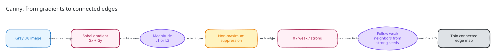
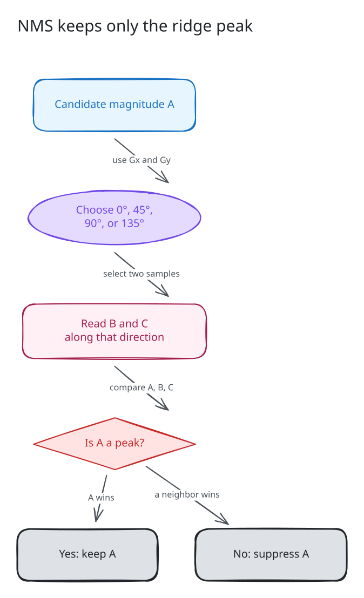
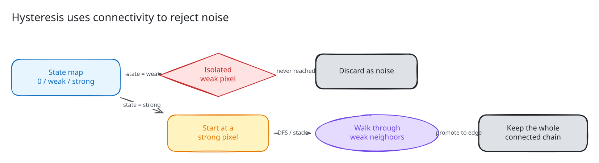
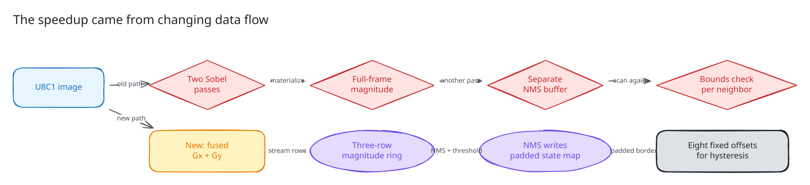
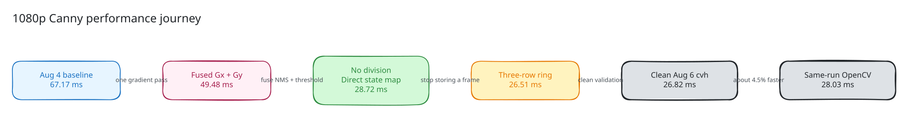

# How Does Canny Find Edges, and How Did cvh Catch OpenCV?

**English (default)** | [简体中文](README.zh-CN.md)

You may already know this call:

```cpp
cv::Canny(gray, edges, 50.0, 130.0, 3, false);
```

It looks like one function, but it hides a small computer-vision pipeline:
image gradients, direction classification, non-maximum suppression, two
thresholds, and graph traversal. That combination makes Canny a particularly
good optimization lesson. Some stages are regular numerical kernels; others
are branch-heavy and depend on neighboring pixels.

This tutorial is for readers who use OpenCV but have never implemented Canny.
We will first make the algorithm understandable, then build a readable scalar
version, find where it wastes memory traffic, and finally follow the data-flow
changes that brought the current cvh implementation to OpenCV-level latency.

The most important lesson is not “write more SIMD.” It is this:

> When an algorithm is a pipeline, the largest speedup often comes from
> changing what is materialized between stages.

## What We Will Build

The main performance case is intentionally narrow:

| Property | Tutorial focus |
| --- | --- |
| Input | 2D `CV_8UC1` grayscale image |
| Output | `CV_8UC1`, values `0` or `255` |
| Sobel aperture | `3` |
| Magnitude | L1, `abs(Gx) + abs(Gy)` |
| Thresholds | `50` and `130` |
| Layout | Continuous images, plus odd-width and ROI validation |
| Public call | `cvh::Canny(image, edges, 50, 130, 3, false)` |
| Performance reference | Upstream `cv::Canny` |

The product implementation also supports aperture `5`, L2 magnitude, a
`CV_16SC1` derivative overload, and non-contiguous ROI input. We introduce
those after the main path is clear.

Textbook descriptions usually put Gaussian smoothing before the gradient.
`cv::Canny` and `cvh::Canny` operate on the image supplied by the caller; if
your application needs explicit denoising, call `GaussianBlur` first. This
tutorial begins at the Canny call itself.

## Why Canny Is a Strong Follow-up to Resize

Resize teaches coordinate mapping, interpolation, fixed-point arithmetic, and
SIMD-friendly pixel layout. Canny adds a different set of reusable ideas:

- how a multi-stage CV algorithm transforms its intermediate representation;
- how gradient direction controls which neighbors matter;
- how a three-row dependency can become a ring buffer;
- how a padded state map can remove boundary branches;
- how local numerical work and global connectivity work together;
- why observed dispatch and ISA must be reported separately.

It is also a compelling product story. In the August 4 baseline report, the
1080p cvh case took `67.17 ms` while OpenCV took `34.52 ms`. In the clean
August 6 product-auto report, cvh took `26.82 ms` and OpenCV took `28.03 ms` on
the same Apple M5 class of setup. We will explain what changed without claiming
that one machine proves universal superiority.

## 1. What Is an Edge?

Consider one row of grayscale pixels:

```text
20  22  24  27  180  184  186
```

Most neighboring values differ only slightly. The jump from `27` to `180` is
large. An edge detector tries to find such spatial changes, but a useful edge
map needs more than “large difference”:

1. measure change in both x and y;
2. estimate how strong the change is;
3. keep only the center of a thick response;
4. reject isolated noise without breaking a real weak edge.

That is the Canny pipeline:



## 2. Stage One: Compute `Gx` and `Gy`

For aperture `3`, Sobel uses two 3x3 derivative kernels. Conceptually:

```text
Gx measures left-to-right change.
Gy measures top-to-bottom change.
```

A simple implementation computes them separately:

```cpp
Mat dx;
Mat dy;

Sobel(src, dx, CV_16S, 1, 0, 3, 1.0, 0.0,
      BORDER_REPLICATE | BORDER_ISOLATED);
Sobel(src, dy, CV_16S, 0, 1, 3, 1.0, 0.0,
      BORDER_REPLICATE | BORDER_ISOLATED);
```

The derivatives are signed 16-bit values because an edge can rise or fall.
The sign is also useful later: it tells us which diagonal direction to inspect
during non-maximum suppression.

### L1 versus L2 magnitude

The two public modes combine `Gx` and `Gy` differently:

```text
L1 = abs(Gx) + abs(Gy)
L2 = sqrt(Gx * Gx + Gy * Gy)
```

L2 is the Euclidean magnitude. L1 is cheaper and is the mode used by the
focused benchmark. Both modes must preserve the same threshold and tie
semantics as OpenCV within the supported surface.

## 3. Stage Two: Thin the Response with NMS

A Sobel response around a real boundary is often several pixels wide. If we
threshold it directly, the output looks like a thick band rather than a thin
edge.

Non-maximum suppression (NMS) asks a local question:

> Is this pixel the peak when we look across the edge?

The gradient points in the direction of greatest increase, which is
perpendicular to the visible edge. Canny quantizes that direction into four
bins: `0°`, `45°`, `90°`, or `135°`. It then compares the center magnitude
`A` with two magnitudes `B` and `C` along the selected direction.



The readable version often computes a slope:

```cpp
double slope = gx != 0 ? static_cast<double>(gy) / gx : huge_value;
```

Then it chooses horizontal, vertical, or one of the two diagonal comparisons.
This is easy to learn from, but division appears in the hot pixel loop.

Tie behavior matters. The implementation deliberately uses asymmetric
`>=`/`>` comparisons for selected directions. Changing those operators can
move or duplicate edge pixels even though the result still looks plausible.
That is why Canny needs byte-exact differential tests rather than visual
inspection alone.

## 4. Stage Three: Two Thresholds, Not One

After NMS, each candidate has one of three states:

```text
magnitude <= low    -> suppressed
low < magnitude <= high -> weak
magnitude > high    -> strong
```

The implementation normalizes reversed user arguments with `min` and `max`,
so `Canny(src, dst, 130, 50, ...)` uses the same low/high ordering.

A single high threshold would produce clean but broken edges. A single low
threshold would keep too much noise. The two thresholds defer the final
decision for weak pixels.

## 5. Stage Four: Hysteresis Uses Connectivity

Strong pixels are trusted immediately. A weak pixel is retained only if an
8-connected path reaches it from a strong pixel. An isolated weak response is
discarded.



This stage is naturally expressed as a depth-first search with a stack:

```cpp
for each strong pixel:
    push it
    while stack is not empty:
        pop one pixel
        for each of its 8 neighbors:
            if neighbor is weak or unvisited strong:
                mark it as an output edge
                push it
```

The output is binary: retained pixels become `255`; everything else remains
`0`.

This is the point where Canny stops looking like a pure convolution. Gradient
and magnitude are regular numeric kernels. Hysteresis is a data-dependent
graph walk.

## 6. A Readable Baseline

A first correct implementation usually mirrors the algorithm stages:

```cpp
// Educational pseudocode, not a second product implementation.
dx = sobel_x(src);
dy = sobel_y(src);

magnitude = allocate_float_image(rows, cols);
for every pixel:
    magnitude[p] = abs(dx[p]) + abs(dy[p]);

nms_state = allocate_state_image(rows, cols);
for every pixel:
    direction = classify(dx[p], dy[p]);
    if magnitude[p] is a local maximum:
        nms_state[p] = classify_by_threshold(magnitude[p]);

edges = hysteresis(nms_state);
```

This is an excellent correctness baseline because every intermediate can be
printed or inspected. It is not a good final data flow for a large image.

For a 1920x1080 image, just the main full-frame intermediates cost roughly:

| Intermediate | Type | Approximate storage |
| --- | --- | ---: |
| `dx` | S16 | `3.96 MiB` |
| `dy` | S16 | `3.96 MiB` |
| magnitude | F32 | `7.91 MiB` |
| NMS/state | U8 or larger temporary | about `1.98 MiB` or more |
| output edge map | U8 | `1.98 MiB` |

Storage capacity is only part of the cost. Each stage writes a full frame and
the next stage reads it again. The same pixels travel repeatedly through the
cache hierarchy.

## 7. Measure Before Optimizing

The immutable August 4 full report captured the old gap:

| Output shape | cvh baseline | OpenCV | OpenCV / cvh |
| --- | ---: | ---: | ---: |
| 480x640 | `11.173 ms` | `6.473 ms` | `0.579` |
| 720x1280 | `37.133 ms` | `18.227 ms` | `0.491` |
| 1080x1920 | `67.168 ms` | `34.522 ms` | `0.514` |
| 479x641 | `11.530 ms` | `5.893 ms` | `0.511` |

The ratio means OpenCV was about `1.7–2.0x` faster. More importantly, the
1080p absolute loss was over `32 ms` per call. This was not a microbenchmark
rounding error.

That report came from a development revision and is historical evidence, not
the final release gate. It is still useful because it tells us the optimization
must remove structural work rather than shave a few instructions.

## 8. Optimization One: Produce `Gx` and `Gy` Together

For aperture `3`, both derivatives use the same three source rows. Running two
independent Sobel calls repeats source loads, border handling, and loop setup.

The current image path first tries the shared gradient kernel:

```cpp
const bool fused_gradient =
    apertureSize == 3 &&
    filter_ui::spatial_gradient_u8_c1(
        image, dx, dy, BORDER_REPLICATE);
```

This still produces `dx` and `dy`, because later stages need both. The win is
that the source traversal and neighborhood preparation are shared.

During development, the 1080p probe fell from about `68.62 ms` to `49.48 ms`.
That was a large improvement, but still far from the target. SIMD helped one
stage; it did not fix the pipeline.

## 9. Optimization Two: Classify Direction without Division

We do not need the exact angle. We only need one of four bins.

Let:

```text
ax = abs(Gx)
ay = abs(Gy)
```

Then compare `ay` with:

```text
tan(pi / 8)  * ax
tan(3pi / 8) * ax
```

This distinguishes near-horizontal, near-vertical, and diagonal gradients
without calculating `Gy / Gx` for every candidate. The sign relationship of
`Gx` and `Gy` selects the diagonal; the implementation uses `(gx ^ gy) >= 0`.

The larger lesson is that an algorithm often asks for a category, while a
straightforward implementation calculates a much more precise value.

## 10. Optimization Three: Let NMS Write the Threshold State

NMS already knows whether a pixel survives. The next pass only needs to know
whether that survivor is weak or strong.

Instead of writing one NMS image and scanning it again, the optimized loop
writes the final state immediately:

```cpp
if (keep) {
    state[x] = magnitude > high ? 2 : 1;
}
```

State `0` means suppressed, `1` means weak, and `2` means strong. This fuses:

- local-maximum suppression;
- low-threshold rejection;
- weak/strong classification.

Together with division-free direction selection and simpler hysteresis state,
the development probe reached about `28.72 ms` at 1080p.

## 11. Optimization Four: Keep Only Three Magnitude Rows

NMS for output row `y` needs magnitude rows `y-1`, `y`, and `y+1`. Once row
`y` is classified, magnitudes older than `y-1` will never be used again.

That dependency radius gives us a three-row ring:

```cpp
std::vector<float> magnitude_ring(cols * 3);

float* row_for(int y) {
    return magnitude_ring.data() + (y % 3) * cols;
}
```

At 1080p, magnitude storage drops from about `7.91 MiB` to `22.5 KiB`:

```text
full frame: 1920 * 1080 * 4 bytes
three rows: 1920 * 3 * 4 bytes
```

The smaller working set stays cache-friendly, but the more important change is
that magnitude production and NMS now form a streaming pipeline.

## 12. Optimization Five: Pad the State Map

Hysteresis visits eight neighbors for every pixel it follows. A direct `(x,y)`
implementation checks four bounds for every neighbor.

The optimized state map is `(rows + 2) x (cols + 2)` with a zero border. A
pixel can then use eight fixed linear offsets:

```cpp
const int offsets[8] = {
    1, 1 - stride, -stride, -1 - stride,
   -1, -1 + stride,  stride,  1 + stride
};
```

The padded border safely terminates traversal. The stack stores one linear
index instead of a `Point`, and the inner neighbor loop no longer asks whether
each coordinate is inside the image.

## 13. Old Data Flow versus Current Data Flow

The optimizations are easier to understand as one redesign:



The new path did not eliminate every full-frame buffer. `dx`, `dy`, the padded
state map, and the output still exist. It removed the most expensive redundant
passes and changed magnitude into a streaming intermediate.

## 14. What the Final Implementation Actually Does

The public image overload enters
[`canny_image_fast_impl`](../../../include/cvh/imgproc/detail/canny_impl.hpp):

1. reset dispatch and algorithm telemetry;
2. accept a 2D `CV_8UC1` image and aperture `3` or `5`;
3. clone the source only when input and output alias;
4. for aperture `3`, try the fused UI gradient kernel;
5. otherwise compute two Sobel derivatives;
6. run the three-row magnitude/NMS state pipeline;
7. perform padded-map hysteresis and write the binary output.

The derivative overload accepts matching `CV_16SC1` `dx` and `dy` and begins
at step 6.

| Case | Gradient path | Later stages | Algorithm telemetry |
| --- | --- | --- | --- |
| U8C1, aperture 3, UI available | Fused `Gx + Gy` | Ring NMS + hysteresis | `canny_fused_gradient_ring_nms` |
| U8C1, aperture 3 without fused UI | Two Sobel calls | Ring NMS + hysteresis | `canny_ring_nms` |
| U8C1, aperture 5 | Two Sobel calls | Ring NMS + hysteresis | `canny_ring_nms` |
| S16 derivative overload | Caller supplies `dx`/`dy` | Ring NMS + hysteresis | `canny_ring_nms` |
| Unsupported input | Public fallback validates and throws | No silent conversion | `canny_fallback` |

The scalar fallback remains reliable. Optimized execution does not expand the
public type or aperture contract.

## 15. Performance Journey



The intermediate `49.48`, `28.72`, and `26.51 ms` values are development
measurements that explain causality. The current product claim comes from the
clean immutable August 6 report:

| Output shape | cvh | OpenCV | OpenCV / cvh |
| --- | ---: | ---: | ---: |
| 480x640 | `3.783 ms` | `3.964 ms` | `1.0477` |
| 720x1280 | `11.808 ms` | `12.128 ms` | `1.0271` |
| 1080x1920 | `26.815 ms` | `28.029 ms` | `1.0453` |
| 479x641 | `3.794 ms` | `3.939 ms` | `1.0382` |

Configuration:

- Apple M5, Darwin arm64;
- Apple Clang 21;
- Release build, one thread;
- `warmup=1`, `iters=10`, `repeats=3`;
- product `cvh_auto`;
- cvh commit `adac8bd`, clean;
- upstream OpenCV commit `d48bf69`;
- `algorithm_path=canny_fused_gradient_ring_nms`;
- `dispatch_path=opencv_ui`;
- `isa_observed=unknown`.

That final line is important. The report observed the OpenCV UI path but did
not prove which machine instruction set executed inside it. We therefore say
“UI path,” not “NEON path,” even though the host is ARM64.

The August 4 and August 6 reports used the same CPU model, compiler, upstream
commit, image shapes, sampling counts, and one-thread policy, but they are
different source snapshots and product modes. Their comparison explains the
engineering journey; the same-run August 6 cvh/OpenCV columns own the final
performance claim.

## 16. Correctness Is Harder Than It Looks

Canny can produce a visually reasonable image while still disagreeing at
hundreds of pixels. The important contracts are:

- exact Sobel border behavior, including ROI-isolated sampling;
- aperture `3` and `5`;
- L1 and L2 magnitude;
- reversed thresholds;
- narrow images and threshold boundary values;
- NMS direction and tie behavior;
- 8-connected weak-edge promotion;
- input/output aliasing;
- non-contiguous ROI step handling;
- scalar and UI dispatch results.

The repository validates these through:

- focused tests in
  [`test/imgproc/feature/canny_test.cpp`](../../../test/imgproc/feature/canny_test.cpp);
- an independent local reference in
  [`test/imgproc/support/canny_test_utils.hpp`](../../../test/imgproc/support/canny_test_utils.hpp);
- direct upstream OpenCV byte comparison in
  [`test/opencv_contract/opencv_contract_smoke_test.cpp`](../../../test/opencv_contract/opencv_contract_smoke_test.cpp);
- benchmark checksum and route recording in
  [`benchmark/opencv_compare_header_benchmark.cpp`](../../../benchmark/opencv_compare_header_benchmark.cpp).

The direct OpenCV contract uses zero byte tolerance for five aperture/L1/L2/
threshold/short-image cases under both scalar-only and UI-only dispatch.

## 17. Reproduce the Focused Checks

Reuse a compatible Release test build when one already exists. A standalone
configuration looks like:

```bash
cmake -S . -B build-dev-release \
  -DCMAKE_BUILD_TYPE=Release \
  -DCVH_BUILD_TESTS=ON

cmake --build build-dev-release \
  --target cvh_test_imgproc \
  --parallel 2

./build-dev-release/cvh_test_imgproc \
  --gtest_filter='CannyTest.*:CannyUpstreamTest.*'
```

For direct differential validation against a configured upstream OpenCV:

```bash
cmake -S . -B build-opencv-compare \
  -DCMAKE_BUILD_TYPE=Release \
  -DCVH_BUILD_TESTS=ON \
  -DCVH_ENABLE_OPENCV_COMPARE=ON \
  -DOpenCV_DIR=/path/to/opencv/build

cmake --build build-opencv-compare \
  --target cvh_test_opencv_contract_smoke \
  --parallel 2

./build-opencv-compare/cvh_test_opencv_contract_smoke \
  --gtest_filter='OpenCVContractSmoke_TEST.imgproc_canny_matches_upstream_bits'
```

The reusable compare runner currently groups Canny inside `IMGPROC_FLOOR`:

```bash
./benchmark/opencv_compare/run_compare.sh \
  --profile stable \
  --impls auto,ui,scalar \
  --ops IMGPROC_FLOOR
```

This runs the full focused Imgproc group, not Canny alone. Inspect the `CANNY`
rows and verify `algorithm_path`, `dispatch_path`, checksum, shape, and status
before drawing a conclusion.

## 18. General Lessons You Can Reuse

### Lesson 1: Optimize dependency radius

If a stage needs only the previous, current, and next rows, it probably does
not need a full-frame intermediate.

### Lesson 2: Compute only the decision you need

Canny needs one of four directions, not an accurate angle. Replacing a precise
division with direct classification simplifies the hot loop.

### Lesson 3: Fuse representations, not unrelated behavior

NMS and thresholding share the same surviving magnitude, so one state write is
natural. Hysteresis remains a separate graph traversal because its dependency
is global and data-dependent.

### Lesson 4: Padding can replace control flow

A small zero border around a state map turns eight coordinate checks into eight
constant offsets.

### Lesson 5: SIMD is only one layer

The fused gradient kernel mattered, but most of the remaining gain came from
removing full-frame data movement and simplifying state transitions.

### Lesson 6: Report what actually ran

Algorithm path, dispatch path, and observed ISA are different facts. Do not
infer all three from the host architecture.

## 19. Where to Read the Product Code

- Public API and readable fallback:
  [`include/cvh/imgproc/canny.h`](../../../include/cvh/imgproc/canny.h)
- Ring-buffer and hysteresis implementation:
  [`include/cvh/imgproc/detail/canny_impl.hpp`](../../../include/cvh/imgproc/detail/canny_impl.hpp)
- Current clean performance evidence:
  [August 6 product-auto report](../../../benchmark/opencv_compare/results/2026-08-06-v0.1-neon-hot-opencv-upstream-performance.en.md)
- Historical pre-redesign gap:
  [August 4 baseline report](../../../benchmark/opencv_compare/results/2026-08-04-opencv-upstream-performance.en.md)
- Other tutorials:
  [cvh tutorial catalog](../README.md)

The progression to remember is:

```text
understand the stages
    -> build a correct baseline
    -> measure full-frame traffic
    -> fuse shared gradients
    -> write threshold state directly
    -> stream magnitude through three rows
    -> pad the connectivity map
    -> validate every pixel and every path
```

That is how a textbook edge detector became a product implementation that, for
the measured scope, reached OpenCV performance without giving up a scalar
fallback or a precise correctness contract.
