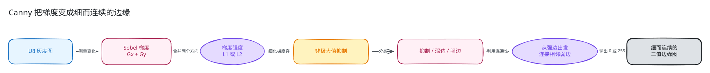
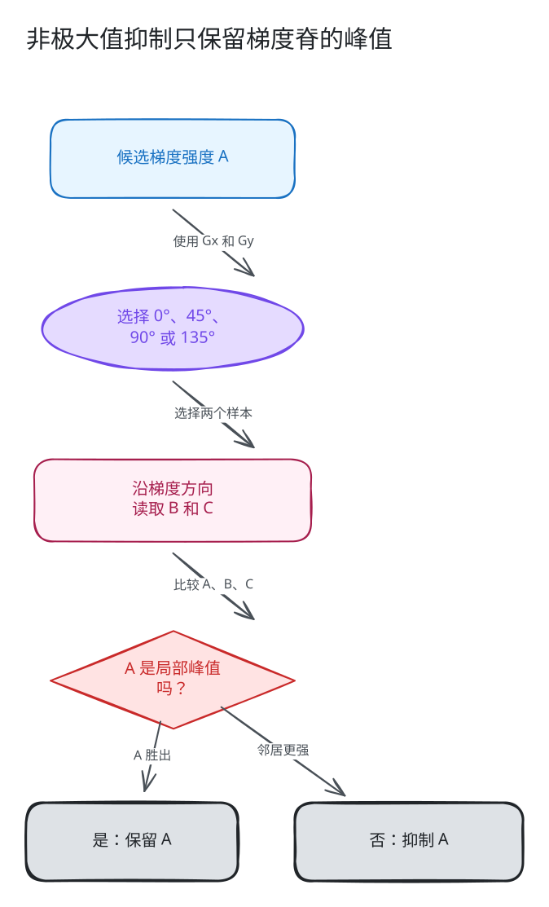
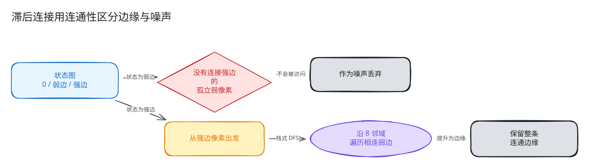
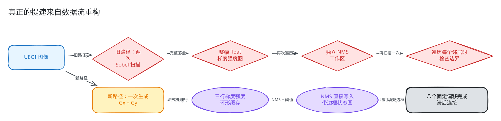
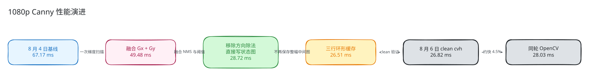

# Canny 是怎样找到边缘的，又是怎样追上 OpenCV 的？

[English (default)](README.md) | **简体中文**

你可能已经写过这行代码：

```cpp
cv::Canny(gray, edges, 50.0, 130.0, 3, false);
```

它看起来只是一个函数，内部却藏着一条小型计算机视觉流水线：图像梯度、
方向分类、非极大值抑制、双阈值和图遍历。这让 Canny 特别适合用来学习优化：
其中一些阶段是规则的数值计算，另一些阶段则充满分支，并且依赖相邻像素。

这篇教程面向“会调用 OpenCV，但没有实现过 Canny”的读者。我们先把算法讲
明白，再写出容易理解的标量版本，找到其中浪费内存带宽的地方，最后沿着真实
的数据流改造过程，看当前 cvh 实现怎样达到 OpenCV 级别的延迟。

最重要的结论不是“多写一些 SIMD”，而是：

> 当一个算法由多个阶段组成时，最大的提速通常来自改变阶段之间需要落盘的
> 中间结果。

## 这篇教程实现什么

主线性能 case 有意保持窄而明确：

| 属性 | 教程主线 |
| --- | --- |
| 输入 | 二维 `CV_8UC1` 灰度图 |
| 输出 | `CV_8UC1`，像素值为 `0` 或 `255` |
| Sobel aperture | `3` |
| 梯度强度 | L1，即 `abs(Gx) + abs(Gy)` |
| 阈值 | `50` 和 `130` |
| 布局 | 连续图像，并验证奇数宽度和 ROI |
| 公共调用 | `cvh::Canny(image, edges, 50, 130, 3, false)` |
| 性能参照 | upstream `cv::Canny` |

产品实现还支持 aperture `5`、L2 梯度强度、`CV_16SC1` 导数重载，以及非连续
ROI。等主线清楚后，我们再说明这些路径。

教科书通常会在求梯度前加入高斯平滑。`cv::Canny` 和 `cvh::Canny` 都直接处理
调用者传入的图像；如果应用需要显式去噪，应先调用 `GaussianBlur`。本教程从
Canny 调用本身开始。

## 为什么下一篇选择 Canny

Resize 教会我们坐标映射、插值、定点计算和适合 SIMD 的像素布局。Canny 又能
带来一组不同但同样可复用的知识：

- 多阶段 CV 算法怎样改变中间数据表示；
- 梯度方向怎样决定应该比较哪两个邻居；
- 只依赖三行的数据怎样改造成环形缓存；
- 带填充边框的状态图怎样消除边界分支；
- 局部数值计算怎样与全局连通性结合；
- 为什么算法路径、派发路径和实际 ISA 必须分别报告。

它也有很好的产品故事。8 月 4 日的基线报告中，1080p cvh 耗时 `67.17 ms`，
OpenCV 为 `34.52 ms`；8 月 6 日的 clean product-auto 报告中，cvh 为
`26.82 ms`，OpenCV 为 `28.03 ms`。下面会解释发生了什么，但不会把一台机器
上的结果泛化成“所有平台都更快”。

## 1. 什么是边缘

观察一行灰度像素：

```text
20  22  24  27  180  184  186
```

大多数相邻数值只差一点，`27` 到 `180` 却发生了很大的跳变。边缘检测要寻找
这种空间变化，但实用的边缘图不能只判断“差值很大”，还需要：

1. 测量 x、y 两个方向的变化；
2. 判断变化有多强；
3. 从较宽的响应中只保留中心；
4. 去掉孤立噪声，同时不要切断真实的弱边。

这就是 Canny 流水线：



## 2. 第一阶段：计算 `Gx` 和 `Gy`

aperture 为 `3` 时，Sobel 使用两个 3x3 导数核。可以先这样理解：

```text
Gx 测量从左到右的变化。
Gy 测量从上到下的变化。
```

最直接的实现会分别计算它们：

```cpp
Mat dx;
Mat dy;

Sobel(src, dx, CV_16S, 1, 0, 3, 1.0, 0.0,
      BORDER_REPLICATE | BORDER_ISOLATED);
Sobel(src, dy, CV_16S, 0, 1, 3, 1.0, 0.0,
      BORDER_REPLICATE | BORDER_ISOLATED);
```

导数使用有符号 16-bit，因为边缘既可能上升，也可能下降。符号还会在后面的
非极大值抑制中帮助我们选择应该检查哪个对角方向。

### L1 与 L2 梯度强度

两个公共模式用不同方式组合 `Gx` 和 `Gy`：

```text
L1 = abs(Gx) + abs(Gy)
L2 = sqrt(Gx * Gx + Gy * Gy)
```

L2 是欧氏长度，L1 更便宜，也是专项 benchmark 使用的模式。在当前支持范围
内，两种模式都必须保持与 OpenCV 一致的阈值和相等值处理语义。

## 3. 第二阶段：用 NMS 把响应变细

真实边界附近的 Sobel 响应往往有几个像素宽。如果直接做阈值处理，输出会是
一条粗带，而不是细边缘。

非极大值抑制（NMS）问的是：

> 沿着横跨边缘的方向观察时，这个像素是不是峰值？

梯度指向灰度增加最快的方向，它与肉眼看到的边缘垂直。Canny 把这个方向量化
到 `0°`、`45°`、`90°`、`135°` 四类，然后将中心强度 `A` 与这个方向上的两个
邻居 `B`、`C` 比较。



易读版本通常先计算斜率：

```cpp
double slope = gx != 0 ? static_cast<double>(gy) / gx : huge_value;
```

然后选择水平、垂直或两个对角方向之一。这很容易理解，但把除法放进了逐像素
热循环。

相等值处理同样重要。实现会在特定方向刻意使用不对称的 `>=` 和 `>`。即使改完
后的图肉眼看起来仍然合理，改变这些运算符也可能移动或复制边缘像素。因此
Canny 需要逐字节差分测试，不能只靠看图。

## 4. 第三阶段：为什么需要两个阈值

NMS 之后，每个候选会进入三种状态之一：

```text
magnitude <= low         -> 被抑制
low < magnitude <= high  -> 弱边
magnitude > high         -> 强边
```

实现会用 `min` 和 `max` 规范化顺序相反的参数，因此
`Canny(src, dst, 130, 50, ...)` 仍会得到正确的 low/high 顺序。

只用高阈值，输出会干净但边缘容易断；只用低阈值，噪声又会太多。双阈值把
弱边的最终决定推迟到连通性阶段。

## 5. 第四阶段：滞后连接利用连通性

强边像素可以直接信任。弱边像素只有在 8 邻域路径能够连接到强边时才保留；
孤立的弱响应会被丢弃。



这一阶段天然适合用栈实现深度优先搜索：

```cpp
遍历每个强边像素：
    将它压栈
    当栈不为空：
        弹出一个像素
        遍历它的 8 个邻居：
            如果邻居是弱边或尚未访问的强边：
                标记为输出边缘
                将邻居压栈
```

最终输出是二值图：保留的像素写成 `255`，其他位置保持 `0`。

到这里，Canny 已经不再只是卷积。梯度和强度计算是规则的数值 kernel，滞后
连接却是由数据决定路径的图遍历。

## 6. 一个容易理解的基线实现

第一版正确实现通常会忠实映射算法阶段：

```cpp
// 教学伪代码，不是第二套产品实现。
dx = sobel_x(src);
dy = sobel_y(src);

magnitude = allocate_float_image(rows, cols);
遍历每个像素：
    magnitude[p] = abs(dx[p]) + abs(dy[p]);

nms_state = allocate_state_image(rows, cols);
遍历每个像素：
    direction = classify(dx[p], dy[p]);
    如果 magnitude[p] 是局部极大值：
        nms_state[p] = classify_by_threshold(magnitude[p]);

edges = hysteresis(nms_state);
```

这是很好的正确性基线，因为每个中间结果都能打印或查看；但对于大图，它不是
理想的最终数据流。

以 1920x1080 图像为例，仅几个主要整幅中间量就大约需要：

| 中间量 | 类型 | 大致存储量 |
| --- | --- | ---: |
| `dx` | S16 | `3.96 MiB` |
| `dy` | S16 | `3.96 MiB` |
| 梯度强度 | F32 | `7.91 MiB` |
| NMS/状态 | U8 或更大的临时表示 | 约 `1.98 MiB` 或更多 |
| 输出边缘图 | U8 | `1.98 MiB` |

容量只是成本的一部分。每个阶段写出整幅图，下个阶段又完整读回，同一批像素会
反复经过缓存层级。

## 7. 优化前先测量

不可变的 8 月 4 日 full 报告记录了旧差距：

| 输出尺寸 | cvh 基线 | OpenCV | OpenCV / cvh |
| --- | ---: | ---: | ---: |
| 480x640 | `11.173 ms` | `6.473 ms` | `0.579` |
| 720x1280 | `37.133 ms` | `18.227 ms` | `0.491` |
| 1080x1920 | `67.168 ms` | `34.522 ms` | `0.514` |
| 479x641 | `11.530 ms` | `5.893 ms` | `0.511` |

这个比值表示 OpenCV 大约快 `1.7–2.0x`。更重要的是，1080p 每次调用的绝对
损失超过 `32 ms`，这不是微基准里的舍入误差。

这份报告来自开发 revision，是历史证据，不是最终发布门禁。但它清楚地告诉
我们：需要消除结构性工作，而不是只减少几条指令。

## 8. 优化一：同时生成 `Gx` 和 `Gy`

aperture 为 `3` 时，两个导数共享相同的三行输入。运行两次独立 Sobel 会重复
源图加载、边界处理和循环准备。

当前图像路径会先尝试共享梯度 kernel：

```cpp
const bool fused_gradient =
    apertureSize == 3 &&
    filter_ui::spatial_gradient_u8_c1(
        image, dx, dy, BORDER_REPLICATE);
```

它仍会输出 `dx` 和 `dy`，因为后续阶段两者都需要；收益来自共享源图遍历和
邻域准备。

开发过程中，1080p 探针从约 `68.62 ms` 降到 `49.48 ms`。这是很大的改善，
但仍离目标很远。SIMD 加速了一个阶段，却没有解决整条流水线。

## 9. 优化二：不用除法完成方向分类

我们不需要精确角度，只需要四个方向类别之一。

定义：

```text
ax = abs(Gx)
ay = abs(Gy)
```

然后将 `ay` 与下面两个边界比较：

```text
tan(pi / 8)  * ax
tan(3pi / 8) * ax
```

这样无需逐像素计算 `Gy / Gx`，就能区分接近水平、接近垂直和对角方向。
`Gx`、`Gy` 的符号关系决定选择哪个对角，当前实现使用 `(gx ^ gy) >= 0`。

这里可复用的经验是：算法只需要一个类别时，直接实现却常常计算了远比类别
更精确的数值。

## 10. 优化三：让 NMS 直接写入阈值状态

NMS 已经知道像素是否应该保留，下一个阶段只需要知道幸存者是弱边还是强边。

优化后的循环不再写一份 NMS 图再扫描，而是立即写最终状态：

```cpp
if (keep) {
    state[x] = magnitude > high ? 2 : 1;
}
```

状态 `0` 表示抑制，`1` 表示弱边，`2` 表示强边。它把以下操作融合到一次写入：

- 局部极大值抑制；
- 低阈值拒绝；
- 弱边/强边分类。

结合无除法方向分类和更简单的滞后状态，1080p 开发探针到达约 `28.72 ms`。

## 11. 优化四：只保留三行梯度强度

计算输出行 `y` 的 NMS 只需要强度行 `y-1`、`y`、`y+1`。行 `y` 分类完成后，
比 `y-1` 更老的强度再也不会使用。

这个依赖半径允许我们使用三行环形缓存：

```cpp
std::vector<float> magnitude_ring(cols * 3);

float* row_for(int y) {
    return magnitude_ring.data() + (y % 3) * cols;
}
```

1080p 下，梯度强度存储从约 `7.91 MiB` 降到 `22.5 KiB`：

```text
整幅图：1920 * 1080 * 4 bytes
三行：  1920 * 3 * 4 bytes
```

较小的工作集更适合缓存，但更重要的变化是：梯度强度生成和 NMS 变成了真正
的流式流水线。

## 12. 优化五：给状态图加一圈填充

滞后连接每跟随一个像素，就要访问八个邻居。直接使用 `(x,y)` 坐标会为每个
邻居检查边界。

优化后的状态图大小是 `(rows + 2) x (cols + 2)`，外围全部为零。每个像素就能
使用八个固定线性偏移：

```cpp
const int offsets[8] = {
    1, 1 - stride, -stride, -1 - stride,
   -1, -1 + stride,  stride,  1 + stride
};
```

填充边框会安全终止遍历。栈中保存一个线性下标，不再保存 `Point`，内层邻居
循环也不再判断坐标是否位于图像内。

## 13. 旧数据流与当前数据流

把这些优化放在同一张图上更容易理解：



新路径没有消除所有整幅缓冲区：`dx`、`dy`、带填充的状态图和输出依然存在。
它删除了最昂贵的重复遍历，并把梯度强度改成了流式中间量。

## 14. 最终实现实际怎样工作

公共图像重载进入
[`canny_image_fast_impl`](../../../include/cvh/imgproc/detail/canny_impl.hpp)：

1. 重置派发与算法路径记录；
2. 接受二维 `CV_8UC1` 图像，以及 aperture `3` 或 `5`；
3. 仅在输入输出别名时 clone 源图；
4. aperture `3` 时先尝试融合 UI 梯度 kernel；
5. 不满足时计算两次 Sobel 导数；
6. 执行三行强度/NMS 状态流水线；
7. 在带填充状态图上完成滞后连接并写出二值结果。

导数重载接受尺寸一致的 `CV_16SC1` `dx` 和 `dy`，直接从第 6 步开始。

| Case | 梯度路径 | 后续阶段 | 算法路径记录 |
| --- | --- | --- | --- |
| U8C1、aperture 3、UI 可用 | 融合 `Gx + Gy` | 环形 NMS + 滞后连接 | `canny_fused_gradient_ring_nms` |
| U8C1、aperture 3、无融合 UI | 两次 Sobel | 环形 NMS + 滞后连接 | `canny_ring_nms` |
| U8C1、aperture 5 | 两次 Sobel | 环形 NMS + 滞后连接 | `canny_ring_nms` |
| S16 导数重载 | 调用者提供 `dx`/`dy` | 环形 NMS + 滞后连接 | `canny_ring_nms` |
| 不支持的输入 | 公共 fallback 校验并抛错 | 不做静默转换 | `canny_fallback` |

可靠的标量 fallback 始终保留。优化路径不会扩张公共类型和 aperture 合同。

## 15. 性能演进



图中的 `49.48`、`28.72`、`26.51 ms` 是用于解释因果关系的开发测量。当前产品
结论来自 8 月 6 日 clean 不可变报告：

| 输出尺寸 | cvh | OpenCV | OpenCV / cvh |
| --- | ---: | ---: | ---: |
| 480x640 | `3.783 ms` | `3.964 ms` | `1.0477` |
| 720x1280 | `11.808 ms` | `12.128 ms` | `1.0271` |
| 1080x1920 | `26.815 ms` | `28.029 ms` | `1.0453` |
| 479x641 | `3.794 ms` | `3.939 ms` | `1.0382` |

运行配置：

- Apple M5，Darwin arm64；
- Apple Clang 21；
- Release，单线程；
- `warmup=1`、`iters=10`、`repeats=3`；
- 产品实现 `cvh_auto`；
- cvh commit `adac8bd`，clean；
- upstream OpenCV commit `d48bf69`；
- `algorithm_path=canny_fused_gradient_ring_nms`；
- `dispatch_path=opencv_ui`；
- `isa_observed=unknown`。

最后一行尤其重要：报告观测到 OpenCV UI 路径，但没有证明 UI 内部实际执行了
哪一种机器指令。因此即使主机是 ARM64，我们也只说“UI 路径”，不写成“NEON
路径”。

8 月 4 日与 8 月 6 日报告使用相同 CPU 型号、编译器、upstream commit、图像
尺寸、采样次数和单线程策略，但它们属于不同源码快照与产品模式。跨报告比较
用于解释工程过程；最终性能主张由 8 月 6 日同一轮 cvh/OpenCV 两列负责。

## 16. 正确性比看起来更难

Canny 即使错了几百个像素，肉眼看起来仍可能“差不多”。必须冻结的合同包括：

- 精确 Sobel 边界行为，包括 ROI-isolated 采样；
- aperture `3` 和 `5`；
- L1 和 L2 梯度强度；
- 顺序相反的阈值；
- 窄图和阈值边界值；
- NMS 方向与相等值处理；
- 8 邻域弱边提升；
- 输入输出别名；
- 非连续 ROI step；
- 标量与 UI 派发结果。

仓库通过以下位置验证它们：

- 专项测试：
  [`test/imgproc/feature/canny_test.cpp`](../../../test/imgproc/feature/canny_test.cpp)；
- 独立本地参考：
  [`test/imgproc/support/canny_test_utils.hpp`](../../../test/imgproc/support/canny_test_utils.hpp)；
- 与真实 upstream OpenCV 逐字节对比：
  [`test/opencv_contract/opencv_contract_smoke_test.cpp`](../../../test/opencv_contract/opencv_contract_smoke_test.cpp)；
- benchmark checksum 和路径记录：
  [`benchmark/opencv_compare_header_benchmark.cpp`](../../../benchmark/opencv_compare_header_benchmark.cpp)。

直接 OpenCV 合同为五组 aperture/L1/L2/阈值/短图 case 使用零字节容差，并同时
运行 scalar-only 和 UI-only 派发。

## 17. 复现专项检查

如果已有兼容的 Release 测试 build，应当直接复用。独立配置示例：

```bash
cmake -S . -B build-dev-release \
  -DCMAKE_BUILD_TYPE=Release \
  -DCVH_BUILD_TESTS=ON

cmake --build build-dev-release \
  --target cvh_test_imgproc \
  --parallel 2

./build-dev-release/cvh_test_imgproc \
  --gtest_filter='CannyTest.*:CannyUpstreamTest.*'
```

要与已配置的 upstream OpenCV 做直接差分验证：

```bash
cmake -S . -B build-opencv-compare \
  -DCMAKE_BUILD_TYPE=Release \
  -DCVH_BUILD_TESTS=ON \
  -DCVH_ENABLE_OPENCV_COMPARE=ON \
  -DOpenCV_DIR=/path/to/opencv/build

cmake --build build-opencv-compare \
  --target cvh_test_opencv_contract_smoke \
  --parallel 2

./build-opencv-compare/cvh_test_opencv_contract_smoke \
  --gtest_filter='OpenCVContractSmoke_TEST.imgproc_canny_matches_upstream_bits'
```

当前可复用 compare runner 把 Canny 放在 `IMGPROC_FLOOR` 集合内：

```bash
./benchmark/opencv_compare/run_compare.sh \
  --profile stable \
  --impls auto,ui,scalar \
  --ops IMGPROC_FLOOR
```

这会运行整个 Imgproc 专项集合，不只运行 Canny。得出结论前，应提取 `CANNY`
行并检查 `algorithm_path`、`dispatch_path`、checksum、尺寸和状态。

## 18. 可以复用到其他算子的经验

### 经验一：围绕依赖半径优化

如果某阶段只依赖上一行、当前行和下一行，它很可能不需要整幅中间图。

### 经验二：只计算决策真正需要的信息

Canny 只需要四个方向之一，不需要精确角度。用直接分类代替高精度除法，可以
简化热循环。

### 经验三：融合表示，不要强行融合不同性质的行为

NMS 和阈值共享同一个幸存强度，因此合并成一次状态写入很自然。滞后连接具有
全局、数据依赖关系，仍应保持为独立图遍历。

### 经验四：填充可以替代控制流

给状态图加一圈很小的零边框，就能把八次坐标判断变成八个常量偏移。

### 经验五：SIMD 只是其中一层

融合梯度 kernel 很重要，但之后的大部分收益来自减少整幅数据搬运和简化状态
转换。

### 经验六：报告实际执行的内容

算法路径、派发路径和观测 ISA 是三个不同事实，不能从主机架构推导全部结论。

## 19. 继续阅读产品代码

- 公共 API 与易读 fallback：
  [`include/cvh/imgproc/canny.h`](../../../include/cvh/imgproc/canny.h)
- 环形缓存与滞后连接实现：
  [`include/cvh/imgproc/detail/canny_impl.hpp`](../../../include/cvh/imgproc/detail/canny_impl.hpp)
- 当前 clean 性能证据：
  [8 月 6 日 product-auto 报告](../../../benchmark/opencv_compare/results/2026-08-06-v0.1-neon-hot-opencv-upstream-performance.en.md)
- 优化前历史差距：
  [8 月 4 日基线报告](../../../benchmark/opencv_compare/results/2026-08-04-opencv-upstream-performance.en.md)
- 其他教程：
  [cvh 教程目录](../README.md)

请记住这条主线：

```text
理解算法阶段
    -> 建立正确基线
    -> 测量整幅中间量的数据搬运
    -> 融合共享梯度
    -> 直接写入阈值状态
    -> 用三行缓存流式处理梯度强度
    -> 填充连通状态图
    -> 逐像素、逐路径验证
```

这就是一个教科书边缘检测器变成产品实现的过程：在本教程测量范围内追上
OpenCV，同时没有牺牲标量 fallback 和严格的正确性合同。
