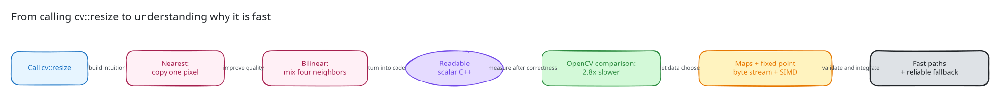
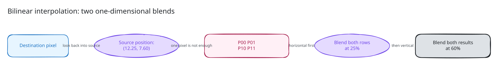
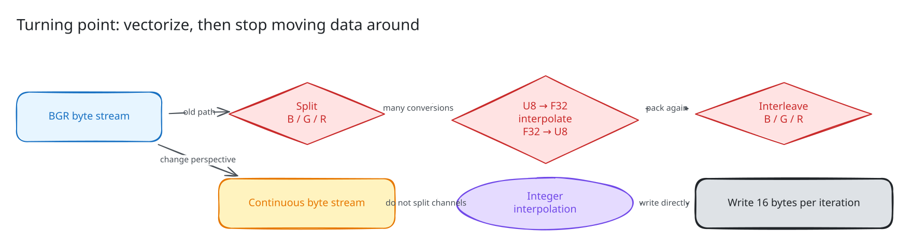
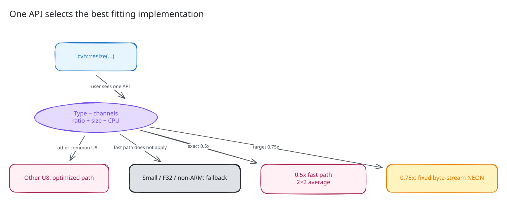
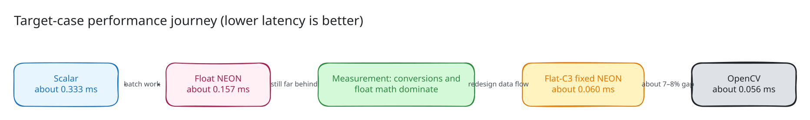

# How Does `resize` Work, and How Did We Bring It Close to OpenCV Speed?

**English (default)** | [简体中文](README.zh-CN.md)

You have probably written this many times:

```cpp
cv::resize(src, dst, cv::Size(480, 360), 0, 0, cv::INTER_LINEAR);
```

But what does `resize` actually do? Why is a mature OpenCV implementation much
faster than what looks like a simple nested loop? If we start from scratch, how
can we close that performance gap one step at a time?

This tutorial is for readers who know how to use OpenCV but have never
implemented image resizing. The main path only assumes ordinary C++ knowledge.
NEON intrinsics, Q16 coordinates, and dispatch telemetry are collected in the
[advanced appendix](#advanced-appendix-exact-details-of-the-current-product-implementation),
which you can skip on a first read.

We will focus on one common case:

```text
8-bit BGR image (CV_8UC3)
640×480 -> 480×360 (both dimensions shrink to 3/4)
INTER_LINEAR
ARM64, single-threaded
```

Here is the result up front: the old implementation ran at about `35%` of
OpenCV's speed, while the new implementation reaches about `93%`. In other
words, a roughly `2.8x` gap was reduced to about `1.07–1.08x`. That is close,
but it does not mean every `resize` type, size, ratio, and platform now matches
OpenCV.



## Before We Start: Five Terms Are Enough

| Term | Meaning in this tutorial |
| --- | --- |
| source / `src` | The original image |
| destination / `dst` | The resized output image |
| U8C3 | 8 bits per channel and 3 channels per pixel; a typical BGR image |
| scalar | Ordinary C++ that processes one value at a time |
| SIMD / NEON | One instruction processes a batch of values; NEON is ARM SIMD |
| fallback | A correct general implementation used when a fast path does not apply |

## 1. Forget Optimization for a Moment: What Does `resize` Actually Do?

Turning a `640×480` image into `480×360` is not simply a matter of deleting
some pixels. Every output pixel must answer one question:

> Where am I in the source image, and which source pixels should determine my
> color?

Implementations normally iterate over the destination and look backward into
the source. This is called inverse mapping:

```text
for every destination pixel (dx, dy):
    compute its source position (sx, sy)
    sample the source image
    write dst(dy, dx)
```

Why not push every source pixel forward into the destination? Forward mapping
may send several source pixels to the same output position while leaving holes
elsewhere. Inverse mapping guarantees that each destination pixel is written
exactly once.

### 1.1 The Simplest Version: Nearest Neighbor

Nearest-neighbor resizing finds the source position for an output pixel and
copies one nearby source pixel directly.

The core of a teaching implementation looks like this:

```cpp
for (int dy = 0; dy < dst_rows; ++dy) {
    const int sy = std::min(src_rows - 1,
                            dy * src_rows / dst_rows);

    for (int dx = 0; dx < dst_cols; ++dx) {
        const int sx = std::min(src_cols - 1,
                                dx * src_cols / dst_cols);

        for (int c = 0; c < 3; ++c) {
            dst(dy, dx, c) = src(sy, sx, c);
        }
    }
}
```

It is fast and easy to understand. Its weakness is visual quality: enlarging
an image tends to expose blocky pixels, while shrinking can discard noticeable
detail. The corresponding OpenCV mode is `INTER_NEAREST`.

Nearest neighbor gives us the first important mental model: **Resize is not
primarily about changing a container's dimensions. It is about mapping
destination coordinates back to source coordinates.**

## 2. Bilinear Interpolation: Mix Four Neighbors Instead of Copying One

`INTER_LINEAR` uses bilinear interpolation. Start with a one-dimensional
example:

```text
A = 10       B = 30
      ^
      target position is 25% of the way from A to B
```

The result is:

```text
10 × 75% + 30 × 25% = 15
```

This operation is commonly written as:

```cpp
lerp(a, b, t) = a + (b - a) * t;
```

A two-dimensional image applies one-dimensional interpolation twice. Suppose
an output pixel maps to source coordinate `(sx=12.25, sy=7.60)`:

- Horizontally, it lies between columns 12 and 13 with weight `0.25`.
- Vertically, it lies between rows 7 and 8 with weight `0.60`.
- Therefore, it needs the four surrounding source pixels.



In symbols:

```text
P00 = src(y0, x0)    P01 = src(y0, x1)
P10 = src(y1, x0)    P11 = src(y1, x1)

top    = lerp(P00, P01, wx)
bottom = lerp(P10, P11, wx)
dst    = lerp(top, bottom, wy)
```

Mathematically, we may interpolate vertically first and horizontally second.
The two orders are equivalent in pure floating-point arithmetic. An integer
implementation rounds at each stage, however, so production code must freeze
one order. We will return to that detail later.

### 2.1 Why Does the Coordinate Formula Contain `+0.5` and `-0.5`?

A pixel is not merely a dimensionless grid point. It is useful to imagine it as
a small square centered on an integer coordinate. A common half-pixel mapping
is:

```text
scale_x = src_width / dst_width
sx = (dx + 0.5) * scale_x - 0.5
```

The vertical formula is the same. For `640 -> 480`, the first destination pixel
has `dx=0`:

```text
sx = (0 + 0.5) × (640 / 480) - 0.5
   = 0.1667
```

It lies between source columns 0 and 1 and is closer to column 0. This matches
the geometric intuition of scaling around pixel centers.

You do not need to memorize the formula, but you do need to know this:
**coordinate alignment is part of an operator's output contract.** Removing a
single `0.5` may still produce a plausible-looking image, but its borders and
pixel values no longer describe the same `resize` operation.

## 3. Write the First Readable Bilinear Resize

To keep the main loop clear, first wrap one-dimensional coordinate mapping in a
small helper. The following is teaching code, not a complete replacement for
the product implementation; it omits `Mat` allocation, type checks, and error
handling.

```cpp
struct AxisPosition {
    int first;
    int second;
    float fraction;
};

AxisPosition locate(int dst_index, int src_size, int dst_size)
{
    if (src_size == 1) {
        return {0, 0, 0.0f};
    }

    const float scale = float(src_size) / float(dst_size);
    const float source = (float(dst_index) + 0.5f) * scale - 0.5f;

    // Replicate the border instead of reading outside the image.
    if (source <= 0.0f) {
        return {0, 0, 0.0f};
    }
    if (source >= float(src_size - 1)) {
        return {src_size - 1, src_size - 1, 0.0f};
    }

    const int first = int(std::floor(source));
    return {first, first + 1, source - float(first)};
}
```

With that helper, the U8C3 bilinear loop is straightforward:

```cpp
for (int dy = 0; dy < dst_rows; ++dy) {
    const AxisPosition py = locate(dy, src_rows, dst_rows);
    const uchar* row0 = src.data + std::size_t(py.first) * src.step(0);
    const uchar* row1 = src.data + std::size_t(py.second) * src.step(0);
    uchar* output = dst.data + std::size_t(dy) * dst.step(0);

    for (int dx = 0; dx < dst_cols; ++dx) {
        const AxisPosition px = locate(dx, src_cols, dst_cols);

        for (int c = 0; c < 3; ++c) {
            const float top = lerp(
                row0[px.first * 3 + c],
                row0[px.second * 3 + c],
                px.fraction);
            const float bottom = lerp(
                row1[px.first * 3 + c],
                row1[px.second * 3 + c],
                px.fraction);

            output[dx * 3 + c] = saturate_cast<uchar>(
                lerp(top, bottom, py.fraction));
        }
    }
}
```

Read the loop from the outside inward:

1. Find the two source rows corresponding to the destination row.
2. Find the left and right source pixels corresponding to the destination
   column.
3. Perform bilinear interpolation separately for B, G, and R.
4. Round the floating-point result and clamp it to `[0, 255]`.

`step(0)` is the in-memory stride between rows. We cannot replace it with
`row * width * 3`, because an ROI row may be followed by data that belongs to
the parent image but lies outside the ROI.

The readable general implementation in cvh is
[`resize_fallback_impl_typed`](../../../include/cvh/imgproc/resize.h).

## 4. Prove the First Version Correct Before Making It Fast

Our goal is not to write a function that merely looks like resize. Within the
supported surface, its result must align with OpenCV. OpenCV serves two roles:

- Correctness reference: compare outputs for the same input, size, and
  interpolation mode.
- Performance reference: compare latency on the same machine, with the same
  thread count and input.

U8 interpolation is sensitive to rounding order, so the general differential
contract allows a maximum pixel difference of `1` instead of requiring every
implementation to use the same sequence of arithmetic operations. Tests must
cover more than one photograph. They should include:

- Gradients, checkerboards, constant images, and random data.
- Upscaling, downscaling, odd sizes, and single-row or single-column images.
- C1, C3, and C4 layouts.
- Ordinary contiguous images and non-contiguous ROIs.
- Border pixels, short rows, and tails that do not fill a SIMD block.

Public behavior is covered by
[`resize_test.cpp`](../../../test/imgproc/geometry/resize_test.cpp), while the
OpenCV differential lives in
[`opencv_contract_smoke_test.cpp`](../../../test/opencv_contract/opencv_contract_smoke_test.cpp).

Only now should we start optimizing. Otherwise, after the code gets faster, we
may not even know whether we silently changed the algorithm.

## 5. First Measurement: Correct, but About 2.8 Times Slower Than OpenCV

We freeze the target case as:

```text
CV_8UC3 + INTER_LINEAR
640×480 -> 480×360
Release + single thread + Apple ARM64
```

The repository's clean baseline is:

| Implementation | Latency | Interpretation |
| --- | ---: | --- |
| Old cvh Auto | `0.169096 ms` | Path to optimize |
| OpenCV | `0.060208 ms` | About `2.81x` faster |

This is useful information. We have a correctness baseline and a clear,
repeatable performance gap. Every optimization must now answer two questions:

1. What work does it remove?
2. Can measurement prove that work was significant in the first place?

## 6. First Optimization: Precompute Coordinate Maps

Look again at the naive code. For every destination row `dy`, the inner loop
recomputes the source coordinate for every `dx`. But during one Resize call,
destination column 100 always maps to the same `x0/x1/wx`.

We can therefore build two read-only tables once:

```text
x map: x0, x1, and wx for every dx
y map: y0, y1, and wy for every dy
```

The hot loop changes from "compute coordinates and interpolate" to "look up
coordinates and interpolate." Every row reuses the same x map.

This is sensible, but it is not the final answer. Diagnostics show that mapping
and allocation cost only about `0.000640 ms`, roughly `0.4%` of the old path.
The change is still worthwhile because it simplifies the hot loop and prepares
data for SIMD, but optimizing the map alone cannot close a gap larger than
`0.10 ms`.

The current maps and U8 fast path are in
[`resize_impl.hpp`](../../../include/cvh/imgproc/detail/resize_impl.hpp).

## 7. Second Optimization: Use the Fact That the Image Is C3

General code contains a dynamic channel loop:

```cpp
for (int c = 0; c < channels; ++c) { ... }
```

C1, C3, and C4 are by far the most common layouts. Straight-line versions for
those channel counts reduce inner-loop branches and address calculations and
give the compiler a simpler optimization target. Destination rows are also
independent, so sufficiently large work can be parallelized by row.

Another important technique is recognizing special ratios. For an exact `0.5x`
U8C3 bilinear downscale, one output pixel is exactly the average of a `2×2`
block:

```cpp
dst = (p00 + p01 + p10 + p11 + 2) >> 2;
```

No general coordinate table or floating-point weight is needed. One reason
mature libraries are fast is that they do not require one universal kernel to
handle every size, type, and ratio equally well.

## 8. Third Optimization: The First NEON Attempt—Faster, but Still Not Enough

The SIMD intuition is simple: a normal loop computes one pixel at a time, while
NEON computes a batch. The old U8C3 NEON path processed 8 output pixels per
iteration and roughly followed this pipeline:

```text
split B/G/R
  -> gather four neighbors
  -> convert U8 to float
  -> perform floating-point bilinear interpolation
  -> round float back to U8
  -> interleave B/G/R again
```

This reduced the scalar path from about `0.333 ms` to about `0.157 ms`, more
than a 2x speedup. OpenCV was still around `0.056 ms`, however. **Using NEON
proves that a path is vectorized; it does not prove that its data flow is
efficient.**

Instead of guessing again, we measured parts of the old kernel separately:

| Diagnostic experiment | Latency | Conclusion |
| --- | ---: | --- |
| mapping/allocation | `0.000640 ms` | Not the main bottleneck |
| vector gather/store only | `0.037445 ms` | Lookup and memory traffic alone do not explain 0.15 ms |
| float math without table overhead | `0.142513 ms` | U8/F32 conversion and float arithmetic dominate |
| remove the scalar tail | `0.151076 ms` | The tail is not the main cause either |

The direction is now clear: stop tuning the coordinate map and tail. Remove the
expensive U8/F32 round trip and reduce the cost of splitting and re-interleaving
C3 data.

## 9. Fourth Optimization: Replace Floating-Point Weights with Small Integers

The bilinear weight `t` lies in `[0, 1]`. For a U8 image, we can approximate it
with an integer in `[0, 255]`:

```text
t = 0.25  ->  weight is about 64
t = 0.50  ->  weight is about 128
```

One-dimensional interpolation becomes:

```cpp
uchar lerp_u8(uchar a, uchar b, uint16_t weight)
{
    const int value =
        (int(a) << 8) +
        (int(b) - int(a)) * int(weight) +
        128;  // rounding bias
    return uchar(value >> 8);
}
```

Here, `<< 8` is multiplication by `256`, and `>> 8` is division by `256`. The
hot loop no longer needs to expand every U8 neighbor into a float.

This is what the rest of the tutorial calls a Q8 weight. The name matters less
than the intuition: **represent a fraction between 0 and 1 with a sufficiently
precise small integer so U8 input can remain in integer arithmetic.**

Fixed-point arithmetic changes the rounding of a few half-way cases. We did
not put it directly into a NEON kernel. We first wrote a fixed scalar reference
and froze these contracts:

- Fixed scalar and the legacy float path differ by at most `1` in U8 output.
- Fixed scalar and the future eligible NEON path must be byte-exact.
- The existing OpenCV differential tolerance cannot be relaxed for speed.

The implementation is in
[`resize_fixed_u8c3.hpp`](../../../include/cvh/imgproc/detail/resize_fixed_u8c3.hpp).

## 10. Fifth Optimization: Do Not Split B/G/R—Treat C3 as a Byte Stream

A BGR row is already stored as:

```text
B0 G0 R0  B1 G1 R1  B2 G2 R2  ...
```

The old NEON design split this into three channels, computed each channel, and
interleaved them again. The new design changes perspective: the output is
already a stream of bytes, so why not produce a stream of bytes directly?

For one output byte:

```text
pixel   = output_byte / 3
channel = output_byte % 3
left    = x0[pixel] * 3 + channel
right   = left + 3
```

The same channel in the right-neighboring pixel is always 3 bytes away. The 16
SIMD lanes may therefore cross pixel and channel boundaries without first
separating B, G, and R.



The new 16-byte NEON loop can be summarized in one sentence:

```text
load a small continuous window from the top and bottom rows
  -> use a table lookup to select each lane's left and right neighbors
  -> perform two integer interpolations
  -> store 16 continuous output bytes
```

Remaining bytes outside the vector body use a scalar tail with exactly the same
numeric semantics. Narrow images or rows that cannot safely provide a complete
source window also fall back to fixed scalar. A fast path must not buy speed
with out-of-bounds reads.

The complete NEON implementation is in
[`resize_neon.hpp`](../../../include/cvh/imgproc/detail/resize_neon.hpp).

## 11. The Final Implementation Is a Reliable Selector, Not One Kernel

The user still calls only:

```cpp
cvh::resize(src, dst, cvh::Size(480, 360),
            0.0, 0.0, cvh::INTER_LINEAR);
```

Internally, cvh selects an implementation from the input and the running
platform:



The main routing can be understood as:

| Case | Selected implementation |
| --- | --- |
| U8C3, linear, exact 0.5x, ARM NEON | Specialized 2×2 four-point average |
| U8C3, linear, floor-0.75x, ARM NEON | Flat-C3 fixed-point NEON |
| U8C3, linear, another vectorizable ratio | Generic floating-point gather NEON |
| Common U8 channels without direct NEON | U8 fast path with precomputed maps |
| F32, small images, non-target platforms, or other supported cases | General scalar fallback |

If `src` and `dst` point to the same storage, the public entry point first
copies the source so output allocation cannot overwrite unread input. ROI rows
are located with `step(0)`. Non-ARM builds never instantiate direct NEON but
retain the usable general implementation.

The selector is
[`resize_fast_impl`](../../../include/cvh/imgproc/detail/resize_impl.hpp), and
the public entry point is in
[`resize.h`](../../../include/cvh/imgproc/resize.h).

## 12. How Performance Caught Up, Step by Step



Stage-by-stage results from the same machine build a useful intuition:

| Stage | Approximate latency | What changed from the previous stage |
| --- | ---: | --- |
| Scalar | `0.333 ms` | Readable and verifiable, but one value at a time |
| Old float NEON | `0.157 ms` | Eight pixels per batch, but expensive format conversions remain |
| Flat-C3 fixed NEON | `0.060 ms` | Integer interpolation, no channel split, 16 output bytes per batch |
| OpenCV reference | `0.056 ms` | Current Apple ARM64 upstream path |

The formal old baseline and the median of the current three candidate runs are:

| Case | Old cvh | New cvh candidate | OpenCV | New cvh / OpenCV speed level |
| --- | ---: | ---: | ---: | ---: |
| 640×480 -> 480×360 | `0.169096 ms` | `0.059875 ms` | `0.055796 ms` | `93.19%` |
| 641×479 ROI -> 480×359 | `0.156067 ms` | `0.059679 ms` | `0.055275 ms` | `92.64%` |

In the first row, cvh improves by about `2.62x` over its old path and reduces
the OpenCV gap to about `7.3%`. The ROI case is about `8.0%` behind.

We must distinguish two conclusions honestly:

- We can say that the target case moved from clearly behind to near OpenCV.
- We cannot say that `resize` now matches OpenCV for every type, size, ratio,
  and platform.

The archived old baseline is
[`2026-08-06-v0.1-neon-hot-opencv-upstream-performance.en.md`](../../../benchmark/opencv_compare/results/2026-08-06-v0.1-neon-hot-opencv-upstream-performance.en.md).
The new measurements are still dirty-worktree candidate evidence; configuration,
three-run results, and open gates are owned by the
[`Resize U8C3 fixed-point NEON acceleration plan`](../../cvh-v0.1-resize-u8c3-fixed-point-neon-acceleration-plan.md).

## 13. Why We Believe It Is Still the Same Resize After It Gets Faster

The most dangerous optimization failure is not necessarily a crash. It is a
quietly different image. Current validation builds protection in layers:

1. Formula layer: coordinates, weights, borders, and rounding have independent
   unit tests.
2. Implementation layer: eligible fixed scalar and NEON results are
   byte-exact.
3. OpenCV layer: multiple sizes, seeds, contiguous images, and ROIs run through
   upstream differential checks.
4. Memory layer: narrow images, unaligned data, 16-byte tails, and odd sizes are
   covered.
5. Dispatch layer: Auto, NeonOnly, OpenCVUIOnly, and ScalarOnly verify the
   actually executed path.
6. Platform layer: optimization-off, non-ARM compilation, headers, ODR, and
   installed consumers.
7. Safety layer: ASan and UBSan check out-of-bounds access and undefined
   behavior.

The fixed reference is byte-exact with the current ARM OpenCV path for the
target `640×480 -> 480×360` case. The broader U8 linear differential keeps its
existing maximum error of `1`; the threshold was not loosened for speed.

These tests are concentrated in
[`resize_dispatch_test.cpp`](../../../test/imgproc/internal/resize_dispatch_test.cpp)
and
[`opencv_contract_smoke_test.cpp`](../../../test/opencv_contract/opencv_contract_smoke_test.cpp).

## 14. Recommended Source Reading Order

Do not begin with NEON intrinsics. This order is much easier:

1. [`resize.h`](../../../include/cvh/imgproc/resize.h): find
   `resize_fallback_impl_typed` first, which corresponds to the naive algorithm
   in this tutorial; then read the public `cvh::resize` entry point.
2. [`resize_impl.hpp`](../../../include/cvh/imgproc/detail/resize_impl.hpp): read
   the x/y maps, C1/C3/C4 specializations, and the overall selector.
3. [`resize_fixed_u8c3.hpp`](../../../include/cvh/imgproc/detail/resize_fixed_u8c3.hpp):
   read the integer `lerp_u8` and fixed scalar reference.
4. [`resize_neon.hpp`](../../../include/cvh/imgproc/detail/resize_neon.hpp): first
   read function structure and comments, then the TBL and NEON intrinsics.
5. [`resize_dispatch_test.cpp`](../../../test/imgproc/internal/resize_dispatch_test.cpp):
   work backward from tests to understand border, tail, ROI, and dispatch
   contracts.
6. [`opencv_compare_header_benchmark.cpp`](../../../benchmark/opencv_compare_header_benchmark.cpp):
   see how the public call is measured against OpenCV under matching conditions.

## 15. Four Small Experiments to Try Yourself

### Experiment 1: Implement Only Nearest Neighbor

Start with U8C1 and print the source coordinate chosen for several destination
coordinates. Make sure inverse mapping is intuitive before moving on.

### Experiment 2: Add Bilinear Interpolation

Upscale a `2×2` image to `5×5`. Calculate the center pixel by hand, then compare
your result with your code and OpenCV.

### Experiment 3: Precompute the x Map

Move only `x0/x1/wx` out of the row loop. Compare both code structure and
latency; do not assume in advance that the speedup must be large.

### Experiment 4: Replace Floating-Point Weights with 8-bit Integers

Record the number of pixels that differ from the float version and the maximum
difference. Define the correctness contract before attempting SIMD.

These four experiments reproduce the central method of this optimization:
**build intuition and correctness first, use measurement to choose the
optimization direction, and only then process the algorithm in batches.**

---

## Advanced Appendix: Exact Details of the Current Product Implementation

The following sections help with reading the production source. You can skip
them when first learning `resize`.

### A.1 What Problems Do Q16 Coordinates and Q8 Weights Solve?

An interpolation weight only needs to represent `[0, 1]`, so an 8-bit fraction
is fast and sufficiently precise. Coordinate calculation must also handle
half-pixel alignment, extreme dimensions, and cross-platform consistency. The
current implementation therefore builds a Q16 aligned coordinate with 64-bit
integer arithmetic, then uses the high 8 bits of its fractional part as the Q8
weight.

The two formats solve separate problems:

- Q16 reliably decides which two horizontal or vertical pixels to use.
- Q8 quickly decides how much each pixel contributes.

See
[`aligned_coordinate` and `build_axis_coordinate`](../../../include/cvh/imgproc/detail/resize_fixed_u8c3.hpp).

### A.2 Why Does the Fixed-Point Path Interpolate Vertically First?

Both fixed scalar and NEON currently execute:

```text
left  = lerp(P00, P10, wy)
right = lerp(P01, P11, wy)
dst   = lerp(left, right, wx)
```

Every stage rounds and narrows. Swapping the order can change a half-way case by
`1`, so the order is not merely a coding preference. It is part of the
scalar/NEON byte-exact contract.

### A.3 How Does `FlatBlock` Keep a 32-byte Load Safe?

The map for every output vector stores:

```cpp
struct FlatBlock {
    std::size_t source_byte_base;
    std::array<uchar, 16> left_index;
    std::array<std::uint16_t, 16> x_fraction;
};
```

Map construction proves that the left and right neighbors for all 16 lanes lie
inside a valid 32-byte source window. A right edge that cannot meet this
condition does not enter the vector block and is completed by the
same-semantics scalar tail.

### A.4 Exact Entry Conditions for Direct NEON

`try_resize_linear_u8c3` requires:

- A non-empty, two-dimensional `CV_8UC3` source.
- `INTER_LINEAR`.
- Runtime NEON availability.
- Dispatch mode `Auto` or `NeonOnly`.
- `dst_cols >= 8` and destination area at least `256`.

It then selects exact `0.5x`, floor-`0.75x`, or generic float gather in that
order. The U8 fast path and general fallback are attempted only after direct
NEON does not match.

The target route is recorded as:

```text
resize_linear_u8c3:
map=fixed_q16_q8;
layout=flat_c3;
load=neon_contiguous;
gather=tbl2;
interpolate=fixed8_vertical_horizontal;
store=neon_contiguous;
tail=fixed_scalar
```

Telemetry records the path that actually executed. Compiling on ARM alone does
not prove that a particular input ran through NEON.

### A.5 Reproducible Focused Commands

```bash
cmake -S . -B build-v01-resize-fixed-neon \
  -DCMAKE_BUILD_TYPE=Release \
  -DCVH_BUILD_TESTS=ON \
  -DCVH_BUILD_BENCHMARKS=ON \
  -DCVH_ENABLE_OPENCV_COMPARE=ON \
  -DCVH_ENABLE_OPTIMIZATION=ON \
  -DOpenCV_DIR=../opencv/build-slim

cmake --build build-v01-resize-fixed-neon --parallel 2

build-v01-resize-fixed-neon/cvh_test_imgproc \
  --gtest_filter='Resize*:ResizeDispatchInternalTest*'
```

Closing a performance gate additionally requires Release builds, one thread on
both sides, identical inputs and sampling settings, and at least three
consecutive runs. A single probe may guide the next step; it cannot become a
release conclusion.
