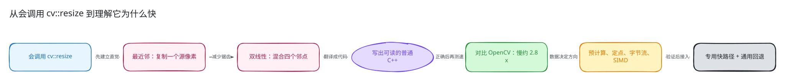
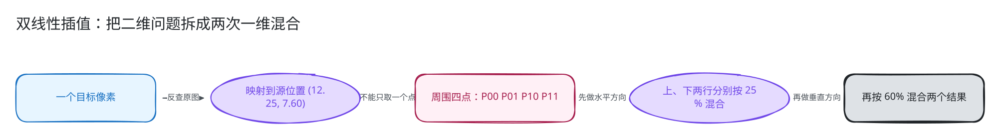
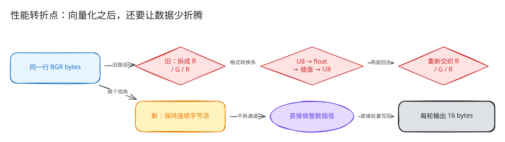
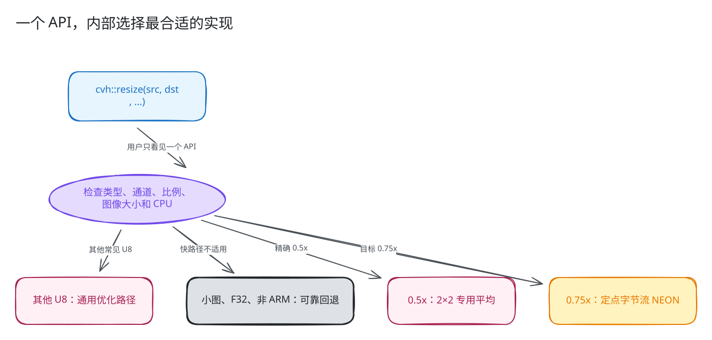
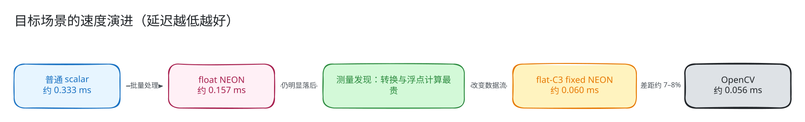

# `resize` 是怎么实现的，又是怎么接近 OpenCV 速度的？

[English (default)](README.md) | **简体中文**

你可能已经写过很多次：

```cpp
cv::resize(src, dst, cv::Size(480, 360), 0, 0, cv::INTER_LINEAR);
```

但 `resize` 内部到底做了什么？为什么一个看起来只是“双重循环”的操作，成熟的
OpenCV 会快很多？如果从零实现，怎样一步一步把速度追到 OpenCV 附近？

这篇教程就是为“会使用 OpenCV，但没有实现过图像缩放”的读者准备的。主线只
需要普通 C++ 基础。NEON intrinsic、Q16 坐标和 dispatch telemetry 被放在最后的
[进阶附录](#进阶附录当前产品实现的精确细节)，第一次阅读可以跳过。

我们会聚焦一个常见场景：

```text
8-bit BGR 图像（CV_8UC3）
640×480 -> 480×360（宽和高都缩小到 3/4）
INTER_LINEAR
ARM64 单线程
```

最终结果先放在这里：旧实现约为 OpenCV 速度的 `35%`，新实现达到约 `93%`；
也就是把约 `2.8x` 的差距缩小到了约 `1.07–1.08x`。它已经很接近，但还不能
宣称整个 `resize` 算子都与 OpenCV 持平。



## 开始前：五个词就够了

| 词 | 这篇教程里的意思 |
| --- | --- |
| source / `src` | 原图 |
| destination / `dst` | 缩放后的目标图 |
| U8C3 | 每个通道 8 bit、每像素 3 个通道；常见的 BGR 图像 |
| scalar | 一次处理一个数值的普通 C++ 实现 |
| SIMD / NEON | 一条指令同时处理一批数值；NEON 是 ARM 的 SIMD |
| fallback | 快速路径不适用时，仍然正确可靠的通用实现 |

## 1. 先忘掉优化：`resize` 到底在做什么

把 `640×480` 的原图变成 `480×360`，不是简单地“删掉一些像素”。目标图中的
每一个像素都要回答一个问题：

> 我在原图的什么位置？应该从哪些源像素得到自己的颜色？

实现通常遍历目标图，再反查原图。这叫反向映射：

```text
for 每个目标像素 (dx, dy):
    计算它在原图中的位置 (sx, sy)
    从原图采样
    写入 dst(dy, dx)
```

为什么不从源图向目标图“撒像素”？因为正向映射可能让多个源像素落到同一个
位置，也可能在目标图留下空洞。反向映射保证每个目标像素恰好被写一次。

### 1.1 最简单的版本：最近邻

最近邻的规则是：找到目标像素对应的源位置，然后直接复制最近的那个源像素。

教学版核心循环可以写成：

```cpp
for (int dy = 0; dy < dst_rows; ++dy) {
    const int sy = std::min(src_rows - 1,
                            dy * src_rows / dst_rows);

    for (int dx = 0; dx < dst_cols; ++dx) {
        const int sx = std::min(src_cols - 1,
                                dx * src_cols / dst_cols);

        for (int c = 0; c < 3; ++c) {
            dst(dy, dx, c) = src(sy, sx, c);
        }
    }
}
```

它很快，也很容易理解；缺点是放大时容易出现方块，缩小时也可能丢掉明显细节。
OpenCV 中对应 `INTER_NEAREST`。

最近邻给了我们第一个重要直觉：**Resize 的核心不是改变容器大小，而是建立
“目标坐标到源坐标”的映射。**

## 2. 双线性插值：不要只拿一个像素，混合周围四个

`INTER_LINEAR` 使用双线性插值。先看一维问题：

```text
A = 10       B = 30
      ^
      目标位置在 A 到 B 的 25%
```

结果是：

```text
10 × 75% + 30 × 25% = 15
```

这个操作通常写作：

```cpp
lerp(a, b, t) = a + (b - a) * t;
```

二维图像只是把一维插值做两次。假设目标像素映射到源坐标
`(sx=12.25, sy=7.60)`：

- 水平方向位于第 12、13 列之间，权重是 `0.25`；
- 垂直方向位于第 7、8 行之间，权重是 `0.60`；
- 因此需要周围的四个源像素。



用符号表示：

```text
P00 = src(y0, x0)    P01 = src(y0, x1)
P10 = src(y1, x0)    P11 = src(y1, x1)

top    = lerp(P00, P01, wx)
bottom = lerp(P10, P11, wx)
dst    = lerp(top, bottom, wy)
```

数学上也可以先纵向、再横向。纯浮点计算时两者等价；整数实现会在每一步舍入，
所以产品代码必须固定顺序。这个细节稍后再讲。

### 2.1 为什么坐标公式里有 `+0.5` 和 `-0.5`

像素不是一个没有面积的格点，可以把它想成以整数坐标为中心的小方块。常见的
half-pixel 映射是：

```text
scale_x = src_width / dst_width
sx = (dx + 0.5) * scale_x - 0.5
```

纵向公式相同。以 `640 -> 480` 为例，第一个目标像素 `dx=0`：

```text
sx = (0 + 0.5) × (640 / 480) - 0.5
   = 0.1667
```

它位于源图第 0、1 列之间，更靠近第 0 列。这正好对应“按像素中心缩放”的
几何直觉。

你不必背这个公式，但必须知道：**坐标对齐方式是算子结果的一部分。** 少一个
`0.5`，图像看起来也许差不多，边界和逐像素结果却已经不是同一个 `resize`。

## 3. 写出第一版能看懂的双线性 Resize

为了让核心逻辑清楚，先把一维坐标映射封装起来。下面是教学代码，不是可直接
替换产品实现的完整文件；它省略了 `Mat` 创建、类型检查和错误处理。

```cpp
struct AxisPosition {
    int first;
    int second;
    float fraction;
};

AxisPosition locate(int dst_index, int src_size, int dst_size)
{
    if (src_size == 1) {
        return {0, 0, 0.0f};
    }

    const float scale = float(src_size) / float(dst_size);
    const float source = (float(dst_index) + 0.5f) * scale - 0.5f;

    // 边界使用复制语义，不读取图像之外的内存。
    if (source <= 0.0f) {
        return {0, 0, 0.0f};
    }
    if (source >= float(src_size - 1)) {
        return {src_size - 1, src_size - 1, 0.0f};
    }

    const int first = int(std::floor(source));
    return {first, first + 1, source - float(first)};
}
```

有了它，U8C3 双线性循环就很直接：

```cpp
for (int dy = 0; dy < dst_rows; ++dy) {
    const AxisPosition py = locate(dy, src_rows, dst_rows);
    const uchar* row0 = src.data + std::size_t(py.first) * src.step(0);
    const uchar* row1 = src.data + std::size_t(py.second) * src.step(0);
    uchar* output = dst.data + std::size_t(dy) * dst.step(0);

    for (int dx = 0; dx < dst_cols; ++dx) {
        const AxisPosition px = locate(dx, src_cols, dst_cols);

        for (int c = 0; c < 3; ++c) {
            const float top = lerp(
                row0[px.first * 3 + c],
                row0[px.second * 3 + c],
                px.fraction);
            const float bottom = lerp(
                row1[px.first * 3 + c],
                row1[px.second * 3 + c],
                px.fraction);

            output[dx * 3 + c] = saturate_cast<uchar>(
                lerp(top, bottom, py.fraction));
        }
    }
}
```

从外到内读这段代码：

1. 找到目标行对应的两条源图行；
2. 找到目标列对应的左右源像素；
3. 对 B、G、R 三个通道分别做双线性插值；
4. 将浮点结果舍入并限制到 `[0, 255]`。

`step(0)` 是每行在内存中的跨度。不能直接使用 `row * width * 3`，因为 ROI 的
一行后面可能还有父图像中未被选中的数据。

cvh 中可读的通用实现位于
[`resize_fallback_impl_typed`](../../../include/cvh/imgproc/resize.h)。

## 4. 在加速前，先证明第一版是对的

我们的目标不是“写一个看起来像 resize 的函数”，而是让支持范围内的结果与
OpenCV 对齐。OpenCV 在这里承担两个角色：

- 正确性参考：同一输入、尺寸和插值模式，比较输出；
- 性能参考：在同一机器、同一线程数和同一输入上比较耗时。

U8 插值会受到舍入顺序影响，因此通用差分合同允许最大像素误差 `1`，而不是
要求所有实现过程完全相同。测试输入不能只有一张照片，还要包括：

- 渐变、棋盘格、常量图和随机数据；
- 放大、缩小、奇数尺寸和单行/单列；
- C1/C3/C4；
- 普通连续图像和 non-contiguous ROI；
- 边界像素、短行和不能填满 SIMD block 的尾部。

公开行为测试见
[`resize_test.cpp`](../../../test/imgproc/geometry/resize_test.cpp)，OpenCV 差分见
[`opencv_contract_smoke_test.cpp`](../../../test/opencv_contract/opencv_contract_smoke_test.cpp)。

到这里才应该开始谈优化。否则速度变快以后，你甚至不知道自己是不是悄悄换了
一个算法。

## 5. 第一次测速：正确了，但比 OpenCV 慢约 2.8 倍

我们把目标固定为：

```text
CV_8UC3 + INTER_LINEAR
640×480 -> 480×360
Release + 单线程 + Apple ARM64
```

仓库的 clean baseline 是：

| 实现 | 延迟 | 怎么读 |
| --- | ---: | --- |
| 旧 cvh Auto | `0.169096 ms` | 当前待优化路径 |
| OpenCV | `0.060208 ms` | 约快 `2.81x` |

这不是坏消息。我们已经有正确性基线，也有明确且可重复的性能差距。接下来每一步
优化都必须回答两个问题：

1. 它减少了什么工作？
2. 测量能否证明这部分工作原来真的重要？

## 6. 第一步优化：把不会变化的坐标映射提前算好

观察朴素代码：对每一行 `dy`，内层都会重新计算全部 `dx` 的源坐标。但在一次
Resize 调用里，目标第 100 列永远映射到同一个 `x0/x1/wx`。

因此先建立两个只读表：

```text
x map: 每个 dx 的 x0、x1、wx
y map: 每个 dy 的 y0、y1、wy
```

热循环从“计算坐标并插值”变成“查表并插值”。同一张 x map 会被每一行复用。

这一步很合理，却不是最终答案。诊断显示 mapping/allocation 只有约
`0.000640 ms`，占旧路径约 `0.4%`。它值得做，因为让热循环更简单，也为后续
SIMD 准备了数据；但只优化 map 不可能填平 `0.10 ms` 以上的差距。

当前 map 和 U8 fast path 位于
[`resize_impl.hpp`](../../../include/cvh/imgproc/detail/resize_impl.hpp)。

## 7. 第二步优化：利用我们知道图像是 C3

通用代码有一个动态的通道循环：

```cpp
for (int c = 0; c < channels; ++c) { ... }
```

现实中 C1、C3、C4 最常见。为这些通道数写直线代码，可以减少内层判断和地址
计算，也让编译器更容易继续优化。目标行彼此独立，还可以按行并行。

另一个重要技巧是识别特殊比例。例如精确 `0.5x` 双线性下采样时，一个输出
像素正好对应一个 `2×2` block：

```cpp
dst = (p00 + p01 + p10 + p11 + 2) >> 2;
```

不需要通用坐标表，也不需要浮点权重。成熟库很快的一个原因就是：它不会要求
一个万能内核把所有尺寸、类型和比例都处理得同样好。

## 8. 第三步优化：第一次 NEON 尝试——更快了，但仍不够

SIMD 的直觉很简单：普通循环一次算一个像素，NEON 一次算一批。旧的 U8C3
NEON 版本每轮处理 8 个输出像素，大致经历：

```text
拆开 B/G/R
  -> 找出四个邻点
  -> U8 转成 float
  -> 浮点双线性插值
  -> float 舍入回 U8
  -> B/G/R 重新交织
```

这确实把标量路径从约 `0.333 ms` 加速到约 `0.157 ms`，超过两倍。但 OpenCV
仍在约 `0.056 ms`。**“已经用了 NEON”不等于“数据流已经高效”。**

于是我们不再猜测，而是把旧内核拆开测：

| 诊断实验 | 延迟 | 结论 |
| --- | ---: | --- |
| mapping/allocation | `0.000640 ms` | 不是主瓶颈 |
| 只保留 vector gather/store | `0.037445 ms` | 查表和访存并没有慢到 0.15 ms |
| float math，去掉 table 开销 | `0.142513 ms` | U8/F32 转换与浮点计算才是主体 |
| 去掉 scalar tail | `0.151076 ms` | 尾部也不是主因 |

现在优化方向很清楚：不要继续微调坐标表或尾部，应该去掉昂贵的 U8/F32 往返，
并减少 C3 的拆分与重新交织。

## 9. 第四步优化：把浮点权重换成小整数

双线性插值里的 `t` 是 `[0, 1]` 的浮点数。对 U8 图像，可以用 `[0, 255]` 的
整数近似它：

```text
t = 0.25  ->  weight 约为 64
t = 0.50  ->  weight 约为 128
```

一维插值就可以写成：

```cpp
uchar lerp_u8(uchar a, uchar b, uint16_t weight)
{
    const int value =
        (int(a) << 8) +
        (int(b) - int(a)) * int(weight) +
        128;  // 舍入偏置
    return uchar(value >> 8);
}
```

这里的 `<< 8` 相当于乘 `256`，最后的 `>> 8` 相当于除 `256`。整个热循环不再
需要把每个 U8 邻点扩展成 float。

这就是本文后面提到的 Q8 权重。名字不重要，直觉才重要：**用足够精确的小整数
表示 0 到 1 的比例，让 U8 输入尽量留在整数世界里。**

定点会改变少数 half-way case 的舍入。我们没有直接把它塞进 NEON，而是先写
一份 fixed scalar reference，并冻结：

- fixed 与旧 float 路径的最大 U8 差值不超过 `1`；
- fixed scalar 与之后的 NEON 必须逐 byte 相同；
- 与 OpenCV 的既有误差合同不能因为追求速度而放宽。

实现见
[`resize_fixed_u8c3.hpp`](../../../include/cvh/imgproc/detail/resize_fixed_u8c3.hpp)。

## 10. 第五步优化：不要拆 B/G/R，把 C3 当成一条字节流

一行 BGR 图像在内存中本来是：

```text
B0 G0 R0  B1 G1 R1  B2 G2 R2  ...
```

旧 NEON 路径先拆成三条通道，分别计算，再重新交织。新路径换了一个视角：输出
本来就是连续 bytes，为什么不直接生成连续 bytes？

对于某个输出 byte：

```text
pixel   = output_byte / 3
channel = output_byte % 3
left    = x0[pixel] * 3 + channel
right   = left + 3
```

同一通道的右邻像素在内存中总是相隔 3 bytes。于是 16 个 SIMD lane 可以跨过
像素和通道边界，不必先拆 B/G/R。



新的 16-byte NEON 主循环可以用一句话概括：

```text
加载上下两行的一小段连续 bytes
  -> 查表取出每个 lane 的左右邻点
  -> 做两次整数插值
  -> 连续写出 16 个 output bytes
```

向量主体之外的剩余 bytes 继续走同一数值语义的 scalar tail。窄图或无法安全
加载一整个源窗口时，也回退到 fixed scalar。快速路径不能靠越界读取换速度。

完整 NEON 实现位于
[`resize_neon.hpp`](../../../include/cvh/imgproc/detail/resize_neon.hpp)。

## 11. 最终实现不是一个内核，而是一个可靠的选择器

用户仍然只调用：

```cpp
cvh::resize(src, dst, cvh::Size(480, 360),
            0.0, 0.0, cvh::INTER_LINEAR);
```

内部根据输入和运行平台选择最合适的实现：



主线可以这样理解：

| 场景 | 选择 |
| --- | --- |
| U8C3、linear、精确 0.5x、ARM NEON | 2×2 四点平均专用内核 |
| U8C3、linear、floor-0.75x、ARM NEON | flat-C3 定点 NEON |
| U8C3、linear、其他适合向量化的比例 | 通用浮点 gather NEON |
| U8 常见通道、没有命中 direct NEON | 预计算 map 的 U8 fast path |
| F32、小图、非目标平台或其他支持场景 | 通用 scalar fallback |

如果 `src` 和 `dst` 指向同一份数据，公开入口先复制源图，避免输出覆盖尚未读取的
输入。ROI 每行通过 `step(0)` 定位。非 ARM 构建不会实例化 direct NEON，但仍然
保留可用的通用实现。

Selector 见
[`resize_fast_impl`](../../../include/cvh/imgproc/detail/resize_impl.hpp)，公开入口见
[`resize.h`](../../../include/cvh/imgproc/resize.h)。

## 12. 性能是怎样一步一步追上来的



同一台机器上的阶段性数据可以帮助建立直觉：

| 阶段 | 约耗时 | 相比前一阶段发生了什么 |
| --- | ---: | --- |
| Scalar | `0.333 ms` | 可读、可验证，但一次处理一个值 |
| 旧 float NEON | `0.157 ms` | 一批处理 8 个像素，但仍有昂贵的格式转换 |
| flat-C3 fixed NEON | `0.060 ms` | 整数插值、不拆通道、一次输出 16 bytes |
| OpenCV 参考 | `0.056 ms` | 当前 Apple ARM64 upstream 路径 |

正式旧基线和当前候选的三轮中位数是：

| Case | 旧 cvh | 新 cvh candidate | OpenCV | 新 cvh / OpenCV 速度水平 |
| --- | ---: | ---: | ---: | ---: |
| 640×480 -> 480×360 | `0.169096 ms` | `0.059875 ms` | `0.055796 ms` | `93.19%` |
| 641×479 ROI -> 480×359 | `0.156067 ms` | `0.059679 ms` | `0.055275 ms` | `92.64%` |

第一行里，cvh 相对自身旧路径提升约 `2.62x`，与 OpenCV 的差距缩小到约
`7.3%`；ROI case 的差距约 `8.0%`。

这里必须诚实地区分两个结论：

- 可以说：目标场景已经从明显落后推进到 OpenCV 附近；
- 不能说：所有类型、尺寸、比例和平台的 `resize` 都已经与 OpenCV 一样快。

已归档的旧基线见
[`2026-08-06-v0.1-neon-hot-opencv-upstream-performance.en.md`](../../../benchmark/opencv_compare/results/2026-08-06-v0.1-neon-hot-opencv-upstream-performance.en.md)。
新结果目前仍是 dirty-worktree candidate；配置、三轮证据和未关闭项以
[`Resize U8C3 定点 NEON 加速计划`](../../cvh-v0.1-resize-u8c3-fixed-point-neon-acceleration-plan.md)
为准。

## 13. 为什么我们相信“变快以后仍然是同一个 Resize”

性能优化最危险的失败方式不是 crash，而是悄悄算出不同的图。当前验证形成了
一层一层的保护：

1. 公式层：坐标、权重、边界和舍入有独立单测；
2. 实现层：eligible fixed scalar 与 NEON 逐 byte 相同；
3. OpenCV 层：多尺寸、多 seed、continuous 和 ROI 做 upstream differential；
4. 内存层：窄图、unaligned、16-byte 尾部和奇数尺寸均有覆盖；
5. Dispatch 层：Auto、NeonOnly、OpenCVUIOnly、ScalarOnly 都检查实际路径；
6. 平台层：optimization-off、非 ARM 编译、header/ODR/install consumer；
7. 安全层：ASan/UBSan 检查越界和未定义行为。

目标 `640×480 -> 480×360` case 的 fixed reference 与当前 ARM OpenCV 路径逐
byte 相同；更广泛的 U8 linear differential 仍保持最大误差 `1`，没有为了性能
放宽门槛。

这些测试集中在
[`resize_dispatch_test.cpp`](../../../test/imgproc/internal/resize_dispatch_test.cpp)
和
[`opencv_contract_smoke_test.cpp`](../../../test/opencv_contract/opencv_contract_smoke_test.cpp)。

## 14. 如果你想跟着源码读，建议用这个顺序

不要第一眼就钻进 NEON intrinsic。按下面的顺序会轻松很多：

1. [`resize.h`](../../../include/cvh/imgproc/resize.h)：先找
   `resize_fallback_impl_typed`，对应本文的朴素算法；再看公开 `cvh::resize`。
2. [`resize_impl.hpp`](../../../include/cvh/imgproc/detail/resize_impl.hpp)：看 x/y map、
   C1/C3/C4 专化和总 selector。
3. [`resize_fixed_u8c3.hpp`](../../../include/cvh/imgproc/detail/resize_fixed_u8c3.hpp)：
   看整数 `lerp_u8` 和 fixed scalar reference。
4. [`resize_neon.hpp`](../../../include/cvh/imgproc/detail/resize_neon.hpp)：先只读函数
   结构和注释，再读 TBL/NEON intrinsic。
5. [`resize_dispatch_test.cpp`](../../../test/imgproc/internal/resize_dispatch_test.cpp)：
   从测试反向理解边界、tail、ROI 和 dispatch 合同。
6. [`opencv_compare_header_benchmark.cpp`](../../../benchmark/opencv_compare_header_benchmark.cpp)：
   看 public call 如何与 OpenCV 在相同条件下测量。

## 15. 可以自己动手做的四个小实验

### 实验一：只实现最近邻

先支持 U8C1，打印几个目标坐标对应的源坐标。确认你真正理解反向映射。

### 实验二：加入双线性

用一个 `2×2` 小图放大到 `5×5`，手算中心像素，再和代码、OpenCV 对比。

### 实验三：预计算 x map

先只把 `x0/x1/wx` 移出行循环。比较代码结构和耗时，不要预设它一定有巨大收益。

### 实验四：将浮点权重改为 8-bit 整数

记录与浮点版不一致的像素数量和最大差值。只有正确性合同明确以后，再尝试 SIMD。

这四步已经复现了本次优化最核心的方法：**先建立直觉和正确性，再用测量选择
优化方向，最后才把算法批量化。**

---

## 进阶附录：当前产品实现的精确细节

以下内容用于继续阅读产品源码。第一次理解 `resize` 时可以不看。

### A.1 Q16 坐标与 Q8 权重分别解决什么问题

插值权重只需要表达 `[0, 1]`，8-bit fraction 已足够快。坐标计算却必须处理
half-pixel、极端尺寸和跨平台一致性，所以当前实现先用 64-bit 整数建立 Q16
aligned coordinate，再取小数部分的高 8 bit 作为 Q8 权重。

这样做把两个问题分开：

- Q16：稳定地决定“左右/上下是哪两个像素”；
- Q8：快速地决定“两个像素各占多少”。

具体实现是
[`aligned_coordinate` 和 `build_axis_coordinate`](../../../include/cvh/imgproc/detail/resize_fixed_u8c3.hpp)。

### A.2 为什么定点实现固定为先纵向、再横向

当前 fixed scalar 与 NEON 都执行：

```text
left  = lerp(P00, P10, wy)
right = lerp(P01, P11, wy)
dst   = lerp(left, right, wx)
```

每一级都会 round-and-narrow。交换顺序可能让 half-way case 相差 `1`，所以顺序
不是随意的代码风格，而是 scalar/NEON byte-exact 合同的一部分。

### A.3 FlatBlock 如何保证 32-byte load 安全

每个输出向量的 map 保存：

```cpp
struct FlatBlock {
    std::size_t source_byte_base;
    std::array<uchar, 16> left_index;
    std::array<std::uint16_t, 16> x_fraction;
};
```

构建 map 时验证 16 个 lane 的左右邻点都位于合法的 32-byte source window 内。
不能满足条件的右边界不进入 vector block，由同语义 scalar tail 完成。

### A.4 Direct NEON 的精确入口条件

`try_resize_linear_u8c3` 要求：

- 二维、非空、`CV_8UC3`；
- `INTER_LINEAR`；
- runtime NEON 可用；
- dispatch mode 为 `Auto` 或 `NeonOnly`；
- `dst_cols >= 8` 且目标面积至少 `256`。

然后依次选择 exact `0.5x`、floor-`0.75x`、generic float gather。未命中 direct
NEON 后才尝试 U8 fast path 和通用 fallback。

目标 route 记录为：

```text
resize_linear_u8c3:
map=fixed_q16_q8;
layout=flat_c3;
load=neon_contiguous;
gather=tbl2;
interpolate=fixed8_vertical_horizontal;
store=neon_contiguous;
tail=fixed_scalar
```

Telemetry 记录实际走过的路径，不能仅凭“在 ARM 上编译”就声称执行了 NEON。

### A.5 可复现的 focused 命令

```bash
cmake -S . -B build-v01-resize-fixed-neon \
  -DCMAKE_BUILD_TYPE=Release \
  -DCVH_BUILD_TESTS=ON \
  -DCVH_BUILD_BENCHMARKS=ON \
  -DCVH_ENABLE_OPENCV_COMPARE=ON \
  -DCVH_ENABLE_OPTIMIZATION=ON \
  -DOpenCV_DIR=../opencv/build-slim

cmake --build build-v01-resize-fixed-neon --parallel 2

build-v01-resize-fixed-neon/cvh_test_imgproc \
  --gtest_filter='Resize*:ResizeDispatchInternalTest*'
```

关闭性能 gate 还要求 Release、双方单线程、相同输入和采样设置，并连续运行至少
三轮。一次 probe 可以指导下一步，不能成为发布结论。
